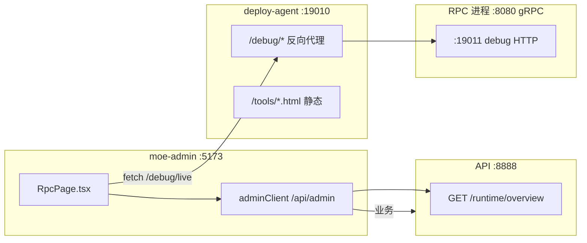

# 管理台开发启动、RPC 监控与进程内存说明

> **文档用途**：标注 2026-05 起「一键开发启动 + 原生 RPC 监控页 + 进程内存展示」的架构、命令与排障。  
> **相关 SSOT**：[ports.md](./ports.md) · [moe-admin.md](./moe-admin.md) · [kratos-migration.md](./kratos-migration.md)  
> **管理台入口**：[moe-admin/README.md](../../moe-admin/README.md)

---

## 1. 总览

| 能力 | 管理台路径 | 后端 / 数据 |
|------|------------|-------------|
| 业务 Admin API | `/ops/*`（除运维菜单） | `GET/POST /api/admin/*` → `:8888` |
| 运维（构建/发布等） | `/ops/deploy` 等 | Vite 代理 → `:19010` Deploy Agent |
| **RPC 监控** | `/ops/rpc` | React 页 + `/debug/*` + `GET /api/admin/runtime/overview` |
| 对话日志 / 分析 / 标签 | `/ops/app/ai/chat-logs` 等 | `super.api` Admin 接口 |

**重要**：`/ops/rpc` **不再** iframe 嵌入 `docs/dev/tools/rpc-monitor.html`，已改为 `moe-admin/src/pages/RpcPage.tsx` 原生实现（样式与管理台浅色主题一致）。

遗留 HTML 仍可用于 Agent 工具台或本地直接打开：`docs/dev/tools/rpc-monitor.html`（`?embed=ops` 为旧内嵌样式，管理台请勿再依赖）。

---

## 2. 推荐启动方式

### 2.1 日常开发（推荐）

```bash
# 终端 1：后端（单进程 API+RPC + Agent + RPC debug）
cd backend && make moe-social

# 终端 2：管理台
cd moe-admin && npm install && npm run dev
```

浏览器：**http://127.0.0.1:5173/ops/** · RPC 监控：**http://127.0.0.1:5173/ops/rpc**

`make moe-social` 实际执行：`go run ./cmd/moe-social-stack`（**非**生产用 `cmd/moe-social` 二进制）。

| 组件 | 端口 | 默认是否启动 |
|------|------|----------------|
| HTTP API + gRPC RPC（单 OS 进程） | 8888 + 8080 | ✅ |
| RPC debug（pprof / live / logs） | 19011 | ✅ `-monitor=true` |
| deploy-agent | 19010 | ✅ `-agent=true` |

### 2.2 关闭 Agent 或 RPC 监控

```bash
cd backend
go run ./cmd/moe-social-stack -agent=false      # 不要 :19010（运维菜单不可用）
go run ./cmd/moe-social-stack -monitor=false    # 不要 :19011（/ops/rpc 无指标）
```

### 2.3 双进程开发（等价旧 `make rpc` + `make api`）

```bash
cd backend && make dev
```

| 组件 | 说明 |
|------|------|
| RPC | 独立进程，`moe-rpc -debug` → :19011 |
| API | 独立进程 → :8888 |
| Agent | 默认启动 → :19010 |
| 文档站 | 默认 `:19012`（可选 `-docs=false`） |

### 2.4 生产构建

```bash
cd backend && make build-moe-social   # → bin/moe-social（纯 API+RPC，不含 Agent / debug）
```

生产环境 **不要** 暴露 `:19011` / `:19010` 到公网。

---

## 3. 架构与请求链路



**RPC 监控数据流**

1. **进程内存卡片**：`GET /api/admin/runtime/overview`（API 进程内采样 + HTTP 拉取 `127.0.0.1:19011/debug/live`）。
2. **堆/GC/Goroutine/日志**：浏览器 `fetch('/debug/...')` → Vite 代理 → Agent → RPC debug。

Vite 代理配置：`moe-admin/vite.config.ts`（`/api/admin` → 8888，`/debug` → 19010）。

---

## 4. 进程数量与内存占用

### 4.1 为何会有「很多进程」？

| 模式 | 典型 OS 进程 | 说明 |
|------|----------------|------|
| `make moe-social` | **2** | `moe-social-stack`（API+RPC 合一）+ `deploy-agent` |
| `make dev` | **3～4** | `moe-rpc` + `moe-api` + `agent`（+ 可选 docs Python） |
| 另开 `npm run dev` | **+1** | Node/Vite |

Go 服务空载通常 **几十～二百 MB RSS/进程**；`make dev` 多进程时 RSS **相加**，管理台「预估总 RSS」为 API + RPC 之和（单进程模式只计一份）。

### 4.2 管理台如何展示内存？

**页面**：`/ops/rpc` 顶部「本机服务内存」

| 字段 | 含义 |
|------|------|
| 预估总 RSS | API RSS + RPC RSS（`moe-social` 同 PID 时只显示一份） |
| API 进程 | 处理 `/api/admin/runtime/overview` 的 **API 服务** 的 RSS、Go 堆、goroutine |
| RPC 进程 | **RPC debug** 所在进程的 RSS（与 gRPC 业务同进程） |
| layout | `moe-social`（同 PID）或 `split`（多进程） |

**API**

```http
GET /api/admin/runtime/overview
Authorization: Bearer <admin_token>
```

**实现位置**

| 层级 | 文件 |
|------|------|
| 契约 | `backend/api/super.api` → `AdminRuntimeOverview*` |
| API Logic | `backend/api/internal/logic/admin/adminruntimeoverviewlogic.go` |
| RSS 采样 | `backend/pkg/processmem/` |
| debug 扩展 | `backend/rpc/internal/debug/monitor.go` → `handleLive` 含 `process` / `pid` |

**指标说明**

| 指标 | 说明 |
|------|------|
| **RSS** | 操作系统视角物理内存（`getrusage`，macOS/Linux） |
| **Go 堆 / Sys** | `runtime.MemStats`，用于看堆增长与 GC |
| **Goroutines** | 协程数；持续飙升需结合 pprof 排查 |

---

## 5. RPC 监控页（React）功能对照

| 功能 | 前端 | 数据源 |
|------|------|--------|
| 连接状态 | `RpcPage.tsx` | `GET /debug/live` |
| 性能指标卡片 | 同上 | `/debug/live` |
| 堆内存趋势图 | Recharts `AreaChart` | 前端每 3s 采样 `heap_inuse_mb` |
| 内存 Top 函数 | 表格 | `GET /debug/heap-top?limit=12` |
| Goroutine 采样 | `<pre>` | `GET /debug/goroutine-summary` |
| RPC 日志 | 表格 + 级别筛选 | `GET /debug/logs` |
| 自动刷新 | 勾选 3s | metrics / logs 分 tab |

**前端代码**

| 路径 | 说明 |
|------|------|
| `moe-admin/src/pages/RpcPage.tsx` | 页面主组件 |
| `moe-admin/src/lib/rpcMonitor.ts` | debug API 封装 |
| `moe-admin/src/api/adminClient.ts` | `getRuntimeOverview()` |

---

## 6. 后端启动实现索引（便于改代码时定位）

| 命令 | 入口 | 备注 |
|------|------|------|
| `make moe-social` | `backend/cmd/moe-social-stack/main.go` | 调 `moesocial.Run` + 可选 Agent |
| `make dev` | `backend/cmd/dev/main.go` | 编译 `.dev/moe-rpc`、`moe-api`，RPC 带 `-debug` |
| `make deploy-agent` | `backend/cmd/deploy-agent/main.go` | 单独起 Agent |
| `make rpc-debug` | `backend/rpc/super.go -debug` | 仅 RPC + debug（无 API） |
| 生产单二进制 | `backend/cmd/moe-social/main.go` | 无 Agent、默认无 monitor |

| 包 | 作用 |
|----|------|
| `backend/devlauncher/` | 编译并拉起 `deploy-agent` |
| `backend/internal/platform/moesocial/run.go` | 单进程 RPC+API；`EnableRPCMonitor` 时 `StartMonitor` |
| `backend/rpc/runserver/server.go` | `EnableMonitor` → `debug.StartMonitor` |
| `backend/devports/ports.go` | 19010 / 19011 / 19012 常量 |

**deploy-agent 配置**

- 示例：`backend/deploy/config.example.yaml`
- 本地：`backend/deploy/config.yaml`（首次启动可从 example 复制）
- 关键项：`rpc_debug_upstream: "http://127.0.0.1:19011"`

---

## 7. 常见问题

### 7.1 `/ops/rpc` 报 502 或「连接失败」

1. 确认已 **`make moe-social`** 或 **`make dev`**，且未加 `-monitor=false`。
2. 日志中应有：`RPC debug API: http://127.0.0.1:19011/debug/live`。
3. 确认 **deploy-agent** 在跑（`make moe-social` 默认已带）；单独测：浏览器或 `curl http://127.0.0.1:19011/debug/live`。
4. 改配置后需 **重启** 后端。

### 7.2 内存卡片 RPC 未连接、但指标 Tab 正常

`/runtime/overview` 在 API 进程执行；若 19011 不可达，仅 RPC 卡片显示未连接，需检查 monitor 是否启动。

### 7.3 `make gen` 后 API 编译 duplicate logic

goctl 可能生成与 `admin_insights_logic.go` 重复的空壳。处理：删空壳、保留 `admin_insights_logic.go` 与 `adminruntimeoverviewlogic.go`。见 [Codex启动指南-后端.md](../guidelines/Codex启动指南-后端.md)。

### 7.4 仍想用旧 HTML 监控页

- Agent：`http://127.0.0.1:19010/tools/rpc-monitor.html`
- 勿在 `RpcPage` 再嵌 iframe；旧页 `embed=ops` 曾为深色主题，已与当前管理台 UI 脱钩。

---

## 8. 变更记录（摘要）

| 日期 | 变更 |
|------|------|
| 2026-05 | `make moe-social` / `make dev` 默认启动 deploy-agent（:19010） |
| 2026-05 | `make moe-social` / `make dev` 默认启动 RPC debug（:19011） |
| 2026-05 | `/ops/rpc` 改为 React 原生页；统一浅色样式 |
| 2026-05 | 新增 `GET /api/admin/runtime/overview` 展示 API/RPC RSS |
| 2026-05 | 管理台新增：对话日志、数据分析看板、统一标签中心（另见 `super.api` Admin 路由） |

---

## 9. 相关管理台路由（业务扩展）

| 侧栏 | 路由 | API 前缀 |
|------|------|----------|
| AI 对话日志 | `/ops/app/ai/chat-logs` | `/api/admin/ai/chat/*` |
| 数据分析看板 | `/ops/app/analytics` | `/api/admin/analytics/overview` |
| 统一标签中心 | `/ops/app/tags` | `/api/admin/topic-tags`、`/api/admin/tag-dictionary` |

契约与生成：改 `backend/api/super.api` 后 `cd backend && make gen-api`，并清理重复 logic 空壳。
