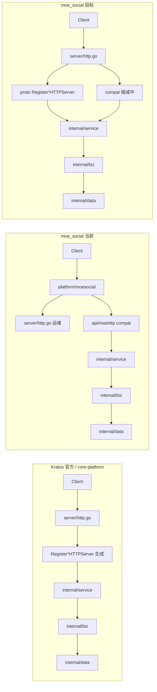

# Server 层目录收敛（对齐 Kratos 官方 / core-platform）

> **最后更新：2026-05-27**  
> 状态板：[kratos-migration-status.md](./kratos-migration-status.md)

## 1. 三方结构对比

### Kratos 官方推荐（[项目布局](https://go-kratos.dev/zh-cn/docs/intro/layout/)）

```text
cmd/<app>/
api/                      # proto 契约（含 google.api.http）
internal/
  biz/                    # 业务
  data/                   # 数据访问
  service/                # 实现 proto service（协议适配）
  server/
    http.go               # ★ 创建 HTTP Server + Register*HTTPServer
    grpc.go               # ★ 创建 gRPC Server + Register*GRPCServer
```

**特征**：`internal/server` 只有 **`http.go` / `grpc.go` 两个装配入口**；路由来自 proto 生成的 `RegisterXxxHTTPServer`。

### core-platform（本机参考实现）

```text
api/<module>/v1/*.proto
internal/
  biz/
  data/
  service/                # JobService、DeviceService…
  server/
    http.go               # NewHTTPServer + 30+ Register*HTTPServer
    grpc.go               # NewGRPCServer + Register*GRPCServer
    mqtt/                 # 额外传输（MQTT）
    scheduler/            # 定时任务
  pkg/                    # auth、middleware、errors（横切）
```

**特征**：无 `api/internal`、无 compat、无 `*gw`；HTTP/gRPC 注册集中在 `internal/server`。

### moe_social（迁移前 · 历史）

```text
api/<domain>/v1/*.proto
api/moehttp/*_compat.go   # P3 基线 263 条（已迁出）
api/internal/             # go-zero 遗产
...
```

### moe_social（当前 · 2026-05-27）

```text
api/<domain>/v1/*.proto + *_http.pb.go    # 227 条 proto HTTP
internal/server/
  http.go / http_proto.go / http_compat.go
  httplegacy/*_compat.go                  # 45 条活跃 compat
  grpc/<domain>/                          # proto 薄适配
internal/apilegacy/swaggerdoc/            # /swagger 三件套 bridge
internal/platform/moesocial/
```

**特征**：HTTP 装配已收敛到 `internal/server`；compat 从 263→45；P0/P1 审计 100%。

---

## 2. 目标命名（清晰版）

| 当前 | 目标 | 包名 | 职责 |
|------|------|------|------|
| `internal/server/moekratoshttp/` | **`internal/server/http.go`** | `server` | HTTP 运维路由 + 未来 `NewHTTPServer` |
| `internal/server/moegrpc/` | **`internal/server/grpc/`** | `grpcserver` | 各域 gRPC 传输适配（薄包装 service） |
| `internal/platform/moesocial/` | 保留，逐步变薄 | `moesocial` | 仅 `main` 级启动编排 |
| `api/moehttp/` | 暂留 → 最终迁入 `server/http.go` 或 proto HTTP | `moehttp` | 存量 compat 路由 |
| `api/internal/*` | 逐步删除 | — | 见 [api-internal 收敛](#5-apiinternal-收敛) |

与 **core-platform** 对齐后的终态：

```text
internal/server/
  http.go          # NewHTTPServer：RegisterOps + RegisterCompat（过渡期）+ 未来 Register*HTTPServer
  grpc.go          # NewGRPCServer：Register 12 域 + MoeAdmin
  grpc/<domain>/   # 可选：域级 gRPC 薄适配（或合并进 service 后删除）
```

---

## 3. 数据流对比



---

## 4. 分阶段迁移

### 阶段 S0 — 命名清晰化 ✅（本批）

| 动作 | 验收 |
|------|------|
| `moekratoshttp` → `internal/server/http.go`（`RegisterOpsHTTP`） | `go build ./...` |
| 文档：本文 + `LAYOUT.md` 更新 | — |

### 阶段 S1 — gRPC 目录对齐 ✅

| 动作 | 验收 |
|------|------|
| `moegrpc` → `internal/server/grpc`（包名 `grpcserver`） | `rpc/runserver/kratos.go` |
| `internal/server/grpc.go`：`RegisterSocialGRPC` | 与 core-platform `grpc.go` 同形 |

### 阶段 S2 — HTTP 装配归位 ✅

| 动作 | 验收 |
|------|------|
| `server.NewHTTPServer` 统一注册 Ops + Compat | `moesocial` / `moekratos` 已切换 |
| 删除 `api/moehttp/register_all.go` | `grep RegisterAll` 无匹配 |

### 阶段 S3 — 按域 compat 编排 ✅（结构层）

| 动作 | 验收 |
|------|------|
| `server/http_compat.go` 按域调用 `moehttp.Register*Compat` | admin / post / user … 分组 |
| proto `Register*HTTPServer` | ✅ | `http_proto.go` · **227** 路由 · 18 域 |
| compat 手写路由 | 🟡 缩减中 | **45** 条（原 P3 基线 263） |

### 阶段 S3b — proto HTTP 生成 ✅

- [x] `google.api.http` + `protoc-gen-go-http` → `*_http.pb.go`
- [x] `http_proto.go` · **227** 路由 · P0/P1 大批量 compat no-op

### 阶段 S4 — 删除 `api/internal`（进行中）

| 动作 | 验收 |
|------|------|
| compat 直调 `*App`，去掉 `svc.*GW` | 无 `UserGW` 等于号引用 |
| `common/*_convert` → `api/moehttp/*_convert` 或 `internal/pkg/httputil` | — |
| 删除 `api/internal/*gw`、`svc` | `go build ./...` |
| `types/` 随客户端迁移逐步归档 | — |

### 阶段 S5 — 与 core-platform 同形（长期）

| 动作 | 验收 |
|------|------|
| `internal/platform/moesocial` 仅保留 `Run()`，server 构造全在 `internal/server` | — |
| `rpc/pb/moe` bridge 归零 | service/biz 无 `moe.*` |
| `make gen` 生成 HTTP 注册，手写 compat **45**（目标 0） | 对齐官方布局；见 [kratos-migration-status.md](./kratos-migration-status.md) |

---

## 5. `api/internal` 收敛

**不进 `biz`**。按层迁移：

| 子目录 | 迁到哪 |
|--------|--------|
| `types/` | 随 compat 删除；新接口用 proto JSON |
| `*gw/` | 删除（S4）；或临时 `internal/adapter/gwclient` |
| `common/*_convert` | `api/moehttp/*_convert.go` |
| `common/error_*` | `internal/pkg/httperr` |
| `svc/` | 并入 `internal/platform/moewiring` |

---

## 6. 新接口纪律（与官方一致）

1. 改 `api/<domain>/v1/*.proto`（含 `google.api.http`）
2. `make gen` → `*_http.pb.go`
3. 实现 `internal/service/<domain>`
4. 在 `internal/server/http.go` 增加 `RegisterXxxHTTPServer`
5. **禁止** 新增 `api/moehttp/*_compat.go`、`api/internal/*`

参考：[new-api-kratos.md](./new-api-kratos.md)

---

## 7. 验收命令

```bash
cd backend && go build ./...
make grpc-smoke                    # gRPC 域冒烟
curl -s http://127.0.0.1:8888/health
curl -s http://127.0.0.1:8888/migration | jq '.percent'
```
