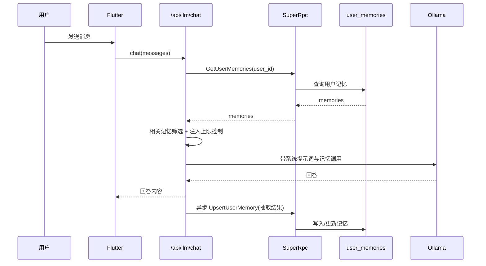
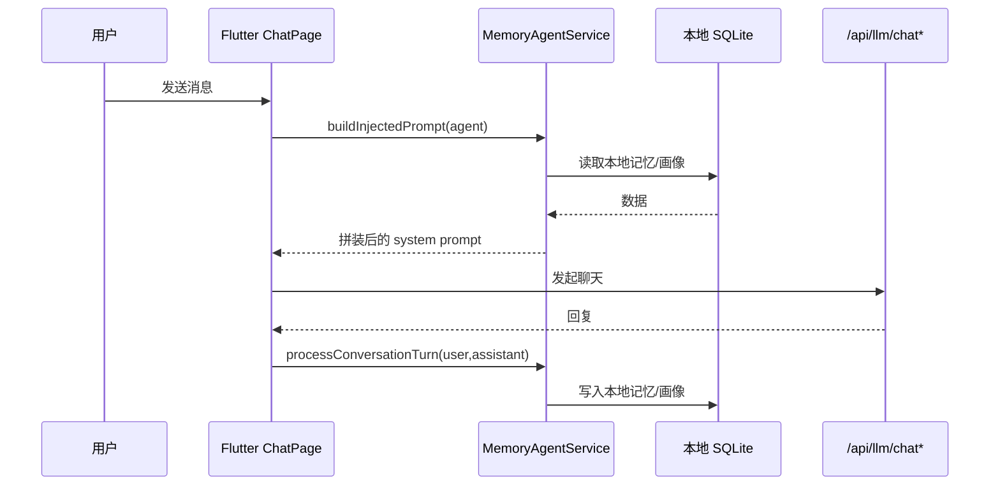

# Ollama 用户级记忆架构与前后端流程（归档）

> 说明：本文件已归档，不再作为主维护文档。  
> 统一入口请使用：`docs/dev/ollama/用户级记忆统一文档.md`  
> 验收脚本请使用：`docs/dev/用户级记忆统一改造验收脚本.md`

---

## 1. 文档目的

这份文档用于解决当前“记忆能力已做了一部分，但缺少统一设计图、实现规划和前端对接流程”的问题，给出：

1. 当前实现到底是什么（后端链路 + 前端链路）。  
2. 当前存在的结构性缺口与风险。  
3. 目标架构图与可执行落地计划。  
4. 前端同学可直接执行的操作流程与接口约定。  

---

## 2. 当前实现快照（截至 2026-05-09）

## 2.1 后端用户级记忆（已实现）

- 已有用户记忆模型：`user_memories`（`memory_type/confidence/source` 已入库）。  
- 已有反馈表：`user_memory_feedback`（accept/reject/correct 反馈记录）。  
- 聊天注入逻辑已接入用户记忆召回（按相关度 + 最近性选择，控制注入上限）。  
- 已有内存缓存（按 `user_id`，短 TTL）提升读取性能。  
- 已有反馈接口：`POST /api/user/:user_id/memories/feedback`。  
- 已有冲突保护：人工来源记忆优先，低置信自动提取不覆盖人工修正。  

## 2.2 前端能力（已实现）

- 记忆线页面（`MemoryTimelinePage`）可查看后端用户记忆、删除、反馈（认可/驳回/纠正）。  
- 聊天页已统一为“后端记忆注入”：仅发送基础系统提示词，不再执行本地记忆注入与本地记忆提取。  
- 聊天页记忆入口统一到后端记忆线页面（Web/移动端一致）。  
- 记忆管理页面（`MemoryManagerPage`）仍保留本地记忆/画像配置能力，属于“待收敛模块”。  

## 2.3 当前最关键事实（必须明确）

当前项目历史上存在**两套并行记忆链路**，目前已进入“部分收敛”状态：

1. **后端用户级记忆链路**（账号绑定，跨设备）。  
2. **前端本地 Agent 记忆链路**（基于 `sqflite`，按 `agent_id` 本地存储）。  

目前状态：

1. 聊天主链路已统一到后端记忆注入/抽取。  
2. 本地 Agent 链路仍存在于 `MemoryManagerPage`（配置与本地画像整理），属于剩余改造项。  

---

## 3. 现状架构图（As-Is）

```mermaid
flowchart TD
  U[用户聊天] --> FE[Flutter ChatPage]
  FE -->|POST /api/llm/chat 或 /api/llm/chat/raw| BE[Backend LLM API]
  BE -->|非 raw 时| Inject[后端召回用户记忆并注入]
  Inject --> Ollama[Ollama]
  Ollama --> BE --> FE

  BE -->|异步抽取| Upsert[UpsertUserMemory RPC]
  Upsert --> UM[(user_memories)]
  FeedbackAPI[POST /api/user/:id/memories/feedback] --> FBL[SubmitUserMemoryFeedback]
  FBL --> UM
  FBL --> UMF[(user_memory_feedback)]

  MM[MemoryManagerPage] -->|本地配置/画像整理(待收敛)| LM[(SQLite: memories/memory_profiles/memory_settings)]
```

---

## 4. 关键时序图

## 4.1 后端用户级记忆时序（非 raw）



## 4.2 前端本地记忆时序（当前并行）



---

## 5. 当前缺口与风险（重点）

## 5.1 架构层缺口

1. **收敛未完成**：聊天页已切后端，但 `MemoryManagerPage` 仍有本地记忆与本地画像链路。  
2. **默认可能绕过记忆链路**：`terminal mode` 默认开启时走 `/api/llm/chat/raw`，后端用户记忆注入会被绕过。  
3. **追溯字段未闭环**：缺少 `source_msg_id/session_id` 级别来源追踪。  

## 5.2 产品体验缺口

1. 用户很难区分“这是后端长期记忆”还是“本地 Agent 记忆”。  
2. 缺少统一“记忆来源解释”面板（为什么这条记忆被注入）。  
3. 缺少“反馈后生效验证”路径（反馈后下一轮是否命中）。  

---

## 6. 目标架构（To-Be）

核心原则：**用户级记忆以后端为单一事实源（SSOT）**，前端本地记忆降级为可选缓存/离线增强。

```mermaid
flowchart TD
  U[用户] --> FE[Flutter]
  FE -->|统一调用| API[/api/llm/chat]
  API --> Recall[召回层: 相关性 + 置信度 + 时效]
  Recall --> Prompt[注入层: 预算控制]
  Prompt --> O[Ollama]
  O --> API --> FE

  API --> Extract[抽取层: 对话->结构化记忆]
  Extract --> Conflict[冲突层: 用户定义 > 用户反馈 > 模型抽取]
  Conflict --> Store[(user_memories)]
  FE --> Feedback[/api/user/:id/memories/feedback]
  Feedback --> Store
  Feedback --> Log[(user_memory_feedback)]
```

---

## 7. 前端对接操作流程（建议标准版）

## 7.1 用户操作流程

1. 用户聊天 -> 发送消息。  
2. 前端调用 `/api/llm/chat`（默认非 raw）。  
3. 收到回答后，用户可在“记忆线”查看相关记忆。  
4. 用户对记忆执行：认可 / 驳回 / 纠正。  
5. 前端调用 `/api/user/:user_id/memories/feedback`。  
6. 后端更新记忆置信度与来源；下一轮聊天体现变化。  

## 7.2 前端页面职责建议

- `ChatPage`：仅负责聊天请求、展示、消息状态。  
- `MemoryTimelinePage`：用户级记忆管理（查看、反馈、删除）。  
- `MemoryManagerPage`：待改造为“后端模式与可观测配置页”，不再承担本地记忆源角色。  

## 7.3 前端联调检查清单

1. 登录态下 `user_id` 由 token 决定，路径参数仅作路由占位。  
2. 反馈成功后列表回刷，置信度与来源字段同步变化。  
3. 切换模型/注入模式后，提示词预览同步更新。  
4. `terminal mode` 开关状态明确可见（避免误走 raw）。  

---

## 8. 分阶段落地规划（可执行）

## Phase A（1-2 天）：文档与开关治理

- 在 UI 明确标记“当前是否 raw 模式”。  
- 把“用户级记忆以服务端为准”写入代码注释和页面文案。  
- 完成本设计文档评审并冻结术语。  

## Phase B（3-5 天）：链路统一

- `ChatPage` 默认走 `/api/llm/chat`，除调试场景不走 raw。  
- 前端本地记忆抽取改为可选（默认关闭），防止双写双注入。  
- 后端补 `source_msg_id/session_id` 字段与透传。  

## Phase C（5-7 天）：学习闭环强化

- 基于反馈记录做定时强化/衰减任务。  
- 增加画像聚合任务与解释能力。  
- 输出监控指标：命中率、误提率、冲突率、反馈采纳率、注入成本。  

---

## 9. 数据与接口清单（当前）

## 9.1 后端接口

- `GET /api/user/:user_id/memories`  
- `POST /api/user/:user_id/memories`  
- `DELETE /api/user/:user_id/memories?key=...`  
- `POST /api/user/:user_id/memories/feedback`  
- `POST /api/llm/chat`（服务端注入记忆）  
- `POST /api/llm/chat/raw`（绕过服务端注入，仅转发）  

## 9.2 关键字段

- `UserMemory`: `key/value/memory_type/confidence/source/source_msg_id/session_id/created_at/updated_at`  
- `SubmitUserMemoryFeedbackReq`: `key/feedback_type/corrected_value/reason`  
- `LlmChatReq`: `messages/session_id/source_msg_id`（用于来源追溯透传）  

---

## 10. 验收标准（建议）

1. 用户反馈后 1~2 轮对话内可观察到行为变化。  
2. 同账号跨设备聊天，记忆一致性可复现。  
3. 非 raw 模式下，记忆命中率与回答稳定性可观测提升。  
4. 无重复注入、无明显冲突回写，且可追溯来源。  

---

## 11. 结论

当前系统已经具备“可用的记忆能力”，但还不是“统一的用户级记忆系统”。  
下一阶段重点不是继续堆功能，而是先完成 **单一事实源统一 + 链路可追溯 + 前端流程标准化**，再推进强化学习闭环。

---

## 12. 本轮统一改造落地结果（2026-05-09）

### 12.1 架构冻结与 raw 边界（freeze-architecture）

1. 默认聊天链路切换为 `/api/llm/chat`，`raw` 不再作为默认模式。  
2. 前端将 raw 文案调整为“调试模式”，降低误开导致“记忆失效”的概率。  
3. 配置页新增“服务端记忆是否生效 / raw 调试边界”可见性。  

### 12.2 远端 API -> 本地 Ollama 安全桥接策略（plan-bridge）

固定采用“App -> 后端 API -> Ollama”单跳方案，约束如下：

1. App 仅访问后端 API，不直连 `11434`。  
2. raw 调试仍经后端转发，沿用统一鉴权与转发头。  
3. 桥接异常必须显式失败并提示（已通过模型配置页与连接测试路径暴露）。  
4. 运维口径固定：只暴露 API 域名，Ollama 仅绑定本机/内网。  

### 12.3 Web 端记忆可用流程（plan-web-memory）

1. Web 保持禁用本地 SQLite 记忆链路。  
2. Web 聊天统一走服务端记忆注入链路。  
3. Web 点击“记忆库”时跳转到后端记忆线页面（`MemoryTimelinePage`），不再提示“不可用”。  

### 12.4 追溯契约与存储变更（plan-schema-trace）

已完成 API/RPC/DB/调用链改造：

1. `user_memories` 增加 `source_msg_id/session_id`。  
2. `super.proto` 与 `super.api` 同步新增追溯字段。  
3. `LlmChatReq` 新增 `session_id/source_msg_id`。  
4. 聊天接口将追溯字段透传到异步 `UpsertUserMemory`。  

### 12.5 记忆中心 IA 最小交互（plan-frontend-ia）

1. 聊天页保留轻入口（记忆库按钮）。  
2. Web：入口直达“记忆线”（查看/反馈）。  
3. 移动端：当前入口已统一到记忆线；`MemoryManagerPage` 后续改造成“后端配置与可观测面板”。  
4. 模型配置页统一展示当前模式 + 服务端记忆状态，形成“可解释入口”。  

### 12.7 待完成收敛项（新增）

1. 下线 `MemoryManagerPage` 的本地 SQLite 记忆数据读写能力。  
2. 将画像整理从前端本地模型调用迁移为后端聚合任务与接口。  
3. 增加记忆列表分页与指标观测，降低大用户数据量下的查询压力。  

### 12.6 端到端验收脚本与指标口径（define-acceptance）

新增可执行验收脚本文档：`docs/dev/用户级记忆统一改造验收脚本.md`，包含：

1. 非 raw 模式命中验证。  
2. 模型切换后连续性验证。  
3. 反馈 1-2 轮生效验证。  
4. 桥接异常提示验证。  
5. 指标口径：命中率/误提率/冲突率/反馈采纳率/注入 token 成本。  

