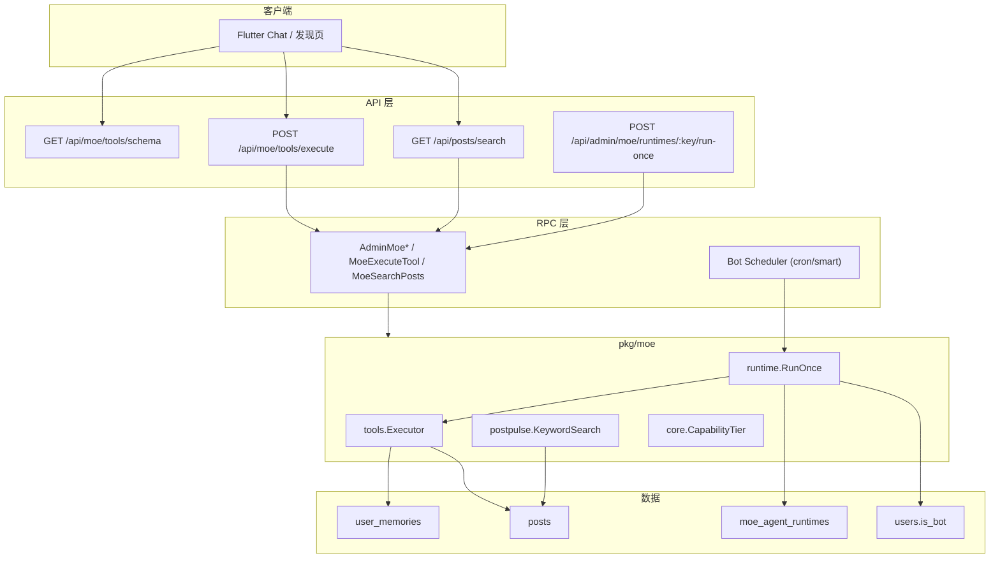

# Moe Intelligence Stack v1（框架 SSOT）

> **定位**：与具体 LLM 解耦的 **Moe Core** 第一版——工具、动态检索、Agent 运行时、能力档位。  
> **模型策略**：默认保持 **7B（llama-server）**；记忆提取优先本机 llama.cpp，不再依赖 Ollama 11434。  
> **记忆 SSOT** 仍见：[用户记忆系统-OpenClaw式演进设计.md](./用户记忆系统-OpenClaw式演进设计.md)

---

## 1. 架构总览



### 模型隔离（酒馆 vs Bot 发帖 vs 聊天）

| 场景 | 模型 | 人设来源 | 是否受酒馆角色卡影响 |
|------|------|----------|----------------------|
| **App 聊天** | 角色卡绑定的 `modelName` | 每次请求 `messages` 里的 `system`（角色卡） | ✅ 仅当次对话，设计如此 |
| **Bot 发帖** | `moe.bot_post_model`（基座 GGUF） | `moe_agent_runtimes.system_prompt` + 社区上下文 | ❌ 不用角色派生模型 |

**数据访问**：Moe 相关读写统一在 **RPC 进程**（`AdminMoe*` / `MoeExecuteTool` / `MoeSearchPosts`）；API 仅 HTTP + 鉴权 + 调 RPC。Bot 定时调度器跑在 **RPC** 进程内。
| **Ollama 派生模型（遗留）** | App 仍可调 `POST /api/llm/agents` | modelfile baked SYSTEM | Bot 发帖**不用**；默认 llama-server 基座 |

llama-server **无全局会话**；Bot 发帖用 `moe.bot_post_model` + `post_rules`（库表 `moe_agent_runtimes.post_rules`，管理后台可编辑，每行一条硬性规则）。

| 模块 | 目录 | 职责 |
|------|------|------|
| **核心契约** | `backend/pkg/moe/core` | 能力档位、执行上下文、错误码 |
| **工具执行器** | `backend/pkg/moe/tools` | 注册表 + 统一 `Execute` |
| **动态脉搏** | `backend/pkg/moe/postpulse` | 站内动态关键词检索（P0） |
| **Agent 运行时** | `backend/pkg/moe/runtime` | Bot 配置加载、单次回合编排 |
| **Flutter SDK** | `lib/moe/` | 调 schema/execute、档位常量 |

---

## 2. 能力档位（7B = S2）

| 档位 | 常量 | 典型模型 | v1 允许的工具 |
|------|------|----------|----------------|
| S0 | `s0` | ≤1.5B | 无（仅路由，预留） |
| S1 | `s1` | 2B～3B | `post_search`, `memory_search` |
| **S2** | `s2` | **7B 默认** | S1 + `post_create`, `post_get`, `memory_save` |
| S3 | `s3` | 云端 | 全部 + 多步（后续） |

执行器按 `CapabilityTier` 校验；未配置 Agent 时按 `moe.default_capability_tier`（默认 `s2`）。

---

## 3. HTTP API（v1）

| 方法 | 路径 | 说明 |
|------|------|------|
| GET | `/api/moe/tools/schema` | OpenAI tools JSON 列表 |
| POST | `/api/moe/tools/execute` | 执行工具（需登录 JWT） |
| GET | `/api/posts/search` | 动态关键词检索（Post Pulse P0） |
| GET | `/api/admin/moe/runtimes` | 列出 Bot 运行时配置 |
| POST | `/api/admin/moe/runtimes` | 创建/更新运行时 |
| POST | `/api/admin/moe/runtimes/:agent_key/run-once` | 手动触发单 Bot 发帖 |
| — | API 内 `bot_scheduler` | `cron`：到期自动 AI 发帖；`smart`：LLM 判断是否发帖后再 AI 生成 |
| GET | `/api/admin/moe/tools/schema` | 管理台：工具目录（含档位说明） |
| GET | `/api/admin/moe/tools/stats` | 管理台：调用次数聚合 |
| GET | `/api/admin/moe/tools/calls` | 管理台：调用明细分页 |

### 3.1 工具执行请求

```json
{
  "tool": "post_search",
  "arguments": "{\"query\":\"手绘\",\"limit\":5}",
  "agent_key": "moe_guide",
  "idempotency_key": "optional-uuid"
}
```

- **用户发起**：`actor_user_id` 由 JWT 注入，Bot 工具仅当用户为 Bot 或管理员代发时允许 `post_create`。
- **Admin run-once**：服务端用 `moe_agent_runtimes.bot_user_id` 作为发帖身份。

---

## 4. 工具清单（v1）

| 工具 | 层 | 说明 |
|------|-----|------|
| `memory_search` | L1 | RPC 拉记忆 + `pkg/memory` 检索 |
| `memory_save` | L1 | RPC upsert |
| `memory_get` | L1 | RPC 按 key 读 |
| `brain_refine_episode` | L1 | 润色单条 Bot 自传/记忆（低分或未认可） |
| `brain_curate_memories` | L1 | 批量整理低分记忆，LLM 迭代直到认可 |
| `post_search` | L5 | `postpulse` 关键词检索 |
| `post_get` | L5 | RPC 帖子详情摘要 |
| `post_create` | L5 | RPC CreatePost（Bot user_id） |

`memory_list` / `memory_read_daily` 仍由 Flutter 本地工具处理；v2 迁入 Executor。

---

## 5. 数据模型

### `users` 扩展

- `is_bot`：社区 AI 账号
- `bot_agent_key`：关联 `moe_agent_runtimes.agent_key`

### `moe_tool_calls`

| 字段 | 说明 |
|------|------|
| `tool` | 工具名 |
| `actor_user_id` | 调用方用户 |
| `agent_key` | 关联 Bot（可选） |
| `ok` / `error_msg` | 成败与错误 |
| `latency_ms` | 耗时 |
| `source` | `api`（App JWT）或 `runtime`（Admin run-once） |

### `moe_agent_runtimes`

| 字段 | 说明 |
|------|------|
| `agent_key` | 唯一键，如 `moe_guide` |
| `bot_user_id` | 发帖用户 ID |
| `post_schedule_mode` | `manual` / `cron` / `smart`（LLM 决策是否发） |
| `system_prompt` | Bot 人设（性格/领域，**不是**发帖正文） |
| `post_rules` | 发帖硬性规则（每行一条，管理后台可改，注入 LLM） |
| `schedule_cron` | 标准 5 段 cron，如 `0 */6 * * *` |
| `next_run_at` | 下次定时执行（调度器维护） |
| `capability_tier` | s0～s3 |
| `model_name` | 7B 模型名 |
| `post_quota_daily` | 日发帖上限 |
| `enabled` | 是否启用 |

---

## 6. 演进路线（v1 之后）

| 阶段 | 内容 |
|------|------|
| v1.1 | `post_embeddings` + 语义 search |
| v1.2 | Memory scope `account/agent`、注入预算 |
| v1.3 | ~~Runtime cron~~ 已实现：cron + smart + `pkg/llminference` 生成帖 |
| v2 | 发现页 Moe 助手 UI、可解释排序 |

---

## 7. 验收（框架）

1. `GET /api/moe/tools/schema` 返回 ≥6 个工具定义。  
2. `GET /api/posts/search?q=测试` 返回 JSON 列表（可为空）。  
3. `POST /api/moe/tools/execute` + `post_search` 成功。  
4. Admin 创建 runtime + `run-once`：需 `llm_inference.base_url` 可用，由 7B 生成 JSON 后 `post_create`。  
5. Flutter `MoeToolService.fetchSchema()` 可调通。

---

## 8. 变更记录

| 日期 | 内容 |
|------|------|
| 2026-05-27 | **架构统一**：Moe Admin/工具/检索/大脑/润色 全部经 RPC；Bot 调度迁至 RPC 进程 |
| 2026-05-27 | **记忆整理**：质量分 1–100、`brain_refine_episode`/`brain_curate_memories`、Admin 润色/批量整理 |
| 2026-05-27 | **AI 大脑**：`moe_bot_episodes`、发帖写记忆、`forbidden_tags`/`preferred_tags`、管理端 `/app/moe-brain` |
| 2026-05-27 | Bot 发帖：文艺腔加权检测，最多 5 次重试；仍偏文艺则选最优一条发出（`llm#N-relaxed`） |
| 2026-05-27 | Bot 发帖：注入本 Bot 历史帖 + 社区脉搏，去重重试 |
| 2026-05-27 | Bot 发帖改为 LLM 生成；`smart` 智能发送；`pkg/llminference` |
| 2026-05-27 | Admin：工具目录 / 调用统计 / 明细；`moe_tool_calls` 埋点 |
| 2026-05-26 | v1 框架：pkg/moe、API、模型、Flutter SDK 骨架 |
