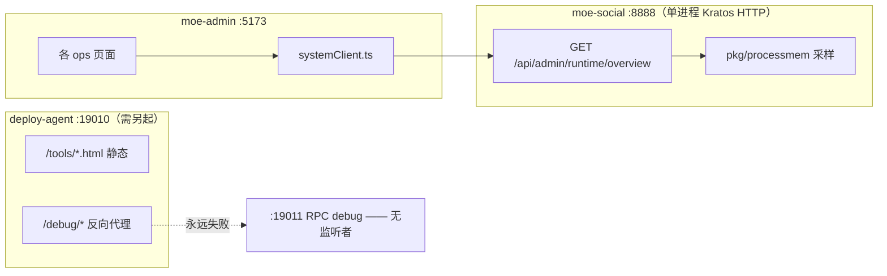

# 管理台开发启动、运行时监控与进程内存说明

> **文档用途**：标注管理台一键开发启动、运行时指标接口与进程内存展示的现状、命令与排障。
> **最后核对：2026-09-08**（Kratos 单进程迁移后）
> **相关 SSOT**：[ports.md](./ports.md) · [moe-admin.md](./moe-admin.md) · [moe-social-runtime.md](./moe-social-runtime.md)
> **管理台入口**：[moe-admin/README.md](../../moe-admin/README.md)

---

## 0. 与旧版的差异（先读这段）

本文 2026-05 版本描述的「双进程 + RPC 监控」架构**已整体不存在**。逐项实测：

| 旧文档说法 | 实测结果（2026-09-08） |
|------------|----------------------|
| `make moe-social` = `go run ./cmd/moe-social-stack` | ✗ 实为 `go run ./cmd/moe-social`（`Makefile:66-67`；`:70-71` 的 `moe-social-dev` 才是 `moe-social-stack`，且带 `-agent=false`） |
| `make moe-social` 默认带 Agent :19010 + RPC debug :19011 | ✗ `cmd/moe-social` **没有** `-agent` / `-monitor` / `-debug` flag，只有 `-f` / `-f-api` / `-migrate` |
| HTTP :8888 + gRPC :8080 同进程 | ✗ 无 gRPC 监听；`internal/platform/moesocial/` 下无 `transport/grpc` |
| `make dev` → `cmd/dev/main.go` 编译 `moe-rpc` / `moe-api` | ✗ target 与文件均已删除 |
| `make rpc-debug` → `rpc/super.go -debug` | ✗ `backend/rpc/` 目录不存在 |
| `/ops/rpc` React 监控页 `RpcPage.tsx` | ✗ 文件不存在，`moe-admin` 无 `/ops/rpc` 路由 |
| `moe-admin/src/lib/rpcMonitor.ts` | ✅ 已于 2026-09-08 删除（此前零 import 的死文件，本文档 §7 曾建议删除） |
| `getRuntimeOverview()` 在 `adminClient.ts` | ⚠️ 实在 `systemClient.ts:449`，且**零调用方** |
| 契约 `backend/api/super.api` + `make gen-api` | ✗ go-zero IDL 与 target 均已删除 |
| `adminruntimeoverviewlogic.go` | ✗ go-zero logic 层已删；现走 Kratos proto |

**仍然有效的部分**：后端接口 `GET /api/admin/runtime/overview` 存在且有实现（见 §4）；`backend/pkg/processmem/` 存在；deploy-agent :19010 与 Vite 代理链有效（见 §3）。

---

## 1. 总览

| 能力 | 管理台路径 | 后端 / 数据 |
|------|------------|-------------|
| 业务 Admin API | `/ops/biz/*`、`/ops/ai/*` | `/api/admin/*` → `:8888` |
| 运维（构建/发布/Docker 等） | `/ops/infra/*`（deploy 页为 `/ops/infra/deploy`） | Vite 代理 → `:19010` Deploy Agent |
| 对话日志 / 分析 / 标签 | `/ops/ai/chat-logs`、`/ops/biz/analytics`、`/ops/biz/tags` | Kratos proto Admin 接口 → `:8888` |
| 运行时内存指标 | ⚠️ **无前端页面** | `GET /api/admin/runtime/overview` → `:8888`（接口在、UI 缺失） |

---

## 2. 推荐启动方式

### 2.1 日常开发

```bash
# 终端 1：后端（单进程 Kratos HTTP :8888）
cd backend && make moe-social

# 终端 2：管理台
cd moe-admin && npm install && npm run dev
```

浏览器：**http://127.0.0.1:5173/ops/**

`make moe-social` 实际执行 `go run ./cmd/moe-social`（生产同一入口）。

| 组件 | 端口 | `make moe-social` 是否启动 |
|------|------|---------------------------|
| Kratos HTTP（唯一业务监听） | 8888 | ✅ |
| gRPC | — | ✗ 不存在 |
| RPC debug（pprof / live / logs） | 19011 | ✗ target 已删，无监听者 |
| deploy-agent | 19010 | ✗ **不启动**，需另开 `make deploy-agent` |

### 2.2 带 deploy-agent 的开发形态

```bash
cd backend
go run ./cmd/moe-social-stack -agent=true    # :8888 + :19010
# 或分两个终端：make moe-social  +  make deploy-agent
```

`make moe-social-dev` = `go run ./cmd/moe-social-stack -agent=false`，等价于 `make moe-social`（同样不带 Agent）。

### 2.3 生产构建

```bash
cd backend && make build-moe-social   # → bin/moe-social
cd backend && make build-linux        # → Linux amd64 交叉编译
```

生产环境 **不要** 暴露 `:19010` 到公网。

---

## 3. 架构与请求链路



Vite 代理（`moe-admin/vite.config.ts:18-29`）：

| 前缀 | 目标 |
|------|------|
| `/api/admin`、`/ws`、`/api/images` | `http://127.0.0.1:8888` |
| `/api/deploy`、`/api`、`/debug`、`/tools`、`/devtools.html`、`/index.html` | `http://127.0.0.1:19010` |

> ⚠️ `/debug` 代理到 deploy-agent，Agent 再转发到 `devports.RpcDebugUpstream()`（:19011）。19011 已无进程提供，**该链路必然失败**。

---

## 4. 运行时内存指标接口

**接口仍在，前端页面已缺失。**

```http
GET /api/admin/runtime/overview
Authorization: Bearer <admin_token>
```

**实现位置**

| 层级 | 文件 |
|------|------|
| proto 契约 | `backend/api/admin/v1/admin_messages.proto:1966` |
| 生成路由 | `backend/api/admin/v1/admin_messages_http.pb.go:259` |
| Kratos handler | `backend/internal/server/protohttp/adminapp/adminapp_legacy.go:280` |
| 业务汇总 | `backend/internal/biz/admin/runtime_overview.go:38` |
| RSS 采样 | `backend/pkg/processmem/`（`rss_unix.go` / `rss_other.go` / `snapshot.go`） |

**返回字段**

| 字段 | 当前实际值 |
|------|-----------|
| `api_process.*` | ✅ 本进程实测（PID / GoAllocMB / GoSysMB / RSSMB / Goroutines / NumCPU） |
| `rpc_process.*` | ⚠️ 恒为 `reachable: false`——`runtime_overview.go:100` 仍探测 `:19011/debug/live`，但无进程提供 |
| `rpc_monitor_online` | ⚠️ 恒为 `false` |
| `layout` | ⚠️ 恒为 `"split"`（分支依赖 19011 探测成功） |
| `estimated_rss_mb` | = `api_process.rss_mb` |
| `processes_note` | 已改为陈述事实的文案，不再指引失效命令 |

**前端侧待办**：`src/lib/rpcMonitor.ts` 已删除（2026-09-08）。剩下 `moe-admin/src/api/systemClient.ts:449` 的 `getRuntimeOverview()` 仍**零调用方**，但后端 `GET /api/admin/runtime/overview` 是活的（见 §4），故先保留这个绑定。若要恢复「本机服务内存」卡片，应新建页面消费 `getRuntimeOverview()` 并只渲染 `api_process`。

**指标说明**

| 指标 | 说明 |
|------|------|
| **RSS** | 操作系统视角物理内存（`getrusage`，macOS/Linux） |
| **Go 堆 / Sys** | `runtime.MemStats`，用于看堆增长与 GC |
| **Goroutines** | 协程数；持续飙升需结合 pprof 排查（⚠️ 当前**未挂载** pprof，见 [security-and-stability-backlog.md](./security-and-stability-backlog.md) P2） |

---

## 5. 后端启动实现索引

| 命令 | 入口 | 备注 |
|------|------|------|
| `make moe-social` | `backend/cmd/moe-social/main.go` | 生产同一入口；单进程 Kratos HTTP :8888 |
| `make moe-social-dev` | `backend/cmd/moe-social-stack/main.go` | `-agent=false`，等价上者 |
| （无 make target） | `backend/cmd/moe-social-stack/main.go` | `-agent=true` 才带 deploy-agent :19010 |
| `make deploy-agent` | `backend/cmd/deploy-agent/main.go` | 单独起 Agent |
| `make db-migrate` | `backend/cmd/migrate/main.go` | 仅建表 |
| （无 make target） | `go run ./cmd/moe-social -migrate` | 启动前先建表，再起服务 |
| `make build-moe-social` | — | → `bin/moe-social` |

| 包 | 作用 |
|----|------|
| `backend/devlauncher/` | 编译并拉起 `deploy-agent` |
| `backend/internal/platform/moesocial/run.go` | 单进程 HTTP-only 启动编排 |
| `backend/internal/platform/moesocial/kratos_pure_http.go` | Kratos HTTP server 构造与启停 |
| `backend/devports/ports.go` | 19010 / 19011 / 19012 常量（19011 已无消费者提供数据） |

**deploy-agent 配置**

- 示例：`backend/deploy/config.example.yaml`
- 本地：`backend/deploy/config.yaml`（**不进 Git**，`.gitignore:38`；首次 `make deploy-config-init` 生成）
- 关键项：`rpc_debug_upstream`（默认取 `devports.RpcDebugUpstream()` = `http://127.0.0.1:19011`）

---

## 6. 常见问题

### 6.1 管理台运维菜单不可用

`make moe-social` 不启动 deploy-agent。另开 `cd backend && make deploy-agent`（首次先 `make deploy-config-init` 并填 token）。

### 6.2 内存 / RPC 指标显示未连接

预期行为。`:19011` 无监听者，`rpc_monitor_online` 恒为 `false`。只有 `api_process` 一份数据是真实的。

### 6.3 `make gen` 报 protoc 插件缺失

Kratos 用 `protoc-gen-go` / `-go-grpc` / `-go-http` / `-openapi`，**不再需要 goctl**。先执行 `cd backend && make init-proto-tools`。

### 6.4 仍想用旧 HTML 监控页

`http://127.0.0.1:19010/tools/rpc-monitor.html` 可打开（deploy-agent 静态托管），但其数据源 `/debug/*` → :19011 已断，页面只会显示连接失败。文件内提示文案待清理。

---

## 7. 变更记录

| 日期 | 变更 |
|------|------|
| 2026-09-08 | 按实际代码重写：确认 gRPC :8080 / RPC debug :19011 / `make dev` / `make rpc-debug` / `/ops/rpc` / `RpcPage.tsx` / `super.api` / goctl 均已移除；`make moe-social` 不带 Agent；`/api/admin/runtime/overview` 接口仍在但前端无页面 |
| 2026-05 | ~~`make moe-social` / `make dev` 默认启动 deploy-agent（:19010）~~ 已失效 |
| 2026-05 | ~~`make moe-social` / `make dev` 默认启动 RPC debug（:19011）~~ 已失效 |
| 2026-05 | ~~`/ops/rpc` 改为 React 原生页~~ 页面已不存在 |
| 2026-05 | 新增 `GET /api/admin/runtime/overview`（**仍有效**） |

---

## 8. 相关管理台路由（业务扩展）

| 侧栏 | 路由（`moe-admin/src/App.tsx`） | API 前缀（`backend/api/admin/v1/admin_messages.proto`） |
|------|------|----------|
| AI 对话日志 | `/ops/ai/chat-logs`（:115） | `/api/admin/ai/chat/sessions`、`/messages`、`/messages/export`（:1978-1984） |
| 数据分析看板 | `/ops/biz/analytics`（:103） | `/api/admin/analytics/overview`（:1987） |
| 统一标签中心 | `/ops/biz/tags`（:104） | `/api/admin/topic-tags/*`（:1876-1881）、`/api/admin/tag-dictionary/*`（:1860-1872） |

契约与生成：改 `backend/api/admin/v1/admin_messages.proto` 后 `cd backend && make gen`（Kratos protoc 链，非 goctl）。
