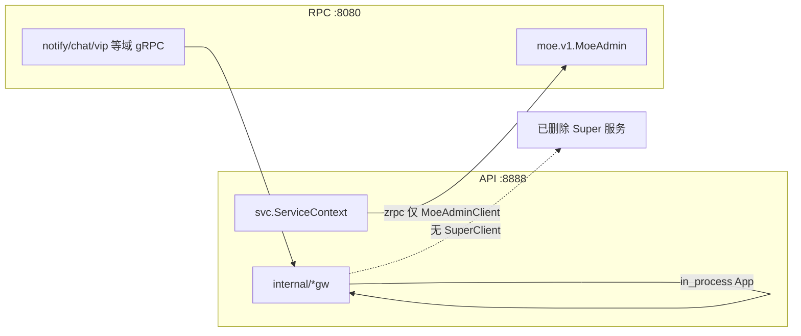

# P5 — 分体部署（api + rpc 容器）

> **最后更新：2026-05-29**  
> **前置**：P5 Super 退役完成，见 [kratos-migration-status.md](./kratos-migration-status.md)

---

## 何时使用

| 形态 | `moe.single_process` | `moe.super_grpc_retired` | 说明 |
|------|----------------------|--------------------------|------|
| **生产默认** | `true` | `true` | `make moe-social` 单二进制，无 Super gRPC |
| **分体 api/rpc** | `false` | `false` | API 与 RPC 分容器/进程，API 经 zrpc dial **MoeAdmin** |

**禁止**：在分体环境把 `super_grpc_retired: true` 且 `single_process: false` 当作「仍可用 Super」——`moewiring.SuperGrpcRetired()` 要求 **两者同时为 true** 才视为退役生效；分体应显式 `super_grpc_retired: false`。

---

## 分体配置片段

`backend/config/config.yaml`（或各容器挂载的等价片段）：

```yaml
moe:
  single_process: false
  super_grpc_retired: false
  register_moe_grpc: true
  use_moe_grpc: true
  # 各域 *_api_in_process: false 时，HTTP 网关可走 MoeAdmin / 域 gRPC（按域开关）

api:
  super_rpc_endpoints:
    - rpc:8080   # Docker 服务名；本机分体用 127.0.0.1:8080
  super_rpc_timeout_ms: 600000

runtime:
  grpc_listen: "0.0.0.0:8080"
```

---

## 运行时行为（P5-C 后）



| 组件 | 单进程 (`super_grpc_retired=true`) | 分体 (`super_grpc_retired=false`) |
|------|-------------------------------------|-----------------------------------|
| RPC 注册 | 域 gRPC 12 + MoeAdmin；**无** `Super` | 同上 |
| `api/internal/svc` | 不 dial zrpc | `zrpc` → `MoeAdminClient`（`NewMoeGRPCAdminClient`） |
| `*gw` 网关 | 无 `moe.SuperClient` 字段；进程内 / `errNoBackend` | 同上；Admin 可走 `MoeGRPC` |
| 历史 `Super.*` RPC | **不存在**（勿指望 grpcurl `super.Super`） | **不存在** |

---

## 切流检查清单

1. **RPC 镜像/二进制**：`go build ./rpc` 且 `moe.proto` 无 `service Super`（P5-B）。
2. **API 镜像/二进制**：`go build ./api`；gateway 无 `SuperClient` import（P5-C）。
3. **配置**：分体必须 `single_process: false` + `super_grpc_retired: false`。
4. **连通**：API 容器 `MOE_SUPER_RPC_ENDPOINT` 或 `api.super_rpc_endpoints` 指向 RPC `:8080`。
5. **冒烟**：按域 proto 用 grpcurl 逐域验证（原 grpc-smoke 脚本已随 go-zero 时代退役删除）
6. **观测**：`curl -s http://<api>:8888/migration | jq '.breakdown.p5_super_runtime_pct'`（单进程应为 100；分体该项语义见 status 板）。

---

## 常见误区

| 误区 | 事实 |
|------|------|
| `super_grpc_retired=false` 会恢复单体 Super | 仅恢复 **API→RPC 的 zrpc 回环**；注册的是 **MoeAdmin + 域服务** |
| 分体可 dial `super.Super` | `RegisterSuperServer` 已移除；`rpc/internal/logic` 已删 |
| 单进程改 `super_grpc_retired=false` 即可测 Super | 无 Super 服务可注册；应测域 gRPC 或 MoeAdmin |

---

## 相关命令

```bash
cd backend && make build          # api + rpc + moe-social 二进制
cd backend && make split-deploy-smoke
GRPC_SMOKE=1 go test ./internal/platform/grpcsmoke/... -count=1
```
