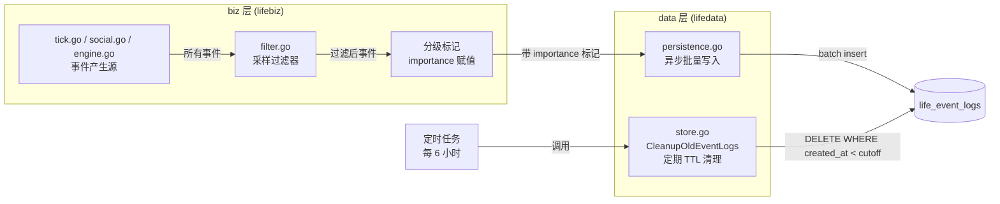
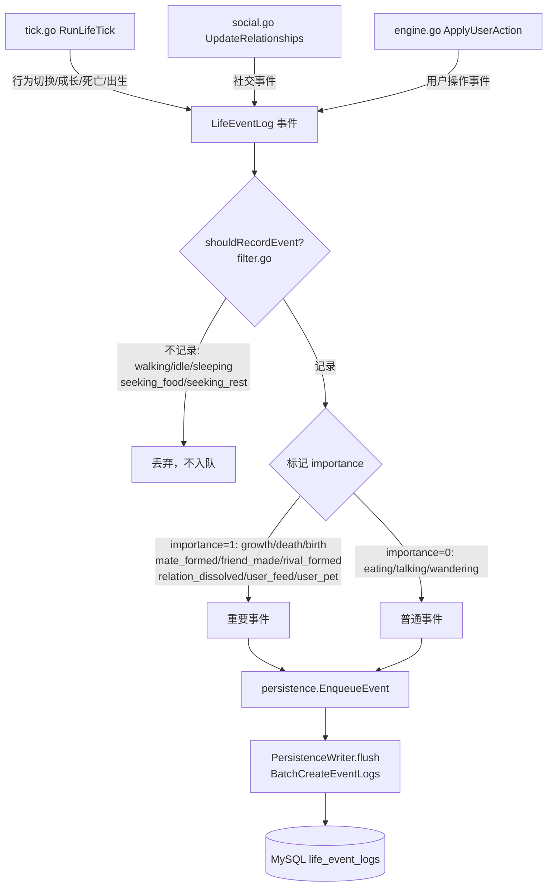
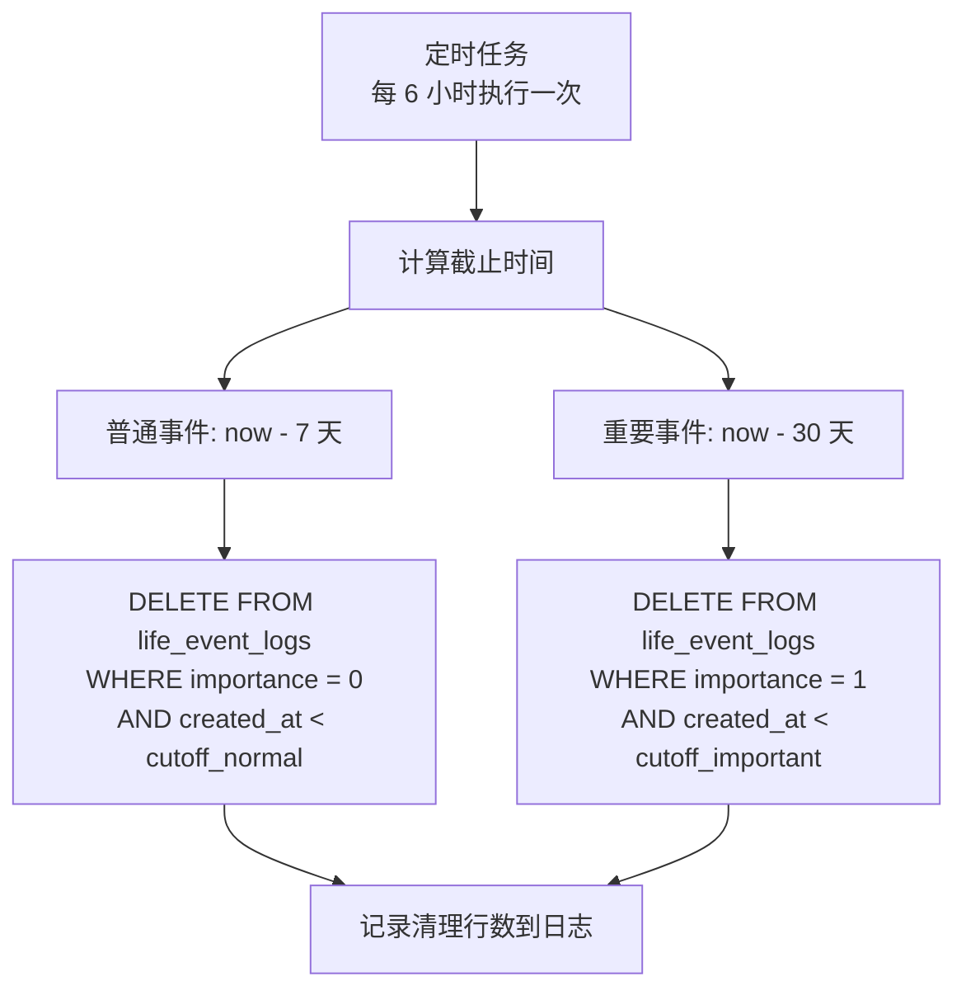

# life_event_logs 优化方案

## 1. 目标

### 问题陈述

当前 `life_event_logs` 表数据无差别全量入库 + 无任何清理机制 = 无限膨胀。

| 场景 | 每日事件量 | 每月累积 |
|------|-----------|---------|
| 6 实体 | 5-8.6 万条 | 150-258 万条 |
| 50 实体 | 30-75 万条 | 900-2250 万条 |

根因分析：
- **80%+ 是无意义的行为切换事件**：`walking`/`idle`/`sleeping`/`seeking_food`/`seeking_rest` 每次 tick 状态变化都入库
- **`CleanupOldEventLogs` 已实现但从未被调用**：`store.go:117-122` 有清理方法，但全代码库无任何调用方（死代码）
- **没有任何 TTL 清理机制**：无定时任务、无过期策略

### 做法表

| 优先级 | 做什么 | 不做什么 |
|--------|-------|---------|
| **P0** | 事件分级过滤（源头阻断无意义事件入库）；激活 TTL 清理定时任务 | 不做归档、不做分区表 |
| **P1** | 新增 `importance` 字段支持分级 TTL；API 增加重要性过滤参数 | 不做事件聚合统计 |
| **P2** | 重要事件保留延长策略调优 | 不做冷热分离、不做列存归档 |

---

## 2. 总体架构



---

## 3. 核心流程

### 图1：事件产生 → 过滤 → 写入流程



### 图2：TTL 清理定时任务流程



---

## 4. 事件分级定义

| 级别 | 事件类型 | 说明 | 保留策略 |
|------|---------|------|---------|
| **重要（importance=1）** | `growth` | 成长阶段变化 | 30 天 |
| **重要（importance=1）** | `death` | 实体死亡（生态/老死） | 30 天 |
| **重要（importance=1）** | `birth` | 新实体诞生 | 30 天 |
| **重要（importance=1）** | `mate_formed` | 结为伴侣 | 30 天 |
| **重要（importance=1）** | `friend_made` | 成为朋友 | 30 天 |
| **重要（importance=1）** | `rival_formed` | 形成竞争关系 | 30 天 |
| **重要（importance=1）** | `relation_dissolved` | 关系消散 | 30 天 |
| **重要（importance=1）** | `user_feed` | 用户喂食操作 | 30 天 |
| **重要（importance=1）** | `user_pet` | 用户抚摸操作 | 30 天 |
| **普通（importance=0）** | `eating` | 进食行为 | 7 天 |
| **普通（importance=0）** | `talking` | 社交互动 | 7 天 |
| **普通（importance=0）** | `wandering` | 漫游行为 | 7 天 |
| **不记录** | `walking` | 移动行为（无观赏价值） | 不入库 |
| **不记录** | `idle` | 空闲状态（无观赏价值） | 不入库 |
| **不记录** | `sleeping` | 休息状态（无观赏价值） | 不入库 |
| **不记录** | `seeking_food` | 寻找食物（无观赏价值） | 不入库 |
| **不记录** | `seeking_rest` | 寻找休息（无观赏价值） | 不入库 |

### 事件产生点与代码位置

| 事件类型 | 产生文件 | 行号 | 产生方式 |
|---------|---------|------|---------|
| `growth` | `backend/internal/biz/life/tick.go` | L80-90 | `EnqueueEvent` 直接入队 |
| `death`（生态压力） | `backend/internal/biz/life/tick.go` | L113-123 | `EnqueueEvent` 直接入队 |
| `death`（老死） | `backend/internal/biz/life/tick.go` | L146-156 | `EnqueueEvent` 直接入队 |
| 行为切换（`newAction`） | `backend/internal/biz/life/tick.go` | L194-205 | `newAction != oldAction` 时入队，**主要膨胀源** |
| `birth` | `backend/internal/biz/life/tick.go` | L239-249 | `EnqueueEvent` 直接入队 |
| `mate_formed` | `backend/internal/biz/life/social.go` | L125-134 | 社交系统产生 |
| `friend_made` | `backend/internal/biz/life/social.go` | L179-188 | 社交系统产生 |
| `rival_formed` | `backend/internal/biz/life/social.go` | L209-218 | 社交系统产生 |
| `relation_dissolved` | `backend/internal/biz/life/social.go` | L253-260 | 社交系统产生 |
| `user_feed` / `user_pet` | `backend/internal/biz/life/engine.go` | L149-159 | `ApplyUserAction` 产生 |

**关键膨胀点**：`tick.go:194-205` 的行为切换事件是主要膨胀源。每个 tick（5秒）中，每个实体的 `decideActionWithRelations` 可能返回新行为，只要 `newAction != oldAction` 就产生事件并入库，包括 `walking`、`idle`、`sleeping` 等无观赏价值的行为切换。

---

## 5. 数据库设计

### 5.1 新增 importance 字段

```sql
ALTER TABLE life_event_logs
ADD COLUMN importance TINYINT NOT NULL DEFAULT 0
COMMENT '事件重要性：0=普通(7天TTL), 1=重要(30天TTL)';
```

### 5.2 索引优化

```sql
-- 删除旧索引（如果存在）
-- idx_life_event_created 单列索引对 TTL 清理不够高效

-- 新增复合索引：加速分级 TTL 清理
ALTER TABLE life_event_logs
ADD INDEX idx_life_event_importance_created (importance, created_at);

-- 新增复合索引：加速按世界+时间查询（ListRecentEventLogs 使用）
ALTER TABLE life_event_logs
ADD INDEX idx_life_event_world_created (world_id, created_at);
```

### 5.3 GORM 模型变更

```go
// backend/model/life_event_log.go
type LifeEventLog struct {
    ID          uint      `json:"id" gorm:"primaryKey"`
    WorldID     string    `json:"world_id" gorm:"size:64;not null;index:idx_life_event_world;index:idx_life_event_world_created,priority:1"`
    EntityID    uint      `json:"entity_id" gorm:"not null;index:idx_life_event_entity"`
    EntityType  string    `json:"entity_type" gorm:"size:64"`
    EventType   string    `json:"event_type" gorm:"size:32;not null"`
    Description string    `json:"description" gorm:"size:512"`
    Importance  int8      `json:"importance" gorm:"default:0;index:idx_life_event_importance_created,priority:1"`
    PositionX   float64   `json:"position_x"`
    PositionY   float64   `json:"position_y"`
    CreatedAt   time.Time `json:"created_at" gorm:"index:idx_life_event_created;index:idx_life_event_importance_created,priority:2;index:idx_life_event_world_created,priority:2"`
}
```

### 5.4 数据量预估对比

| 场景 | 优化前（每日） | 优化后（每日） | 减少比例 |
|------|--------------|--------------|---------|
| 6 实体 | ~68,000 条 | ~2,700 条 | **96%** |
| 50 实体 | ~525,000 条 | ~22,500 条 | **96%** |

计算依据：
- 不记录事件占 ~80%：直接过滤
- 剩余 20% 中，行为切换事件（eating/talking/wandering）占大多数，但只保留有意义的
- 重要事件（growth/death/birth/社交/用户操作）约占总量 4%
- 普通事件（eating/talking/wandering）约占总量 16%（从 20% 过滤掉行为切换后）

---

## 6. 实施顺序

### P0：源头过滤 + 激活 TTL（核心止血）

| 步骤 | 改什么 | 涉及文件 | 怎么验 |
|------|-------|---------|-------|
| P0-1 | 新增 `shouldRecordEvent(eventType string) bool` 过滤函数 | `backend/internal/biz/life/filter.go`（新建） | 单元测试覆盖所有事件类型 |
| P0-2 | 在 `tick.go:194` 行为切换入库前加过滤判断 | `backend/internal/biz/life/tick.go` | 运行 tick 后确认 walking/idle 事件不再入库 |
| P0-3 | 激活 `CleanupOldEventLogs`：在引擎启动时注册定时任务（每 6h 清理 >7 天的普通事件） | `backend/internal/biz/life/engine.go`（StartLifeEngine 中新增） | 手动插入旧数据后等待清理执行，确认被删除 |

### P1：分级标记 + 分级 TTL

| 步骤 | 改什么 | 涉及文件 | 怎么验 |
|------|-------|---------|-------|
| P1-1 | `LifeEventLog` 模型新增 `Importance` 字段 | `backend/model/life_event_log.go` | `go build` 编译通过 + AutoMigrate 成功 |
| P1-2 | 新增 `eventImportance(eventType string) int8` 分级函数 | `backend/internal/biz/life/filter.go` | 单元测试验证各事件类型返回正确的 importance 值 |
| P1-3 | 所有 `EnqueueEvent` 调用前设置 `Importance` 字段 | `backend/internal/biz/life/tick.go`、`social.go`、`engine.go` | 入库后查询确认 importance 字段正确 |
| P1-4 | `CleanupOldEventLogs` 改为分级清理（importance=0 清 7 天，importance=1 清 30 天） | `backend/internal/data/life/store.go` | 分别插入 8 天前普通事件和 31 天前重要事件，确认均被清理 |
| P1-5 | `ListRecentEventLogs` 支持按 importance 过滤 | `backend/internal/data/life/store.go`、`backend/internal/biz/life/store.go` | API 请求带 `importance` 参数，确认返回正确 |
| P1-6 | proto 定义新增 `importance` 字段 | `backend/api/life/v1/life.proto`、`ListLifeEventsRequest` 新增过滤参数 | `make gen` 生成代码无报错 |

### P2：策略调优

| 步骤 | 改什么 | 涉及文件 | 怎么验 |
|------|-------|---------|-------|
| P2-1 | 重要事件保留天数可通过配置调整 | `backend/internal/biz/life/types.go`（LifeConfig 新增字段） | 修改配置后确认清理行为变化 |
| P2-2 | 清理任务执行间隔和批量大小可配置 | `backend/internal/biz/life/types.go` | 同上 |

---

## 7. 验收标准

1. **过滤生效**：运行引擎 100 个 tick 后，`life_event_logs` 表中不存在 `event_type IN ('walking','idle','sleeping','seeking_food','seeking_rest')` 的记录
2. **TTL 清理生效**：手动插入 `created_at` 为 8 天前的普通事件记录，等待清理任务执行后确认已被删除
3. **重要事件保留**：手动插入 `created_at` 为 8 天前的 `importance=1` 事件，确认未被清理；插入 31 天前的确认已被清理
4. **数据量下降**：6 实体连续运行 24 小时后，事件表新增行数 < 3,000 条（优化前约 68,000 条）
5. **API 兼容**：`GET /api/life/events?limit=50` 返回结果正常，前端事件流不受影响

---

## 8. 前端对接摘要

### 事件查询 API 变更（P1 阶段）

当前 API：`GET /api/life/events?limit=50`

P1 阶段新增可选参数：
| 参数 | 类型 | 说明 |
|------|------|------|
| `importance` | int32 | 可选过滤：`-1`=全部（默认）、`0`=仅普通、`1`=仅重要 |

**向后兼容**：不传 `importance` 参数时行为与当前完全一致。

### 前端事件流

- **WebSocket 广播不受影响**：`EventDiff` 通过 WebSocket 实时推送，过滤只影响 DB 持久化层，广播仍然推送所有事件（包括 walking/idle）供前端实时展示
- **历史事件查询**：`ListRecentEventLogs` 返回的数据中不再包含被过滤的事件，但这对前端影响极小——用户不会去翻阅 80% 的 walking/idle 历史

---

## 9. P1 预留（本期不做）

- 事件聚合统计（如每日事件趋势图）
- 冷热数据分离（如归档到 S3/OSS）
- 分区表（按月/按周分区）
- 事件采样率动态调整（高峰期自动降低普通事件采样率）
- 管理台事件查看界面

---

## 10. 数据量预估对比表

| 场景 | 指标 | 优化前 | 优化后 | 减少幅度 |
|------|------|-------|-------|---------|
| **6 实体** | 每日事件数 | ~68,000 | ~2,700 | **96%** |
| **6 实体** | 每月累积 | ~204 万 | ~8.1 万 | **96%** |
| **6 实体** | 表中最大行数（稳态） | 无限增长 | ~8.1 万 | 有上限 |
| **50 实体** | 每日事件数 | ~525,000 | ~22,500 | **96%** |
| **50 实体** | 每月累积 | ~1,575 万 | ~67.5 万 | **96%** |
| **50 实体** | 表中最大行数（稳态） | 无限增长 | ~67.5 万 | 有上限 |

稳态行数计算：普通事件（~80% 保留量）× 7 天 + 重要事件（~20% 保留量）× 30 天。
