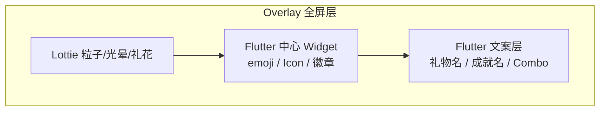

# 成就 / 礼物动效 Lottie 化设计

> SSOT：动效组件见 `lib/widgets/motion/`；礼物播放入口 `GiftAnimationManager`；成就通知 `AchievementUnlockNotification`。

## 1. 目标

| 目标 | 说明 |
|------|------|
| 设计可迭代 | 动效改 JSON，无需改 700 行 `CustomPaint` |
| 动态内容 | 礼物 emoji、成就名称仍来自后端/模型，不 baked 进 Lottie |
| 性能可控 | Web 降级、reduceMotion、体积上限 |
| 渐进迁移 | 保留 `LiveGiftEffect` 粒子作 fallback |

## 2. 现状

### 礼物（生产路径 · 2026-08 已落地 Hybrid）

```
GiftSelector → GiftAnimationManager
  ├─ GiftRunwayController（左侧连送跑道）
  └─ LottieGiftEffect（默认，FeatureFlags.useLottieGiftEffects）
       └─ 失败 / reduceMotion → LiveGiftEffect
```

- 分 4 档：`GiftLevel`（basic / medium / advanced / luxury），由 `price` 推导
- 模板：`assets/lottie/gifts/gift_burst_*.json`（`LottieMotionRegistry`）
- 播放器：`MoeLottieMotion`；打开礼物面板时 `precacheGiftLottie`
- 粒子路径 `LiveGiftEffect` / `OptimizedGiftAnimation` 仅作降级与历史参考

### 成就

| 组件 | 用途 |
|------|------|
| `AchievementUnlockNotification` | 生产：底部卡片通知 |
| `BadgeUnlockAnimation` | 演示页全屏弹窗 |

- 稀有度 `BadgeRarity`：common → legendary（5 档）
- 动效：弹性缩放 + 光晕 + 文案淡入，全手写 `AnimationController`

### Lottie 已有先例

- 依赖：`lottie: ^3.1.0`
- 资源：`assets/frames/Avatar Frame.json`
- 用法：`DynamicAvatar` 按 `frameId` 加载 `Lottie.asset`

---

## 3. 设计原则

### 3.1 模板化，不按 SKU 建文件

礼物目录来自后端，数量会增长。**不做**「每个礼物一个 JSON」。

采用：

```
粒子模板（按 GiftCategory / GiftLevel） + Flutter 文案层（礼物名 / Combo）
```

> **2026-03**：全屏礼物动效已移除中心 emoji，改用 `CategoryParticleClusterPainter`（见 `lib/widgets/motion/category_particle_vfx.dart`）。礼物选择器列表仍可用 emoji/icon 作缩略图。

### 3.2 混合合成（Hybrid Stack）



Lottie 负责**氛围**；Flutter 负责**业务数据**。

### 3.3 降级链

```
1. Lottie 模板（默认）
2. LiveGiftEffect（加载失败或 FeatureFlags.useLottieGiftEffects=false）
3. reduceMotion → LiveGiftEffect（内部已缩粒子 / 时长）
```

---

## 4. 资源目录规划

```
assets/lottie/
├── gifts/
│   ├── gift_burst_basic.json      # ~1.5s，8–12 粒子感
│   ├── gift_burst_medium.json     # ~2.0s
│   ├── gift_burst_advanced.json   # ~2.5s
│   └── gift_burst_luxury.json     # ~3.5s，全屏光晕
├── achievements/
│   ├── badge_unlock_common.json
│   ├── badge_unlock_uncommon.json
│   ├── badge_unlock_rare.json
│   ├── badge_unlock_epic.json
│   ├── badge_unlock_legendary.json
│   └── badge_toast_shine.json     # 通知条边缘流光（可选，loop）
└── shared/
    ├── confetti_burst.json        # 0.8s 一次性
    └── sparkle_particle.json      # 通用点缀
```

**体积预算**：单文件 ≤ 200KB（Bodymovin 导出后 `lottie-cli optimize`）。

**命名约定**：`{域}_{语义}_{档位}.json`，全小写 snake_case。

---

## 5. 礼物 Lottie 分镜（设计师交付 brief）

与现有 `OptimizedGiftAnimation` 时间轴对齐：

| 时间 | 画面 | Lottie | Flutter 层 |
|------|------|--------|------------|
| 0–15% | 礼物从下方飞入 | 拖尾 streak + scale | 中心 emoji scale 同步 |
| 15–60% | 悬浮呼吸 | 光晕 pulse + 轻微摇摆 | emoji + 分类色 shadow |
| 15–70% | 粒子爆发 | 径向粒子/星星 | — |
| 60–85% | 展示名称 | 粒子减弱 | 礼物名 FadeIn |
| 85–100% | 退出 | 整体 opacity↓ | Combo 标签同步淡出 |

### 分档差异

| GiftLevel | 时长 | Lottie 特征 |
|-----------|------|-------------|
| basic | 1.5s | 少量圆点、无全屏闪 |
| medium | 2.0s | 星星 + 爱心混排 |
| advanced | 2.5s | 双层粒子环 |
| luxury | 3.5s | 径向金光 + 屏幕边缘 flash（勿纯白刺眼） |

### 中心留白

- 画布 400×400，**中心 160×160 透明区**，供 Flutter 叠 emoji
- 品牌色参考：`#7F7FD5`、`#86A8E7`、`#F5F7FA`（`MoeTokens`）

### 颜色策略（二选一）

1. **推荐**：Lottie 用中性金/白粒子，外圈 `ColorFiltered` 染 `gift.color`
2. 进阶：Lottie 内建 Color Control，运行时 `LottieDelegates` 改色（维护成本高）

---

## 6. 成就 Lottie 分镜

### 6.1 全屏解锁（替换 `BadgeUnlockAnimation`）

| 时间 | 画面 |
|------|------|
| 0–40% | 徽章从 0 弹性放大 + 外环展开 |
| 20–70% | 稀有度光晕（common 灰 → legendary 金） |
| 50–80% | 星屑 / 丝带（epic+ 加强） |
| 60–100% | 文案区亮起（Flutter 渲染「🎉 徽章解锁」+ 名称） |

时长：**2.5s** 主动画 + 用户阅读停留（逻辑不变）。

### 6.2 底部通知（`AchievementUnlockNotification`）

轻量方案：

- 背景：`badge_toast_shine.json` loop（低 opacity）
- 徽章图：`AchievementBadgeMedallion`（现有 Flutter）
- 入场：保留 `MoeReveal`（已统一动效体系）

不必整条通知做成 Lottie，**只在 medallion 外围加一圈稀有度光效**即可。

### 稀有度 → 资源映射

| BadgeRarity | 资源 | 视觉关键词 |
|-------------|------|------------|
| common | `badge_unlock_common.json` | 银灰细环 |
| uncommon | `badge_unlock_uncommon.json` | 绿色叶形光点 |
| rare | `badge_unlock_rare.json` | 蓝色晶尘 |
| epic | `badge_unlock_epic.json` | 紫色星_burst |
| legendary | `badge_unlock_legendary.json` | 金色放射 + 慢速旋转光环 |

---

## 7. Flutter 架构（实现期）

### 7.1 注册表

```dart
// lib/widgets/motion/lottie_motion_registry.dart
abstract final class LottieMotionRegistry {
  static String giftBurst(GiftLevel level) => switch (level) { ... };
  static String achievementUnlock(BadgeRarity rarity) => switch (rarity) { ... };
  static String? giftOverride(String giftId) => null; // 二期 CDN
}
```

### 7.2 通用播放器

```dart
// lib/widgets/motion/moe_lottie_motion.dart
class MoeLottieMotion extends StatefulWidget {
  final String assetPath;
  final Duration? duration;
  final bool repeat;
  final Widget? centerChild;
  final Color? tintColor;
  final VoidCallback? onComplete;
  final Widget? fallback;
}
```

职责：

- `Lottie.asset` + `onLoaded` 同步 `AnimationController`
- `moeReduceMotion` → 直接 `fallback` 或 `centerChild`
- 加载失败 → `fallback`
- `centerChild` 居中 Stack

### 7.3 礼物改造点

```dart
// GiftAnimationManager 不变；替换 OptimizedGiftAnimation 内部实现
class LottieGiftAnimation extends StatelessWidget {
  // Stack: MoeLottieMotion + emoji + combo + name
}
```

保留 `OptimizedGiftAnimation` 为 `fallback` 参数默认值。

### 7.4 成就改造点

| 场景 | 改造 |
|------|------|
| `AchievementUnlockNotification` | medallion 外包 `MoeLottieMotion(repeat: true)` |
| `BadgeUnlockAnimation` | 全屏 `MoeLottieMotion` + 文案 Column |
| 演示页 `demo_features_page` | 无需改入口 |

---

## 8. 性能与无障碍

| 场景 | 策略 |
|------|------|
| 首次进入商城/直播 | `precacheLottie` 预载 `gift_burst_basic` + `badge_unlock_common` |
| Web | luxury 粒子 Lottie 降级为 advanced；禁止全屏 flash |
| reduceMotion | 跳过 Lottie，仅 `centerChild` + 150ms fade |
| 连送 Combo | 不叠加多个 Lottie 实例；队列逻辑保持 `GiftAnimationManager` |
| 内存 | 动画结束 `dispose` controller；同一模板复用 |

---

## 9. 后端扩展（二期，可选）

```protobuf
// gift catalog 可选字段
optional string lottie_asset = 20;  // 相对路径或 CDN URL

// achievement 可选字段  
optional string unlock_lottie = 15;
```

客户端优先级：`gift.lottie_asset` → `LottieMotionRegistry.giftBurst(level)` → fallback。

---

## 10. 迁移计划

| 阶段 | 内容 | 验收 |
|------|------|------|
| **A** | 目录 + `LottieMotionRegistry` + `MoeLottieMotion` + 四档 JSON | ✅ 已完成 |
| **B** | 礼物 hybrid + 左侧跑道，`FeatureFlags.useLottieGiftEffects` | ✅ 已完成 |
| **C** | 成就通知光晕接入 | 待做 |
| **D** | 设计师正式 JSON 同名替换 `assets/lottie/gifts/` | 待视觉评审 |
| **E** | 删除未引用粒子路径（保留 `LiveGiftEffect` fallback） | 待做 |
| **F** | 后端 `lottie_asset` 字段 | 单个礼物可定制 |

---

## 11. 设计师交付清单

- [ ] Figma 情绪板（Moe 紫蓝渐变、圆角、柔和阴影）
- [ ] 礼物 4 档分镜（与 §5 时间轴一致）
- [ ] 成就 5 档徽章环（中心留白给 medallion）
- [ ] `shared/confetti_burst.json`
- [ ] 导出 JSON + [Lottie Optimizer](https://github.com/airbnb/lottie-web) 压缩
- [ ] 预览：深色/浅色背景各一张截图
- [ ] 交附 `duration_ms` 元数据（README 或同名 `.meta.json`）

### 占位资源来源（开发阶段）

开发 A 阶段可暂用：

- [LottieFiles - Gift](https://lottiefiles.com/search?q=gift&category=animations)
- [LottieFiles - Trophy / Badge](https://lottiefiles.com/search?q=trophy&category=animations)
- [LottieFiles - Confetti](https://lottiefiles.com/search?q=confetti&category=animations)

选用要求：中心区域无关键图形、可循环段清晰、商业许可允许嵌入 App。

---

## 12. 与现有动效体系关系

```
MoeReveal / MoeRevealOnce     → 入场、列表
MoePressable                  → 交互
MoeLottieMotion（新增）       → 高表现力庆祝动效
OptimizedGiftAnimation        → fallback，E 阶段瘦身
```

新页面禁止再写礼物/成就粒子 `CustomPaint`。
