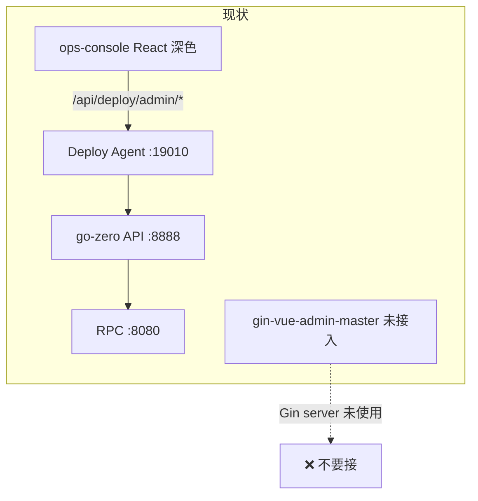

# Moe Admin：前端路线与 gin-vue-admin 整合说明（历史）

> **2026-05**：已选定 **React `moe-admin/`**；仓库内 `gin-vue-admin-master/` 已删除。  
> 仍可借鉴的能力见 **[gva-reference.md](./gva-reference.md)**。  
> 后端固定：**go-zero + Deploy Agent**（不变）。

---

## 0. 路线选择（2025-05 建议）

| | **路径 A：继续 React（推荐）** | **路径 B：迁 Vue（gin-vue-admin）** |
|---|-------------------------------|-------------------------------------|
| 目录 | 沿用并重构 **`ops-console/`** | 新建 **`moe-admin/web/`**，从 GVA 拷壳 |
| 已有投入 | P0 已做：登录、用户、反馈、Agent 代理 | 要从零移植 ops-console 全部页面 |
| 样式 | 在 React 里做 **浅色管理台**（对齐 GVA 布局即可，可用 Ant Design / 自写 CSS） | 直接用 Element Plus 浅色 |
| GVA 里 spikes/coupons 等 | **当 UI/交互参考**，不删也行，**不要接它的 Gin API** | 可 **保留菜单**，后续改成你的业务页 |
| 适合你如果 | 想 **专属 Moe Admin**、少换栈、尽快能用 | 团队更熟 Vue、愿意接受一轮移植 |

**结论：不是「不用 React 了」。** 更省事的是 **React 重构 ops-console**（换壳 + 补菜单），gin-vue-admin 当作 **设计稿/组件参考**，而不是把整个仓库改成 Vue。

---

## 1. 结论（两种路径都适用）

| 问题 | 答案 |
|------|------|
| 还用 React 吗？ | **可以，且建议继续用**（路径 A）。 |
| 能把整个 `gin-vue-admin-master` 改名直接用吗？ | **不能接它的 `server/`（Gin）**；前端可当模板库保留。 |
| 要删光 GVA 里所有菜单吗？ | **不必**。与 Moe 无关的页可先留着占位，后续改成用户/反馈/公告等。 |
| 合并什么？ | **管理台 UI + 调现有 `/api/admin/*` 与 `/api/deploy/*`**；后端契约不变。 |

---

## 2. 当前仓库三件套关系



| 目录 | 技术 | 作用 | 整合后 |
|------|------|------|--------|
| `backend/` | go-zero | 真实业务与 `admin_account` | **保留** |
| `backend/deploy/` | Go Agent | 网关、构建发布、Admin 代理 | **保留** |
| `ops-console/` | React + Vite | Moe Admin P0（登录/用户/反馈/运维） | **路径 A：继续演进** |
| `gin-vue-admin-master/` | Gin + Vue 全套 | 模板/参考菜单与 CRUD 页 | **路径 B：或保留参考不删** |

---

## 3. 路径 A 目标结构（React 重构，推荐）

在 **`ops-console/`** 内演进，改名为对外品牌 **Moe Admin** 即可（目录可仍叫 ops-console，或日后 rename `moe-admin/`）：

```
ops-console/                 # 或将来 rename → moe-admin/
  src/
    layout/                  # 重做：侧栏 + 顶栏（浅色，参考 GVA）
    pages/
      login/                 # 已有 LoginPage，改样式
      dashboard/             # 工作台
      moe/                   # 业务：用户、反馈、公告…
      ops/                   # 运维：构建、Docker、RPC（现有页迁入子目录）
    api/                     # adminClient、deployClient（已有）
    styles/moe-admin.scss    # 主色 #7F7FD5，覆盖深色 ops-theme
```

**重构内容（不是换框架）：**

1. 去掉深色 `ops-theme`，换成浅色布局（侧栏白底、卡片、Element 风格间距）。  
2. 菜单集中在一个配置文件（类似 GVA 动态菜单，v1 可先写死）。  
3. 保留现有 **Admin API / Deploy Agent** 调用，只改 UI。  
4. `gin-vue-admin-master`：**对照它的 login、layout、表格页截图改 React**，不必复制 Vue 代码。

---

## 4. 路径 B 目标结构（Vue，可选）

若选 Vue，建议放在 **`moe-admin/web/`**，不要继续叫 `gin-vue-admin-master`：

```
moe-admin/
  README.md
  web/                    # 来自 gin-vue-admin 的 web，已瘦身
    src/
      view/
        login/            # 改文案/Logo → Moe Admin
        layout/           # 侧栏、顶栏（浅色）
        dashboard/        # 工作台
        moe/              # ★ 新建：Moe 业务页
          users/
          feedback/
        ops/              # ★ 新建：从 ops-console 移植的运维页
          deploy/
          docker/
          build/
          jobs/
          rpc/
      api/
        admin.js          # 调 /api/deploy/admin/* 或直连 :8888
        deploy.js
      utils/request.js    # x-token → X-Admin-Token
    vite.config.js        # 代理到 :19010
  # 不要 server/（Gin）
```

**命名**：`package.json` → `"name": "moe-admin"`，登录页标题 **Moe Admin**，主题色对齐 App **`#7F7FD5`**（Element Plus CSS 变量覆盖）。

`gin-vue-admin-master/` 整合完成后可：

- 删除整个目录，或  
- 改名为 `gin-vue-admin-master.archived/` 仅作对照。

---

## 5. 不是「语法转换」，是「契约不变 + UI 重写」（路径 B 时）

### 4.1 保持不变（已做好，勿动）

- `POST /api/admin/login` → `X-Admin-Token`
- `GET /api/admin/me`、`/dashboard`、`/users`、`/landing/feedback`
- Deploy：`/api/deploy/*`（Token）、Agent 转发
- `admin_account` 表与 `backend/config/config.yaml` 的 `admin.*`

### 4.2 需要在 Vue 里重写（对照 ops-console）

| ops-console (React) | moe-admin (Vue) | API |
|---------------------|-----------------|-----|
| `LoginPage.tsx` | `view/login/index.vue` | `POST .../admin/login` |
| `DashboardPage.tsx` | `view/dashboard/index.vue` | `GET .../admin/dashboard` |
| `UsersPage.tsx` | `view/moe/users/index.vue` | `GET/PUT .../admin/users` |
| `FeedbackPage.tsx` | `view/moe/feedback/index.vue` | `GET .../admin/landing/feedback` |
| `OverviewPage` 等运维 | `view/ops/*.vue` | `/api/deploy/*` |
| `AdminAuthContext` | `pinia/modules/admin.js` | localStorage token |
| `adminClient.ts` | `api/admin.js` + axios | 同路径 |

### 4.3 gin-vue-admin 要改的请求层

上游 `request.js` 使用 `x-token` + Gin 的 `baseURL`。Moe 需改为：

```js
// 示例：管理员接口
headers['X-Admin-Token'] = adminStore.token
// baseURL：开发时 VITE_AGENT_URL=http://127.0.0.1:19010
// 路径：/api/deploy/admin/login?target=local
```

登录接口 **不要** 调 Gin 的 `/base/login`。

---

## 6. 样式：浅色管理台（两路径共同目标）

| 项 | ops-console | gin-vue-admin / Moe Admin |
|----|-------------|---------------------------|
| UI 库 | 自写 CSS 深色 | **Element Plus** 浅色 |
| 侧栏 | 深色 `#1a1d24` | 白/浅灰 + 品牌色 active |
| 登录 | 深色卡片 | 白底 + 蓝色渐变（可改成紫色 `#7F7FD5`） |

- **路径 A（React）**：弱化/替换 `ops-theme.css` 深色，用 SCSS 变量实现 GVA 同款浅色。  
- **路径 B（Vue）**：Element Plus + `moe-theme.scss`，主色 `#7F7FD5`。

---

## 7. 与 Deploy Agent 的托管关系

当前 Agent 挂载 **`ops-console/dist` → `/ops/`**（见 `backend/deploy/handler/devhub.go`）。

整合完成后二选一：

| 方案 | 做法 |
|------|------|
| **A（推荐）** | Agent 改为挂载 `moe-admin/web/dist`，路径仍 `/ops/` 或改为 `/admin/` |
| **B** | 过渡期两个 dist 并存，`/ops/` 旧 React，`/admin/` 新 Vue |

Makefile 中 `ops-console-build` 逐步改为 `moe-admin-build`。

---

## 8. 分阶段实施

### 路径 A（React 重构）— 推荐

| 阶段 | 内容 |
|------|------|
| A1 | 浅色 layout（侧栏/顶栏/内容区），登录页对齐 GVA 风格 |
| A2 | 菜单配置化；业务页：工作台、用户、反馈（已有逻辑接新壳） |
| A3 | 运维页统一进 `pages/ops/`，Deploy Token 设置保留 |
| A4 | 文档与品牌统一为 **Moe Admin**；`gin-vue-admin-master` 仅作参考 |

### 路径 B（Vue 迁移）— 可选

#### Phase 0：瘦身 + 改名（1 天）

- [ ] 新建 `moe-admin/web`，从 `gin-vue-admin-master/web` 复制
- [ ] （可选）删除无关业务；**也可保留**，后续改成 Moe 的 CRUD 页
- [ ] 删除整个 `gin-vue-admin-master/server`（或不再纳入 git）
- [ ] `package.json` name → `moe-admin`，登录文案 → Moe Admin

### Phase 1：管理员 P0 迁 Vue（2–3 天）

- [ ] 登录 / me / pinia
- [ ] 工作台、用户列表、官网反馈
- [ ] Vite 代理 + CORS（与现 ops-console 一致）
- [ ] Agent 可挂载新 dist 做联调

### Phase 2：运维模块迁 Vue（按需）

- [ ] 构建 / Docker / 发布 / 任务 / RPC 监控
- [ ] Deploy Token 设置页

### Phase 3：下线 ops-console

- [ ] 文档与 `make admin` 改为 `moe-admin`
- [ ] 删除 `ops-console/` 或标 archived

---

## 9. 不建议的做法

1. **把 gin-vue-admin 的 Gin `server/` 跑起来当 Moe 后端** — 双后端、双用户表、与 App 数据分裂。  
2. **用工具自动 TSX → Vue** — 事件、状态、路由都不同，返工更多。  
3. **保留 gin-vue-admin 的 Casbin/菜单代码生成** — v1 已约定简化鉴权，菜单可先 **前端写死**（与现 `menu.ts` 一样）。  
4. **路径 B 却不删 Gin `server/` 又跑双后端** — 数据与登录分裂。

---

## 10. 开发时怎么跑

与现在相同，只是前端目录换成 `moe-admin/web`：

| 终端 | 命令 |
|------|------|
| 1 | `go run ./rpc/super.go -f rpc/etc/super.yaml` |
| 2 | `go run ./api/super.go -f api/etc/super.yaml` |
| 3 | `make deploy-agent` |
| 4 | `cd moe-admin/web && npm run serve` |

浏览器：`http://127.0.0.1:5173`（或 GVA 默认端口），Vite 代理 `/api` → `:19010`。

---

## 11. 相关文档

- [moe-admin-platform-design.md](./moe-admin-platform-design.md) — 产品与 API 设计（仍有效）
- [moe-admin.md](./moe-admin.md) — 当前 React 版启动说明（迁移期仍适用）
- [ops-console/README.md](../../ops-console/README.md)

---

**下一步（需你确认）**：

- **路径 A**：在 `ops-console` 做浅色 layout 重构（保留 React，接现有 Admin API）。  
- **路径 B**：执行 Vue Phase 0，从 GVA 拷 `web/`，保留菜单后续再改。

默认建议先 **路径 A**，除非你更想长期用 Vue + Element Plus。
