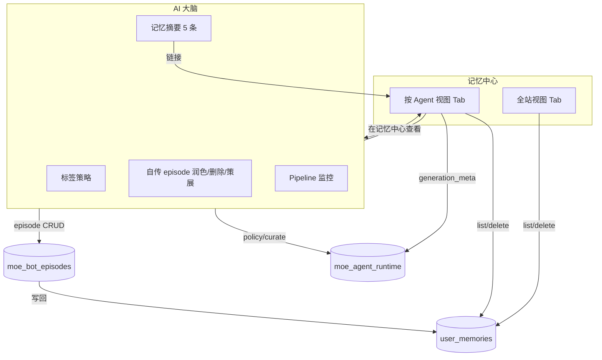

# Moe Admin · 记忆中心设计方案（方案 C）

> **状态**：设计稿（待实现）  
> **范围**：仅 `moe-admin` 前端信息架构与页面合并；**后端 API 保持两套，不合并**  
> **参考**：[`TagsCenterPage`](../../moe-admin/src/pages/TagsCenterPage.tsx)（Tab 工作台）、[`PlatformPage` 记忆 Tab](../../moe-admin/src/pages/PlatformPage.tsx)、[`MoeBrainPage`](../../moe-admin/src/pages/MoeBrainPage.tsx)

---

## 1. 背景与目标

### 1.1 现状问题

| 入口 | 位置 | 能力 |
|------|------|------|
| **记忆治理** | 系统管理 → 平台治理 → Tab「记忆治理」 | 全站 `user_memories` 列表、统计、删除 |
| **AI 大脑 · 记忆库** | AI 与玩法 → AI 大脑 → 侧栏「记忆库」 | 单 Bot 的 `bot_post:*` / `bot_episode` 子集，只读 |

同一批 Bot 自传记忆（如 `bot_post:49`）可在两处看到，但删除只能回平台治理；运营不清楚「该去哪」。

### 1.2 设计目标

1. **侧栏只保留一个记忆入口**：「记忆中心」
2. **页内两个 Tab**：全站视图 / 按 Agent 视图
3. **AI 大脑保留**，专注生成策略、自传 episode、Pipeline；记忆运维统一到记忆中心
4. **零后端契约变更**：继续调用现有 Admin Memory API + Moe Brain API

### 1.3 非目标（本阶段不做）

- 不合并 `AdminListMemories` 与 `AdminGetMoeBrain` 为单一后端接口
- 不把 AI 大脑整页并入记忆中心
- 不迁移 `memory-system-dashboard.html`（DevTools 监控仍走外链）

---

## 2. 信息架构

### 2.1 侧栏变更

**新增**（`AI 与玩法` 分组内，放在「社区 AI Bot」与「AI 大脑」之间）：

| 字段 | 值 |
|------|-----|
| label | 记忆中心 |
| to | `/app/memory-center` |
| icon | 🧠 或 🗂️（与 AI 大脑 🧠 区分，建议 🗂️） |
| status | ready（实现后） |
| appDomain | memory / moe |

**调整**：

| 原入口 | 变更 |
|--------|------|
| 平台治理 · Tab「记忆治理」 | **移除 Tab**；概览卡片保留「记忆条目」统计 + 链接到记忆中心 |
| AI 大脑 · 侧栏「记忆库」面板 | **缩为摘要**（最近 5 条 + 「在记忆中心查看全部」） |
| 数据地图 `user_memories` 快捷操作 | 指向 `/app/memory-center?tab=platform` |

**保留不变**：

- **AI 大脑**侧栏项 → `/app/moe-brain?agent=...`（策略 / episode / Pipeline）
- 侧栏外链「记忆系统监控」→ DevTools

### 2.2 路由

```
/app/memory-center                    默认 tab=platform
/app/memory-center?tab=platform       全站视图
/app/memory-center?tab=agent          按 Agent 视图
/app/memory-center?tab=agent&agent=moe_guide&user_id=123
```

**兼容重定向**（`App.tsx`）：

| 旧 URL | 新 URL |
|--------|--------|
| `/system/platform?tab=memory` | `/app/memory-center?tab=platform`（保留 `user_id` query） |
| `/system/platform?tab=memory&user_id=X` | `/app/memory-center?tab=platform&user_id=X` |

---

## 3. 页面结构

### 3.1 页面类型

按 [`page-layout-rules.md`](../../moe-admin/docs/page-layout-rules.md) 归类为 **列表工作台页 + Tab 切换**（同「统一标签中心」）。

使用 `TabbedPageLayout`：

```tsx
const TABS = [
  { key: 'platform', label: '全站视图', hint: '所有用户记忆条目' },
  { key: 'agent', label: '按 Agent 视图', hint: 'Bot 自传记忆与注入预览' },
]
```

### 3.2 页面线框

```
┌─────────────────────────────────────────────────────────────────┐
│ 记忆中心                                                         │
│ 用户长期记忆数据运维 · 全站检索与 Bot 自传记忆                    │
│ [指标] 总条数 | 有记忆用户数 | 向量数 | Bot 记忆条数(可选)        │
├─────────────────────────────────────────────────────────────────┤
│ [ 全站视图 ]  [ 按 Agent 视图 ]                                  │
├─────────────────────────────────────────────────────────────────┤
│  … Tab 内容 …                                                    │
└─────────────────────────────────────────────────────────────────┘
```

### 3.3 Tab A · 全站视图

**来源**：自 `PlatformPage` 记忆 Tab **抽取**为独立组件，行为 1:1 迁移。

| 区块 | 内容 |
|------|------|
| 摘要 | `getMemoryStats()`：总条数、用户数、向量数、`by_type` 标签 |
| 工具条 | 用户 ID、key/内容关键词、`memory_type` 下拉（可选增强） |
| 主表格 | `listMemories()` 分页列表 |
| 行操作 | 删除 → `deleteMemory(id)`；用户列链到 `/users` |
| 增强（P1） | `bot_post:*` 行显示「在 Agent 视图打开」→ 带 `agent` 推断或 `user_id` |

**Query 参数**：

| 参数 | 说明 |
|------|------|
| `user_id` | 预填用户筛选 |
| `keyword` | 预填搜索（可选） |
| `memory_type` | 预填类型（可选） |
| `page` | 分页 |

**API（不变）**：

- `GET /api/admin/memories/stats` → `client.getMemoryStats()`
- `GET /api/admin/memories` → `client.listMemories()`
- `DELETE /api/admin/memories/:id` → `client.deleteMemory()`

### 3.4 Tab B · 按 Agent 视图

**定位**：以 **Bot 运营视角** 看记忆，不是 AI 大脑的策略工作台。

```
┌──────────────────────────────────────────────────────────────────┐
│ Agent  [ moe_guide ▼ ]   Bot 用户 #49   [ 打开 AI 大脑 → ]        │
├───────────────────────────────┬──────────────────────────────────┤
│ 记忆列表（可删）               │ 注入预览                          │
│ user_id = bot_user_id         │ MemoryInfluencePanel             │
│ 默认 filter: bot_post /       │ generation_meta from getMoeBrain │
│   bot_episode                 │                                  │
│ listMemories + deleteMemory   │                                  │
├───────────────────────────────┴──────────────────────────────────┤
│ 快捷： [ 在全站视图中查看该 Bot 用户 ]  [ 去 AI 大脑润色自传 ]    │
└──────────────────────────────────────────────────────────────────┘
```

| 区块 | 数据源 | 说明 |
|------|--------|------|
| Agent 选择器 | `listMoeRuntimes()` | 与 AI 大脑共用 agent 列表 |
| 记忆表格 | `listMemories({ user_id: bot_user_id })` | **可删除**（补齐 AI 大脑只读缺口） |
| 类型筛选 | 默认 `bot_post` 前缀或 `memory_type=bot_episode` | 与 `pkg/moe/brain/snapshot.go` 过滤一致 |
| 注入预览 | `getMoeBrain(agent).generation_meta` | 复用 `MemoryInfluencePanel` |
| 交叉链接 | — | → `/app/moe-brain?agent=X`；→ Tab A + `user_id` |

**API（不变，两套并行）**：

- `GET /api/admin/moe/runtimes` → agent 列表
- `GET /api/admin/moe/brain/:agent` → `generation_meta`、可选 episodes 计数摘要
- `GET /api/admin/memories?user_id=` → 列表与删除

> **设计原则**：Agent Tab 的列表以 **Memory API** 为准（可 CRUD）；Brain API 只负责 **策略上下文与注入 meta**，避免双写 UI 状态。

---

## 4. 与 AI 大脑的分工



| 能力 | 记忆中心 | AI 大脑 |
|------|----------|---------|
| 全站跨用户检索 | ✅ Tab A | ❌ |
| 按 Bot 删记忆 | ✅ Tab B | ❌（仅 episode） |
| 标签策略 forbidden/preferred | ❌ | ✅ |
| Episode 润色 / 策展 / 试跑 | ❌ | ✅ |
| Pipeline / 推理状态 | ❌ | ✅ |
| 记忆注入 prompt 预览 | ✅ Tab B | ✅ 侧栏摘要 |

---

## 5. 组件与文件规划

```
moe-admin/src/
├── pages/
│   └── MemoryCenterPage.tsx          # 路由页，Tab 路由与 metrics
├── components/memory/
│   ├── MemoryPlatformTab.tsx         # 自 PlatformPage 抽取
│   ├── MemoryAgentTab.tsx            # Agent 选择 + 双栏
│   └── MemoryStatsStrip.tsx          # 共用统计条（可选）
├── config/menu.ts                    # 新增菜单项
├── App.tsx                           # 路由 + 重定向
└── lib/schemaActions.ts              # user_memories → 记忆中心
```

### 5.1 `PlatformPage` 瘦身

- 删除 `memory` Tab 及关联 state/load 逻辑
- 概览 Tab 保留记忆统计卡片，「查看全部」→ `/app/memory-center`
- `TABS` 改为 4 项：概览 / 连接 / 图库 / 数据地图

### 5.2 `MoeBrainPage` 瘦身

- 「记忆库」全表 → **最近 5 条** + 按钮「在记忆中心查看 →」
- 链接：`/app/memory-center?tab=agent&agent=${agentKey}`

---

## 6. URL 与深链约定

| 场景 | URL |
|------|-----|
| 从用户列表进某用户记忆 | `/app/memory-center?tab=platform&user_id={id}` |
| 从 AI 大脑看 Bot 全部记忆 | `/app/memory-center?tab=agent&agent={key}` |
| 从全站视图跳到 Agent | `/app/memory-center?tab=agent&user_id={bot_user_id}`（Agent Tab 反查 runtime） |
| 从 Agent 视图去润色 | `/app/moe-brain?agent={key}` |
| 数据地图快捷操作 | `/app/memory-center?tab=platform` |

---

## 7. 实现分期

### Phase 1 · MVP（1–2 PR）

- [ ] 新增 `MemoryCenterPage` + `MemoryPlatformTab`（迁移现有 UI）
- [ ] 新增 `MemoryAgentTab`（agent 选择 + `listMemories` + 删除 + `MemoryInfluencePanel`）
- [ ] `menu.ts` 增加「记忆中心」；`App.tsx` 路由与 `platform?tab=memory` 重定向
- [ ] `PlatformPage` 移除 memory Tab；`schemaActions` 更新链接
- [ ] `MoeBrainPage` 记忆库改为摘要 + 深链
- [ ] `npm run build` 通过

### Phase 2 · 体验

- [ ] Tab A：`memory_type` 筛选、`bot_post:*` 行级「Agent 视图」
- [ ] Tab B：`listMemories` 与 `getMoeBrain.memories` 差异提示（key 对齐状态）
- [ ] 概览 metrics：Dashboard / Platform 概览卡片统一链到记忆中心

### Phase 3 · 可选（仍不改后端契约）

- [ ] Agent Tab 嵌入「最近 episode」只读表（数据仍来自 `getMoeBrain`，链到 AI 大脑操作）
- [ ] 与 DevTools 监控台互链（外链）

---

## 8. 验收标准

1. 侧栏仅 **一个** 记忆运维入口「记忆中心」，平台治理无记忆 Tab
2. 全站视图：与原记忆治理功能等价（统计、搜索、分页、删除）
3. Agent 视图：选定 agent 后可列出并删除该 Bot 用户记忆；可看到注入 meta
4. 旧 URL `/system/platform?tab=memory` 自动跳转，query 不丢
5. AI 大脑仍可独立完成策略 / episode / Pipeline；记忆库有到记忆中心的深链
6. 无新增 `/api/admin/*` 路由

---

## 9. 相关文档

| 文档 | 关系 |
|------|------|
| [用户记忆系统-OpenClaw式演进设计.md](./用户记忆系统-OpenClaw式演进设计.md) | 记忆架构 SSOT |
| [Moe-Intelligence-Stack-v1.md](./Moe-Intelligence-Stack-v1.md) | AI 大脑 / Bot episode |
| [moe-admin-menu-map.md](./moe-admin-menu-map.md) | 菜单对照（实现后更新） |
| [page-layout-rules.md](../../moe-admin/docs/page-layout-rules.md) | 页面模板 |

---

## 10. 变更摘要（给实现 PR 用）

**菜单**：`AI 与玩法` 下新增「记忆中心」；「AI 大脑」保留。  
**平台治理**：去掉记忆 Tab，概览保留统计跳转。  
**新页**：`/app/memory-center`，Tab `platform` | `agent`。  
**后端**：无变更。
