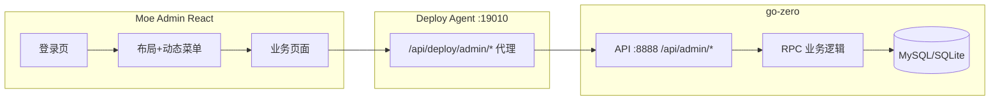
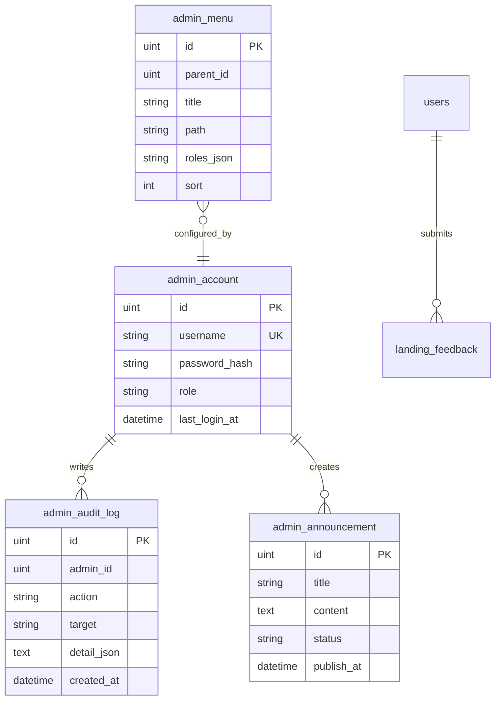

# Moe Admin 完整后台设计方案

> 目标：做出与 **gin-vue-admin 同级能力** 的专用管理后台，但技术栈固定为 **go-zero + RPC + React（ops-console）**，只服务 Moe Social 本项目。  
> 原则：**登录进后台即可用**；业务管理接口走 `/api/admin/*`，**不要求 App 用户 JWT**，也不做 Casbin 级复杂鉴权（v1）。

---

## 1. 产品定位

| 维度 | 说明 |
|------|------|
| 用户 | 运营 / 开发者（你本人或小团队） |
| 入口 | `http://127.0.0.1:19010/ops/`（Deploy Agent 托管 React） |
| 数据环境 | 顶栏切换 **本机 API** / **云端 API**（已有） |
| 与 App 关系 | 管理 App 用户与内容，**不替代** App 登录体系 |



---

## 2. 鉴权设计（简化版）

### 2.1 不做的事（v1）

- 不接 App 的 `Authorization: Bearer` 用户 JWT  
- 不做 Casbin / 细粒度 API 权限表  
- 不要求 Deploy Token 才能看业务数据（Deploy Token **仅**用于构建/发布/Docker）

### 2.2 要做的事

**仅一种登录：管理员账号 + 密码 → 管理员会话**

| 项目 | 设计 |
|------|------|
| 账号表 | 新建 `admin_account`（与 App `users` 分离，避免混用） |
| 登录 | `POST /api/admin/login` → 返回 `admin_token`（专用 JWT 或随机 session id） |
| 鉴权头 | `X-Admin-Token: <token>`（或 HttpOnly Cookie，推荐 Header 便于 Agent 代理） |
| 有效期 | 例如 24h，可配置 `admin.session_expire_hours` |
| 中间件 | 仅 `@server(group: admin)` 下 **需登录** 的路由校验 `X-Admin-Token` |
| 公开 | `POST /api/admin/login`、`GET /api/admin/captcha`（可选） |

**管理员角色（v1 两级即可）**

| 角色 | 说明 |
|------|------|
| `super_admin` | 全部菜单 + 管理员账号管理 + 菜单配置 |
| `admin` | 业务运营：用户/公告/反馈/通知，无系统配置 |

> App 用户表已有 `users.role`（`user/admin/super_admin`），那是 **App 侧身份**，与 `admin_account` 分开；避免一人两套密码逻辑缠在一起。

### 2.3 配置示例（`backend/config/config.yaml`）

```yaml
admin:
  jwt_secret: "单独的管理员密钥-勿与-auth.access_secret-混用"
  token_expire_hours: 24
  # 首个超管（仅首次启动无账号时由 -migrate 种子写入，之后改库或后台改密）
  bootstrap:
    username: "admin"
    password: "请首次登录后立即修改"
```

### 2.4 安全边界（部署）

| 环境 | 建议 |
|------|------|
| 本机开发 | `127.0.0.1` 访问，无 Admin Token 也可仅限内网 |
| 公网 VPS | **/admin 接口不对公网开放** 或 Nginx IP 白名单 + HTTPS；管理台仅 VPN/SSH 隧道访问 |

---

## 3. 功能模块（对标 gin-vue-admin）

### 3.1 模块总览

| 一级菜单 | 子功能 | 优先级 | 后端 | 前端 |
|----------|--------|--------|------|------|
| **工作台** | 统计卡片、服务健康、快捷入口 | P0 ✅部分已有 | `GET /api/admin/dashboard` | `DashboardPage` |
| **用户管理** | 列表/搜索/详情/禁用/VIP/角色 | P0 | 新增 admin 用户 API | `UserListPage` `UserDetailPage` |
| **官网反馈** | 列表/筛选/详情 | P0 ✅已有 | `GET /api/ops/landing/feedback` → 迁到 `/api/admin/landing/feedback` | `FeedbackPage` |
| **公告管理** | 富文本公告、上下线、置顶 | P1 | 新表 + CRUD | `AnnouncementPage` |
| **通知推送** | 全员广播、指定用户 | P1 | 复用/封装 `broadcast` | `NotifyBroadcastPage` |
| **内容 moderation** | 帖子列表/隐藏/删除 | P2 | 封装现有 post RPC | `PostModerationPage` |
| **菜单管理** | 侧栏菜单 CRUD、排序、按角色可见 | P1 | `admin_menu` 表 | `MenuManagePage` |
| **管理员** | 管理员账号 CRUD、改密 | P1 | `admin_account` | `AdminAccountPage` |
| **操作日志** | 谁在何时做了什么 | P2 | `admin_audit_log` | `AuditLogPage` |
| **运维部署** | 构建/Docker/发布/任务 | 已有 | Deploy Agent `/api/deploy/*` | 现有页面 |
| **RPC 监控** | debug 面板 | 已有 | `/debug/*` 代理 | `RpcPage` |

### 3.2 用户管理（详细）

**列表** `GET /api/admin/users`

| 参数 | 说明 |
|------|------|
| page, page_size | 分页 |
| keyword | 用户名 / 邮箱 / moe_no 模糊 |
| role | user / admin / super_admin（App 角色） |
| is_vip | 可选筛选 |

**详情** `GET /api/admin/users/:id`

**更新** `PUT /api/admin/users/:id`

| 字段 | 运营可改 |
|------|----------|
| role | ✅（慎用） |
| is_vip, vip_end_at | ✅ |
| signature, avatar | 可选 |
| 禁用 | `status` 或 `deleted_at` 软封禁（需新增 `users.status` 或用现有 DeletedAt） |

**不复用** 对外 `GET /api/users`（无统一鉴权）；管理专用接口字段可更多（含 feishu_email、注册时间等）。

### 3.3 公告管理（详细）

新表 `admin_announcement`：

| 字段 | 类型 | 说明 |
|------|------|------|
| id | uint | PK |
| title | string | 标题 |
| content | text | Markdown 或 HTML |
| status | enum | `draft` / `published` / `archived` |
| priority | int | 置顶权重 |
| publish_at | time | 定时发布 |
| expire_at | time | 可选下线时间 |
| target | string | `all` / `app_home` / `login_popup` |
| created_by | uint | admin_account.id |
| created_at, updated_at | | |

**App 侧读取**（后续）：`GET /api/public/announcements` 只返回已发布且在有效期内 — 与后台解耦。

**后台 API**

- `GET/POST /api/admin/announcements`
- `GET/PUT/DELETE /api/admin/announcements/:id`
- `POST /api/admin/announcements/:id/publish`

### 3.4 菜单管理（详细）

新表 `admin_menu`（驱动 **Moe Admin 前端侧栏**，不是 App 底部 Tab）：

| 字段 | 说明 |
|------|------|
| id | |
| parent_id | 0 = 顶级 |
| title | 显示名 |
| path | 如 `/users`、`/feedback` |
| icon | 可选 emoji / 图标名 |
| sort | 排序 |
| roles | JSON 数组 `["super_admin","admin"]` 可见角色 |
| hidden | 是否在侧栏隐藏 |

**流程**

1. 登录后 `GET /api/admin/menus` → 按当前管理员角色过滤 → 前端 `react-router` 动态注册（或静态路由 + 菜单过滤）  
2. super_admin 在「菜单管理」页改库 → 下次登录生效  

v1 可 **半动态**：路由仍在前端写死，菜单表只控制显示/排序；v2 再做到全动态组件加载。

### 3.5 官网反馈 / 通知

- **反馈**：已有 `landing_feedbacks`，将列表接口统一前缀为 `/api/admin/landing/feedback`（保留旧路径别名一期）。  
- **通知**：封装 `POST /api/admin/notifications/broadcast`，内部调现有 RPC，body 简化为 `{ title, content, user_ids? }`。

---

## 4. API 规范

### 4.1 路径与分组

所有管理接口：`/api/admin/...`  
在 `super.api` 使用：

```api
@server (
  group: admin
)
// 无需 jwt: Auth
```

登录接口单独：

```api
@server (group: admin_public)
service Super {
  @handler adminLogin
  post /api/admin/login (AdminLoginReq) returns (AdminLoginResp)
}
```

需登录接口在 handler 内或 go-zero middleware 校验 `X-Admin-Token`（**不要**与 App JWT 混用）。

### 4.2 统一响应（沿用现有）

```json
{
  "success": true,
  "code": 200,
  "message": "ok",
  "data": { }
}
```

### 4.3 Deploy Agent 代理（统一前缀）

| Agent 路径 | 转发到 API |
|------------|------------|
| `GET /api/deploy/platform/health` | Agent 本地聚合 |
| `GET /api/deploy/admin/*` | `GET /api/admin/*`（query 保留，加 `target=local\|cloud`） |

前端 **只请求 Agent**（`:19010`），不直连 `:8888`，避免 CORS、统一环境切换。

### 4.4 接口清单（v1 目标）

```
POST   /api/admin/login
POST   /api/admin/logout
GET    /api/admin/me

GET    /api/admin/dashboard

GET    /api/admin/users
GET    /api/admin/users/:id
PUT    /api/admin/users/:id

GET    /api/admin/landing/feedback

GET    /api/admin/announcements
POST   /api/admin/announcements
GET    /api/admin/announcements/:id
PUT    /api/admin/announcements/:id
DELETE /api/admin/announcements/:id
POST   /api/admin/announcements/:id/publish

POST   /api/admin/notifications/broadcast

GET    /api/admin/menus
POST   /api/admin/menus
PUT    /api/admin/menus/:id
DELETE /api/admin/menus/:id

GET    /api/admin/accounts          # super_admin
POST   /api/admin/accounts
PUT    /api/admin/accounts/:id
```

---

## 5. 数据模型（新增）



**迁移**：`rpc -migrate` 增加上述表；种子数据写入默认 super_admin + 默认菜单 JSON。

---

## 6. 前端架构（ops-console → Moe Admin）

### 6.1 目录规划

```
ops-console/src/
  api/
    adminClient.ts      # 所有 /api/deploy/admin/* 
    deployClient.ts     # 运维任务（保留）
  auth/
    AdminAuthContext.tsx
    RequireAdmin.tsx    # 路由守卫
  config/
    routes.tsx          # 静态路由表
    menu.fallback.ts    # 菜单拉取失败时的本地默认
  layout/
    AdminLayout.tsx     # 侧栏+顶栏+内容区
  pages/
    auth/LoginPage.tsx
    dashboard/DashboardPage.tsx
    users/UserListPage.tsx
    users/UserDetailPage.tsx
    feedback/FeedbackPage.tsx
    announcement/AnnouncementListPage.tsx
    announcement/AnnouncementEditPage.tsx
    system/MenuManagePage.tsx
    system/AdminAccountPage.tsx
    deploy/...          # 现有运维页
```

### 6.2 登录与路由

1. 未登录访问任意页 → 重定向 `/login`  
2. 登录成功 → `localStorage.moe_admin_token` + `AdminAuthContext`  
3. `adminClient` 自动带 `X-Admin-Token`  
4. 退出 → 清 token，调 `POST /api/admin/logout`（可选黑名单 session）

### 6.3 UI 规范

- 延续现有 `ops-theme.css` 暗色薰衣草主题（与 App 品牌一致）  
- 列表页：表格 + 分页 + 筛选条  
- 表单页：抽屉或独立页  
- 后续可引入 **TanStack Table** / 轻量组件库（如 shadcn 风格），不强制上 Ant Design（避免与 Flutter 栈无关的重依赖）

---

## 7. 与现有代码的关系

| 已有 | 处理 |
|------|------|
| `User.Role` | App 用户角色；管理台「用户管理」可修改，与 `admin_account.role` 无关 |
| `GET /api/users` | 保留给历史/调试；管理台改用 `/api/admin/users` |
| `GET /api/admin/dashboard` | 保留并扩展字段 |
| `GET /api/ops/landing/feedback` | 迁移别名到 `/api/admin/landing/feedback` |
| `POST /api/notification/broadcast` | 管理台封装一层 |
| Deploy Token | 仅 `pages/deploy/*` 使用 |

---

## 8. 实施分期

### P0（1–2 周）：能用的后台

- [ ] `admin_account` + 登录/登出/me + 中间件  
- [ ] 登录页 + 路由守卫  
- [ ] 用户管理列表/详情/编辑  
- [ ] 反馈列表迁入 admin 前缀 + Agent 通配代理  
- [ ] Dashboard 扩展统计  

### P1（2–3 周）：运营闭环

- [ ] 公告 CRUD + 发布  
- [ ] 菜单表 + 侧栏动态菜单 + 菜单管理页  
- [ ] 通知广播页  
- [ ] 管理员账号管理（super_admin）  

### P2（按需）：内容与审计

- [ ] 帖子/评论 moderation  
- [ ] `admin_audit_log` 自动记录写操作  
- [ ] App 拉公告接口 `GET /api/public/announcements`  

### P3（可选）：增强

- [ ] 图表统计（注册趋势、反馈趋势）  
- [ ] 导出 CSV  
- [ ] 双因素认证  

---

## 9. 启动方式（不变）

| 平台 | 命令 |
|------|------|
| macOS/Linux | `./scripts/start-admin.sh` |
| Windows | `scripts/start-admin.ps1` |
| 仅网关 | `cd backend && make deploy-agent` |

登录地址：**http://127.0.0.1:19010/ops/login**（实现 P0 后）。

---

## 10. 总结建议

| 问题 | 结论 |
|------|------|
| 用 gin-vue-admin 吗？ | **不用整套**；用 Moe Admin 专用实现 |
| 用 Vue 还是 React？ | **继续 React ops-console** |
| Token 很复杂吗？ | **只保留管理员登录 Token**；App JWT、Deploy Token 分离 |
| 菜单动态吗？ | **P1 上 DB 菜单**；路由 v1 可静态 + 菜单过滤 |
| 先做啥？ | **P0：登录 + 用户管理 + 反馈 + Dashboard** |

---

## 11. 请你确认的设计选择

实现前建议确认 3 点（回复即可按你的选择开工 P0）：

1. **管理员账号**：独立 `admin_account` 表 vs 复用 `users` 里 `role=admin` 的账号登录后台？（**推荐独立表**）  
2. **公告展示**：仅后台管理 + 以后 App 接口拉取，还是 v1 就要在 App 首页展示？  
3. **公网**：管理后台是否永远只本机/VPN 访问，还是将来需要 HTTPS 公网域名？

确认后按 **P0 → P1** 在 `backend/api/super.api`、`rpc/super.proto`、`ops-console` 分 PR 实现。
