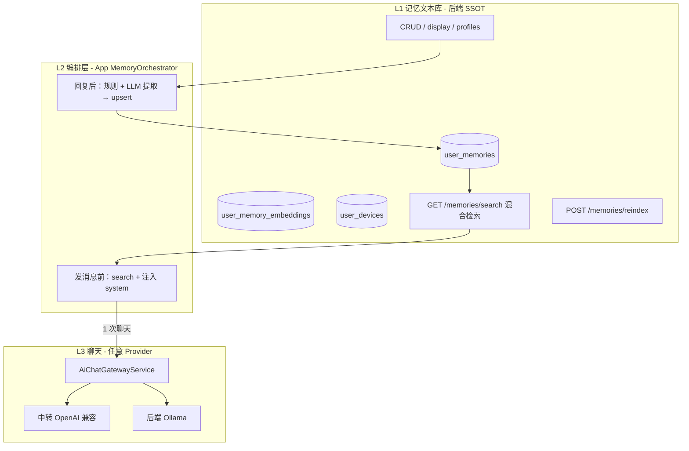
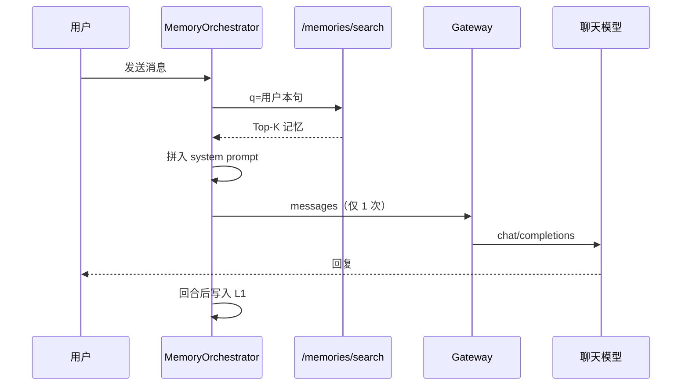

# 用户记忆系统：统一架构（SSOT）

> **文档定位**：记忆子系统唯一事实源，禁止并行多套方案。  
> **核心隐喻**：账号级 **记忆文本库**（后端 PostgreSQL），支持 **查询 / 写入 / 注入**；聊天模型只是消费者。  
> **变更清单**：[记忆系统-2026-05-20-变更整理.md](./记忆系统-2026-05-20-变更整理.md) · **导航**：[docs/index.html](../index.html)

---

## 1. 统一架构（仅此一套）

### 1.1 三层模型



| 层 | 职责 | 与模型关系 |
|----|------|------------|
| **L1 记忆文本库** | 存储、检索、展示、删除（**不含设备**） | **无关** |
| **设备登记** | `user_devices` + `POST/GET /devices` | **无关** |
| **L2 编排层** | 何时查、何时写、拼 prompt | **无关** |
| **L3 聊天** | 生成回复 | 只读已注入的上下文 |

### 1.2 两条「读」路径（不要混为一谈）

| 路径 | 默认 | 谁发起查询 | 聊天请求次数 |
|------|------|------------|--------------|
| **A. 编排层查询注入** | ✅ **默认** | `AiMemoryOrchestrator` 调 `GET /memories/search` | **+0**（合并进 1 次 chat 的 system） |
| **B. 高级：模型多轮 tools** | ❌ 默认关闭 | 模型通过 `tool_calls` 调 `memory_search` | **+1～3** 次中转 |

**记忆工具（路径 B）** = 对 L1 的 LLM 可调用封装，在 Flutter `AiToolRuntime` 执行：

| 工具 | 作用 |
|------|------|
| `memory_search` | 混合检索记忆库（与 search API 同口径） |
| `memory_get` | 按 key 精确读取 |
| `memory_save` | 写入/更新用户事实（`source=tool_call`） |
| `memory_list` | 画像摘要 + 记忆列表（可选 `query` 过滤） |
| `memory_read_daily` | 读今日/昨日日记层 |
| `memory_delete` | 按 key 删除（用户明确要求时） |

需在 Provider 开启 **支持 tool_calls**；默认仍走路径 A 自动注入。

### 1.3 一条「写」路径

| 步骤 | 实现 |
|------|------|
| 规则写入 | `MemoryHeuristicExtract`（昵称、偏好等）→ `upsert` |
| 标签写入 | `[记忆:xxx]` → `tag_extract` |
| LLM 写入 | 回合后提取 JSON → 优先**当前中转模型**，失败回退 Ollama → `llm_extract_client` |
| **日记层** | `daily_note:YYYY-MM-DD`（`observation`）每回合追加一行 |
| **压缩前 flush** | 自动摘要前：`pre_compact_flush` 规则 + 日记 + 异步 LLM |

全部写入 **L1 后端**，与聊天 Provider 无关。

### 1.4 OpenClaw 双层存储（已实现）

| 层 | OpenClaw | Moe Social |
|----|----------|------------|
| 精选长期 | `MEMORY.md` | `user_memory_profile_cache` + 高置信 KV |
| 工作日记 | `memory/YYYY-MM-DD.md` | `daily_note:YYYY-MM-DD` |
| 读顺序 | 精选 → 今/昨日记 → search | `ComposeBootstrap` / `_composeMemoryPrompt` 同序 |

---

## 2. API 契约（L1）

| 方法 | 路径 | 用途 |
|------|------|------|
| GET | `/api/user/:id/memories/search?q=&limit=` | **混合检索（SSOT）**：关键词 + 向量 |
| POST | `/api/user/:id/memories/reindex` | 全量重建向量索引（学习/运维） |
| GET | `/api/user/:id/memories/display` | UI 展示 |
| GET | `/api/user/:id/memories` | 原始列表 |
| POST | `/api/user/:id/memories` | upsert（拒绝 `device_sync`） |
| DELETE | `/api/user/:id/memories?key=` | 删除 |
| POST | `/api/user/:id/devices/sync` | 设备同步（独立于记忆表） |
| GET | `/api/user/:id/devices` | 设备列表 |

检索逻辑在后端 `HybridSearchUserFacingMemories`（关键词 + 向量余弦，可配置权重）；无向量时回退关键词。客户端与 `memory_search` / `memory_list?query=` **共用**。

### 2.1 Embedding 提供方（不偏向单一厂商）

| 策略 | 说明 |
|------|------|
| **默认链** | 先 **Ollama**（`ollama.base_url` + `memory.embedding.ollama_model`），再 **OpenAI 兼容中转**（`openai_base_url` + `openai_api_key` 或 `MOE_MEMORY_EMBED_API_KEY`） |
| **显式列表** | `memory.embedding.providers[]` 按 `priority` 升序覆盖默认链 |
| **学习效果** | 每条记忆 upsert 后 **异步** 更新向量；search 发现无索引时 **自动 rebuild**；亦可 `POST /memories/reindex` |

配置见 `backend/config/config.yaml` 的 `memory.search` / `memory.embedding` 段。

---

## 3. 默认对话流程（路径 A）



**不依赖**中转站 `tools` 参数；Ollama / Xbai / 任意 Provider 行为一致。

---

## 4. 高级选项（路径 B，默认关）

Provider 开关：**「高级：模型多轮工具检索」**（`supports_tool_calls`）。

- 开启且 API 支持 `tools`：`AiChatGatewayService` 多轮 `tool_calls` → `AiToolRuntime` → 仍调 L1 search/get。  
- 失败：降级为路径 A（仅注入，无额外轮次）。  
- **不推荐默认开启**：多 1～3 倍中转消耗；路径 A 已覆盖多数场景。

---

## 5. 模块目录（通用骨架）

| 目录 | 说明 |
|------|------|
| **`backend/pkg/memory/`** | **L1 域 SSOT**：过滤、检索、画像聚合、`Store` 接口 |
| `docs/dev/memory/README.md` | 模块地图与跨服务接入说明 |
| **`lib/memory/`** | Flutter SDK 骨架（`MemoryStore` / `MemoryHttpClient`） |
| `backend/api/.../user/` | HTTP 适配 |
| `backend/rpc/.../` | GORM 持久化 + 画像缓存 |

### 5.1 代码索引（实现文件）

| 文件 | 层 |
|------|-----|
| `backend/pkg/memory/search.go` | L1 关键词检索 |
| `backend/pkg/memory/hybrid.go` | L1 混合检索打分 |
| `backend/pkg/memory/embed/` | L1 embedding 链 |
| `backend/.../memory_hybrid_search.go` | L2 API 混合 search |
| `backend/.../memory_search.go` | L2 API 展示结构 |
| `backend/model/user_memory_embedding.go` | 向量索引表 |
| `backend/model/user_device.go` | 设备表 |
| `lib/memory/client/memory_http_client.dart` | L2 客户端（新代码推荐） |
| `lib/services/memory_service.dart` | L2 客户端（存量） |
| `lib/services/ai_memory_orchestrator.dart` | L2 编排 |
| `lib/services/memory_agent_service.dart` | L2 写入 |
| `lib/services/ai_memory_tools.dart` | 路径 B 工具封装 |
| `lib/services/ai_chat_gateway_service.dart` | L3 聊天 |

---

## 6. 监控台（真实数据）

文档导航：`docs/index.html`（记忆监控台、RPC 监控、设计文档互链）

本地 HTML 监控：`docs/dev/memory-system-dashboard.html`

```bash
cd docs && python3 -m http.server 8765
# http://localhost:8765/index.html
# http://localhost:8765/dev/memory-system-dashboard.html
```

功能：工作流逐步执行真实 API、混合 search、**POST reindex**、search/display 对比、写入规则、API 追踪。

---

## 7. 开源对标与演进路线

系统调研（OpenClaw、SillyTavern/酒馆）与差距分析见：  
**[记忆系统-开源对标调研.md](./记忆系统-开源对标调研.md)**

摘要：

| 来源 | 应对齐的能力 | Moe 现状 |
|------|--------------|----------|
| OpenClaw | 双层记忆、混合检索、compaction 前 flush、注入预算 | 双层 + **混合检索** + flush；注入预算待做 |
| SillyTavern | Lorebook 触发、对话向量 RAG | Lore 已有；消息 RAG 未做 |

**建议优先级**：~~P0 混合检索~~（Phase 2 已落地）→ P1 注入预算与 scope → P2 对话 RAG（独立子系统）。

---

## 8. 验收标准

1. **默认（工具关）**：发「我改名叫新新」→ 记忆库有 `user_nickname`；新对话注入 ≥1 条；**仅 1 次**中转 chat。  
2. **检索**：`GET /memories/search?q=新新` 返回命中；paraphrase 查询在 reindex 后也应命中（混合检索）。  
3. **重索引**：`POST /memories/reindex` 返回 `indexed > 0` 且带 `provider`/`model`。  
4. **高级（工具开）**：Debug 可见 `🔧 [Tool]`；`memory_list` 带 `query` 与 search 一致。  
5. **Provider 无关**：Ollama 与 Xbai 均显示「已从记忆库查询并参考 N 条」。  
6. **设备**：`GET /memories` 无 `device_info`；设备在 `GET /devices`。

---

## 9. 变更记录

| 日期 | 内容 |
|------|------|
| 2026-05-20 | 初版 Phase 1–3 |
| 2026-05-20 | **统一架构 v2**：记忆文本库 + search API；默认编排注入；tools 降为高级 |
| 2026-05-20 | 监控台 v3：可交互工作流验证 + 真实 API 追踪 |
| 2026-05-20 | **设备与记忆分离**：`user_devices` 表；`/devices/sync`；记忆 API 拒绝/过滤 `device_sync` |
| 2026-05-20 | **`backend/pkg/memory` + `lib/memory/`** 通用模块骨架；检索/画像迁入 pkg |
| 2026-05-20 | [记忆系统-开源对标调研.md](./记忆系统-开源对标调研.md) OpenClaw/酒馆对标与四阶段路线 |
| 2026-05-20 | **OpenClaw Phase 1**：双层注入、日记层、`pre_compact_flush`、bootstrap 预算 |
| 2026-05-20 | **Phase 2**：混合检索、Ollama/中转 embedding 链、异步索引、`POST /memories/reindex`、`memory_list?query=`、`docs/index.html` |
| 2026-05-20 | [记忆系统-2026-05-20-变更整理.md](./记忆系统-2026-05-20-变更整理.md) 变更汇总与文档同步 |
