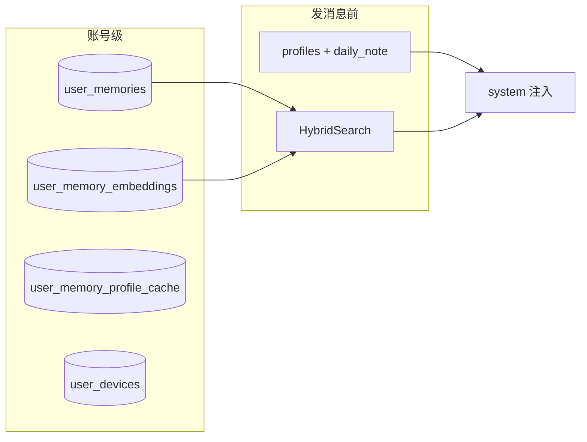

# 记忆系统变更整理（2026-05-20）

> **用途**：本次迭代（设备分离 + OpenClaw Phase 1 + Phase 2 混合检索 + 文档导航）的**变更清单与验收入口**。  
> **架构 SSOT** 仍以 [用户记忆系统-OpenClaw式演进设计.md](./用户记忆系统-OpenClaw式演进设计.md) 为准；**推理配置**见 [llm-inference-and-memory-vision.md](./llm-inference-and-memory-vision.md)。本文侧重「改了什么、怎么验、去哪看」。

**文档导航**：[docs/index.html](../index.html)

---

## 1. 变更摘要

| 主题 | 状态 | 一句话 |
|------|------|--------|
| 设备与记忆分离 | ✅ | `device_sync` 不再写入 `user_memories`；独立 `user_devices` + `/devices` |
| OpenClaw Phase 1 | ✅ | 双层读（画像 + 日记）、`pre_compact_flush`、bootstrap 预算 |
| OpenClaw Phase 2 | ✅ | 混合检索（关键词 + 向量）、多路 embedding 链、异步索引与 reindex |
| OpenClaw Phase 3 | ✅ | 图谱扩展 + MMR rerank（Mem0 风格轻量版） |
| 记忆工具（路径 B） | ✅ | `memory_search/get/save/list/read_daily/delete`；`memory_list` 支持 `query` |
| 文档与监控 | ✅ | `docs/index.html` 导航；监控台支持 reindex / 混合检索说明 |

---

## 2. 架构调整

### 2.1 存储分层



| 表 / 概念 | 用途 |
|-----------|------|
| `user_memories` | 用户事实 KV（不含设备技术项） |
| `user_memory_embeddings` | 每条记忆的向量索引（Phase 2） |
| `user_memory_profile_cache` | 画像聚合缓存 |
| `user_devices` | 设备登记（与记忆解耦） |
| `daily_note:YYYY-MM-DD` | 工作日记层 key |

### 2.2 检索路径（不变契约，升级实现）

- **对外**：仍为 `GET /api/user/:id/memories/search?q=&limit=`
- **对内**：`HybridSearchUserFacingMemories` = 关键词分 + 向量余弦（可配置权重）；无向量时回退纯关键词
- **编排层 / 工具**：无感，继续调同一 search API

### 2.3 Embedding 提供方（不偏向 Ollama 或中转）

| 模式 | 行为 |
|------|------|
| 默认链 | ① Ollama（`ollama.base_url`）→ ② OpenAI 兼容（配置了 `openai_base_url` + key 才启用） |
| 显式列表 | `memory.embedding.providers[]` 按 `priority` 覆盖默认链 |
| 学习 / 更新 | upsert 后**异步** embed；search 无索引时**自动 rebuild**；`POST .../memories/reindex` 全量重建 |

配置：`backend/config/config.yaml` → `memory.search` / `memory.embedding`。

---

## 3. API 变更一览

| 方法 | 路径 | 说明 |
|------|------|------|
| GET | `/api/user/:id/memories/search` | **混合检索**（SSOT，行为升级） |
| POST | `/api/user/:id/memories/reindex` | 全量重建向量索引 |
| POST | `/api/user/:id/devices/sync` | 设备同步（新） |
| GET | `/api/user/:id/devices` | 设备列表（新） |
| POST | `/api/user/:id/memories` | 拒绝 `device_sync` / `device_info:` 类写入 |

RPC 新增：`ListUserMemoryEmbeddings`、`UpsertUserMemoryEmbedding`、`RebuildUserMemoryEmbeddings`。

---

## 4. 配置示例

```yaml
# backend/config/config.yaml
memory:
  search:
    hybrid_enabled: true
    vector_weight: 0.7
    keyword_weight: 0.3
  embedding:
    ollama_model: nomic-embed-text
    openai_base_url: ""   # 中转 / OpenAI 兼容 /v1
    openai_api_key: ""    # 或 MOE_MEMORY_EMBED_API_KEY
    openai_model: text-embedding-3-small
```

---

## 5. Phase 3：图谱 + Rerank

| 项 | 说明 |
|----|------|
| 流水线 | `HybridSearchEnhanced`：混合分 → 1-hop 图谱扩展 → MMR rerank |
| 表 | `user_memory_relations`（`from_key` / `to_key` / `relation` / `weight`） |
| RPC | `ListUserMemoryRelations`；upsert/reindex 后异步 `syncMemoryRelations` |
| 配置 | `memory.search.rerank_*`、`memory.search.graph_*` |

## 6. 代码索引（主要改动）

| 区域 | 文件 |
|------|------|
| L1 混合检索 | `backend/pkg/memory/hybrid.go` |
| L1 embedding 链 | `backend/pkg/memory/embed/config.go`、`chain.go` |
| API 混合 search | `backend/api/internal/logic/user/memory_hybrid_search.go` |
| API reindex | `backend/api/internal/logic/user/rebuildusermemoryembeddingslogic.go` |
| RPC 向量存储 | `backend/rpc/internal/logic/memory_embedding_*.go` |
| 模型 | `backend/model/user_memory_embedding.go`、`user_device.go` |
| OpenClaw flush | `backend/api/internal/logic/llm/memory_openclaw.go` |
| Flutter 工具 | `lib/services/ai_memory_tools.dart` |
| 设备 | `lib/services/device_service.dart` |

---

## 6. 文档同步清单

| 文档 | 角色 |
|------|------|
| [用户记忆系统-OpenClaw式演进设计.md](./用户记忆系统-OpenClaw式演进设计.md) | 架构 SSOT |
| [记忆系统-开源对标调研.md](./记忆系统-开源对标调研.md) | OpenClaw/酒馆对标与路线 |
| [memory/README.md](./memory/README.md) | `pkg/memory` 模块地图 |
| [memory-system-dashboard.html](./memory-system-dashboard.html) | 真实 API 监控台 |
| [用户级记忆统一改造验收脚本.md](./用户级记忆统一改造验收脚本.md) | E2E 验收（含混合检索） |
| [../index.html](../index.html) | HTML / 设计文档导航 |

早期 Ollama 专项文档已删除；以 [用户记忆系统-OpenClaw式演进设计.md](./用户记忆系统-OpenClaw式演进设计.md) 与 [llm-inference-and-memory-vision.md](./llm-inference-and-memory-vision.md) 为准。

---

## 7. 验收步骤（简版）

### 7.1 环境

```bash
cd backend/rpc && go run super.go -migrate   # 含 user_memory_embeddings、user_devices
# 重启 API + RPC
cd docs && python3 -m http.server 8765
# 打开 http://localhost:8765/index.html
```

### 7.2 混合检索

1. 写入记忆：`POST /memories` 或聊天触发 upsert。  
2. `POST /memories/reindex`（或等待 search 自动 rebuild）。  
3. `GET /memories/search?q=与原文不同但语义相近的词` → 应命中。  
4. 监控台「检索 / 注入验证」面板可一键 search + reindex。

### 7.3 设备分离

1. `GET /memories` 不应再出现 `device_info:*` 类用户可见项。  
2. `GET /devices` 可看到设备登记。  
3. `POST /memories` 带 `source=device_sync` 应被拒绝。

### 7.4 工具（路径 B，可选）

1. Provider 开启 `supports_tool_calls`。  
2. 模型调用 `memory_list` + `query` 应返回过滤列表。  

完整脚本见 [用户级记忆统一改造验收脚本.md](./用户级记忆统一改造验收脚本.md) Case G/H。

---

## 8. 已知限制与后续

| 项 | 说明 |
|----|------|
| BM25 / Postgres FTS | 当前关键词侧为 pkg 内分词打分，非独立 BM25 引擎 |
| 跨编码器 rerank API | 当前为 MMR + 业务加权，非 Cohere/Jina 专用 rerank 模型 |
| 图谱 LLM 抽三元组 | 当前为规则簇 + 持久化边，非 LLM 知识图谱 |
| 注入 token 预算 | Phase 1 bootstrap 有预算；全局 scope 仍待 Phase 4 |
| 反馈 → 向量 | 纠正后依赖 upsert 异步 re-embed，非即时强一致 |
| Chat RAG | 会话消息向量检索仍为 Phase 3，不入 `user_memories` |

**下一步建议**：P1 注入预算与 scope 字段 → P2 对话 RAG（`pkg/chatcontext`）。

---

## 9. 变更记录

| 日期 | 内容 |
|------|------|
| 2026-05-20 | 初版：汇总设备分离、Phase 1/2、工具、文档导航 |
