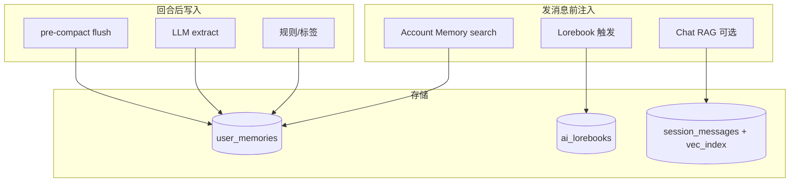

# 记忆系统开源对标调研（OpenClaw · SillyTavern · Moe Social）

> **目的**：对照主流开源方案，厘清「记忆」在产品里的边界，并给出 Moe Social 在现有 `pkg/memory` 架构上的演进优先级。  
> **SSOT 仍见**：[用户记忆系统-OpenClaw式演进设计.md](./用户记忆系统-OpenClaw式演进设计.md)  
> **本次变更**：[记忆系统-2026-05-20-变更整理.md](./记忆系统-2026-05-20-变更整理.md) · **导航**：[docs/index.html](../index.html)

---

## 1. 先统一概念：四种「记住东西」的方式

很多项目把不同机制都叫 memory，容易混。建议 Moe Social 对外用下表区分：

| 类型 | 典型产品 | 存什么 | 何时注入 | 是否跨会话 |
|------|----------|--------|----------|------------|
| **A. 账号长期记忆** | OpenClaw `MEMORY.md`、Moe `user_memories` | 用户偏好、昵称、事实 | 每轮/每会话开头 | ✅ 跨会话 |
| **B. 会话日志 / 日记** | OpenClaw `memory/YYYY-MM-DD.md` | 当日观察、流水 | 检索命中才注入 | ✅ 可跨日检索 |
| **C. 对话内 RAG** | SillyTavern Chat Vectorization | 历史消息向量 | 生成前重排上下文 | 单聊天文件内 |
| **D. 世界书 / Lorebook** | SillyTavern World Info、Moe `ai_lorebooks` | 设定、触发词条目 | 关键词命中注入 | 按角色/书 |

**Moe Social 现状**：

- **A** 已做：`user_memories` + 混合 search 注入 + 回合后写入  
- **B** 已做（轻量）：`daily_note:YYYY-MM-DD` 日记层 + bootstrap 读序  
- **D** 已做：Lorebook 独立链路（酒馆化方案），**不应与 A 混表**  
- **C** 未做：无消息级向量 RAG（Phase 3）  

---

## 2. OpenClaw 记忆系统（对标「个人 Agent 长期记忆」）

### 2.1 架构要点（官方文档）

| 维度 | 做法 |
|------|------|
| **存储形态** | 工作区 Markdown：`MEMORY.md`（长期精选）+ `memory/YYYY-MM-DD.md`（日记） |
| **透明度** | 无隐藏状态；模型「记住」= 写入磁盘 |
| **默认加载** | 每轮 DM 注入 `MEMORY.md`；今日+昨日日记可自动加载 |
| **检索** | `memory_search`（混合检索）+ `memory_get`（按文件/行读） |
| **检索算法** | 向量相似度 + BM25 关键词；可开 MMR 去重、30 天半衰期时间衰减 |
| **写入** | 用户说「记住…」；compaction 前 **memory flush** 静默提醒落盘 |
| **晋升** | 可选 **Dreaming**：短期信号 → 阈值 → 写入 `MEMORY.md` |
| **扩展** | `memory-wiki` 插件（claim/证据/矛盾）；多种 backend（SQLite/QMD/LanceDB） |
| **范围** | 按 **Agent 工作区**（不是全局多租户 DB） |

### 2.2 与 Moe Social 对照

| OpenClaw | Moe Social 现状 | 差距 |
|----------|-----------------|------|
| 双层存储（精选 + 日记） | 画像缓存 + `daily_note:*` | ✅ 已对齐；无独立 Markdown 文件 |
| 混合检索（向量+BM25） | 向量 + 关键词加权（`pkg/memory/hybrid`） | ✅ Phase 2；BM25/FTS 仍为后续增强 |
| `memory_get` 精确读 | `memory_get` 工具 + CRUD | ✅ 路径 B |
| compaction 前 flush | `pre_compact_flush` | ✅ Phase 1 |
| Dreaming 晋升 | 画像缓存 `BuildProfiles` | 有聚合无「晋升门控」 |
| 文件可审计 | DB + 监控台 | 运维友好，用户不可直接看 md |
| Agent 工作区隔离 | **账号级**记忆为主 | 多角色共用账号记忆（需产品决策） |

**已对齐的部分**（你们文档称 OpenClaw 式）：

- 文本库 SSOT + 默认编排注入（路径 A，+0 次 chat）  
- `memory_search` / `memory_get` 作为 L1 的高级工具封装（路径 B）  
- Provider 无关的写入管道（规则 + 标签 + LLM extract）  

---

## 3. SillyTavern（酒馆）记忆相关能力

SillyTavern **没有** OpenClaw 那种统一的账号记忆服务；核心是 **单聊天文件 + 扩展**。

### 3.1 能力拆解

| 能力 | 说明 | 与「长期记忆」关系 |
|------|------|------------------|
| **World Info / Lorebook** | 关键词/正则触发，把条目插入 prompt | **设定记忆**，非从对话归纳 |
| **Chat History** | 完整消息在聊天 JSON 内 | 上下文窗口内可见 |
| **Summarize 扩展** | LLM 生成事件摘要写入 prompt | 压缩历史，可能幻觉 |
| **Chat Vectorization** | 对历史消息做向量，生成前把相关消息提前/延后 | **对话内 RAG**，非账号库 |
| **MessageSummarize 等社区扩展** | 逐条摘要 + 长短记忆分离 | 减轻摘要退化 |

### 3.2 与 Moe Social 对照

| 酒馆 | Moe Social |
|------|------------|
| Lorebook 触发注入 | `ai_lorebooks` + 角色卡导入（Phase 酒馆方案） |
| 每角色独立聊天文件 | 服务端会话 + 本地 `AiDbService`（智能体维度） |
| 向量检索历史消息 | **未做**（长聊靠截断/摘要） |
| 无中心账号记忆库 | **`user_memories` 是差异化能力** |

**结论**：酒馆强项是 **角色扮演上下文（D + C）**；Moe 强项应是 **账号级 A + 云端同步**。不要试图用 `user_memories` 替代 Lorebook。

---

## 4. 横向对比总表

| 维度 | OpenClaw | SillyTavern | Moe Social（当前） |
|------|----------|-------------|-------------------|
| 主存储 | Markdown 文件 | 聊天 JSON + 扩展本地索引 | PostgreSQL KV |
| 记忆范围 | Agent 工作区 | 单 Chat / 角色卡 | 用户账号（+ 本地 agent 遗留） |
| 默认读路径 | 注入 MEMORY + 可选 search | Lore 触发 + 向量重排消息 | search → system 注入 |
| 检索 | 混合（向量+BM25） | 向量（扩展） | **混合（向量+关键词）** |
| 写入口 | 对话指令 + flush + dreaming | 摘要扩展 / 手动 | 规则+标签+LLM extract |
| 可观测性 | 文件/cl CLI | UI 扩展配置 | 监控台 + API |
| 多端同步 | 文件同步/自建 |  mainly 本地 | ✅ 后端 API |
| 与 RPC 关系 | 无（单机 Agent） | 无 | API→RPC→DB（部署形态） |

---

## 5. Moe Social 优势与缺口

### 5.1 已有优势（应保留）

1. **中心化账号记忆**：多端登录一致，优于酒馆纯本地。  
2. **路径 A 默认**：不依赖中转 `tools`，成本可控（与 OpenClaw 默认注入理念一致）。  
3. **`pkg/memory` 域包**：规则可复用，便于未来 memory-service。  
4. **设备与记忆分离**：比早期混写 `device_sync` 清晰。  
5. **Lorebook 独立**：符合酒馆生态，不与 `user_memories` 混表。

### 5.2 关键缺口（按影响力排序）

| 优先级 | 缺口 | 参考来源 | 建议落点 |
|--------|------|----------|----------|
| ~~P0~~ | ~~检索仅关键词~~ | OpenClaw hybrid | ✅ `user_memory_embeddings` + `HybridSearch` |
| ~~P0~~ | ~~压缩前未 flush~~ | OpenClaw flush | ✅ `pre_compact_flush` |
| ~~P1~~ | ~~无日记层~~ | OpenClaw daily md | ✅ `daily_note:YYYY-MM-DD` |
| P1 | 注入无 token 预算 / 分层（精选 vs 全量） | OpenClaw bootstrap 截断 | `memory_budget.go` 扩展 |
| P1 | 账号记忆 vs 角色记忆边界不清 | 酒馆 per-character | 明确：`user_*` vs `agent_*` scope |
| P2 | 无 MMR / 时间半衰期 | OpenClaw search 配置 | `SearchFacing` 可插权重插件 |
| P2 | 无 Dreaming 式晋升门控 | OpenClaw dreaming | 画像缓存 + 阈值任务 |
| P2 | 长聊天无消息级 RAG | ST Vectorization | **独立** `chat_rag`，不写入 `user_memories` |
| P3 | 无 memory-wiki 式证据链 | OpenClaw memory-wiki | 反馈表已有雏形，可扩展 |

---

## 6. 推荐演进路线（在现有架构上完善）

### Phase 1 — 对齐 OpenClaw「可靠性」（2～3 周）✅ 已落地核心

**目标**：少丢记忆、检索更稳，不引入新存储形态。

1. **Compaction / 截断前 Memory Flush** ✅  
   - `chatlogic` + `memory_openclaw.go`：`pre_compact_flush` 规则、日记、异步 LLM。  

2. **注入预算 + 双层读** ✅  
   - `pkg/memory/bootstrap.go`：精选画像 → 今/昨日记 → search。  
   - Flutter `AiMemoryOrchestrator._composeMemoryPrompt` 同序。  

3. **日记层** ✅  
   - Key：`daily_note:YYYY-MM-DD`；Flutter `MemoryDailyNote`、回合后追加。  

4. **待做**：检索增强 v1（分词/别名）、监控台 flush 步骤。  

### Phase 2 — 混合检索（OpenClaw 核心）✅ 已落地

**目标**：`GET /memories/search` 语义召回 — **已完成**。

| 项 | 实现 |
|----|------|
| 混合打分 | `backend/pkg/memory/hybrid.go`（向量余弦 + 关键词，可配置权重） |
| 向量表 | `user_memory_embeddings`（按 `user_id` + `memory_key`） |
| Embedding 链 | `pkg/memory/embed`：Ollama → OpenAI 兼容中转，不偏向单一厂商 |
| 学习 / 索引 | upsert 后异步 embed；search 无索引自动 rebuild；`POST /memories/reindex` |
| 客户端 | 编排层 / `memory_search` / `memory_list?query=` 仍用同一 search API |
| 配置 | `backend/config/config.yaml` → `memory.search` / `memory.embedding` |

详见 [记忆系统-2026-05-20-变更整理.md](./记忆系统-2026-05-20-变更整理.md)。

### Phase 3 — 酒馆式长对话（SillyTavern，按需）

**目标**：单会话消息很多时仍连贯；**不污染账号记忆库**。

1. **Chat RAG 子系统**（新目录建议 `pkg/chatcontext` 或 `lib/chat_rag/`）  
   - 对 `session_messages` 做向量索引；生成前选 K 条插入 **临时 context**，不写 `user_memories`。  
2. 与 **Lorebook** 串联：Lore 触发（设定）+ Chat RAG（情节）+ Account Memory（用户偏好）。  
3. UI 标明三者区别，避免用户以为「记忆库」包含剧情全文。  

### Phase 4 — 范围与晋升（产品决策）

1. **Scope 字段**：`user_memories.scope = account | agent:{id} | session:{id}`  
2. **Dreaming 轻量版**：后台任务扫描低置信/高频召回条目，生成 `profile` 晋升候选，用户确认后写入。  
3. 可选 **导出 Markdown**（OpenClaw 互操作）：`GET /memories/export.md`。  

---

## 7. 架构示意（目标态）

---

## 8. 不建议做的事

1. **不要用 `user_memories` 存整段聊天摘要流水线** — 会膨胀、难检索；用会话表或专用 `session_summaries`。  
2. **不要默认开启路径 B tools** — OpenClaw 也以「需要时再 search」为主；你们路径 A 正确。  
3. **不要复制酒馆「全本地 JSON」为唯一真相** — 与 Moe 云端账号战略冲突。  
4. **不要一步到位 memory-wiki** — 等有稳定混合检索与用户反馈后再做证据层。  

---

## 9. 与 `pkg/memory` / RPC 的关系（回答常见疑惑）

| 组件 | 角色 |
|------|------|
| `pkg/memory` | 所有新项目应引用的 **规则与算法 SSOT** |
| `api` + `rpc` | 当前 **部署形态**；不是记忆架构的必选项 |
| 未来 `memory-service` | 把 Store + 索引 Worker 拆出去，仍用同一 `pkg/memory` |

对标 OpenClaw：**学的是分层（精选/日记/检索/flush）与混合搜索**；不是学「必须 Markdown 文件」。  
对标酒馆：**学的是 Lore + 对话 RAG 分工**；不是学「放弃账号记忆库」。

---

## 10. 验收建议

**Phase 1**

1. 50 轮对话后触发压缩，压缩前 flush 的 key 可在 `memories` 查到。  
2. 注入总长度超限时，优先保留 profiles + 高置信 fact，日志可见截断。  
3. Lorebook 条目不出现在 `memories/display` 中。  

**Phase 2**

1. `POST /memories/reindex` 返回 `indexed > 0`。  
2. 用户写入事实后，用 **非同词** paraphrase 调 `GET /memories/search` 仍能命中。  
3. 仅配置 Ollama 或仅配置中转时，链式回退行为符合 `config.yaml`。  

完整 E2E：[用户级记忆统一改造验收脚本.md](./用户级记忆统一改造验收脚本.md)。

---

## 11. 参考资料

- OpenClaw Memory overview: https://docs.openclaw.ai/concepts/memory  
- OpenClaw Memory search: https://docs.openclaw.ai/concepts/memory-search  
- SillyTavern Chat Vectorization: https://docs.sillytavern.app/extensions/chat-vectorization  
- SillyTavern Summarize extension: https://github.com/SillyTavern/SillyTavern-Docs/blob/main/extensions/Summarize.md  
- 本项目：[AI酒馆化改造方案.md](../product/AI酒馆化改造方案.md)  

---

## 12. 变更记录

| 日期 | 内容 |
|------|------|
| 2026-05-20 | 初版：OpenClaw / SillyTavern 对标与 Moe 四阶段路线 |
| 2026-05-20 | Phase 1/2 状态同步；P0 检索/flush/日记标为已落地；Phase 2 实现表 |
