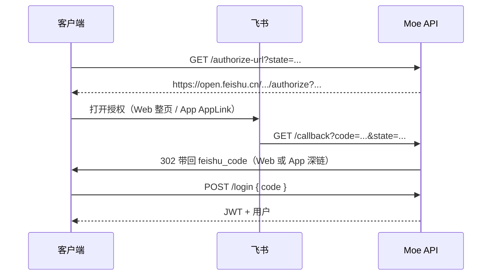

# 飞书通知（自建应用）与绑定

> **OAuth 联调**：分步验证见 [飞书 OAuth 授权验证指南](飞书OAuth授权验证指南.md)。

## 目录

- [模式说明](#模式说明)
- [原则（非强制）](#原则非强制)
- [配置项一览](#配置项一览)
- [OAuth 登录 / 绑定](#oauth-登录--绑定)
- [手动通知邮箱](#手动通知邮箱)
- [角色卡通知](#角色卡通知)
- [飞书开放平台](#飞书开放平台)
- [相关代码路径](#相关代码路径)
- [测试命令](#测试命令)

---

## 模式说明

当前使用 **企业自建应用机器人** + `im/v1/messages`，不是群自定义 Webhook。

配置入口：`backend/config/config.yaml` → `feishu` 段。

---

## 原则（非强制）

- **不加入飞书企业也可正常使用 App**（邮箱/用户名登录）。
- **机器人 IM 仅企业内成员**可收到；需要推送时再绑定飞书或申请加入企业。

---

## 配置项一览

| 配置键 | 说明 |
|--------|------|
| `enabled` | 是否启用飞书能力 |
| `app_id` / `app_secret` | 自建应用凭证 |
| `redirect_uri` | OAuth 回调地址，**须与飞书开放平台「重定向 URL」完全一致** |
| `oauth_scope` | 默认 `contact:user.email:readonly` |
| `app_return_url` | Web 兜底跳回（可选）；Web 端优先用 OAuth `state` = 当前页 origin |
| `receive_id` / `receive_id_type` | 未绑定用户时的默认 IM 收件人 |
| `enterprise_invite_url` | 企业邀请链接（设置页 / 登录页可选展示） |
| `enterprise_notice` | 邀请说明文案 |
| `auto_add_to_directory` | 是否尝试 OAuth 后写入通讯录（默认 `false`） |

**环境对齐（重要）**

| 场景 | `feishu.redirect_uri` | `lib/config/moe_api.json` |
|------|------------------------|---------------------------|
| 本机 Chrome + 本地 API | `http://127.0.0.1:8888/api/auth/feishu/callback` | `127.0.0.1:8888` 或本机 IP |
| 真机 App + 公网 API | `http://47.106.175.49:8888/api/auth/feishu/callback`（示例） | 与 API 主机一致，如 `47.106.175.49:8888` |

三者必须一致：**飞书开放平台重定向 URL** = **config.yaml `redirect_uri`** = **App 实际请求的 API 主机**。

---

## OAuth 登录 / 绑定

### 能力说明

- **登录页 → 飞书登录**：OAuth 拉取 `open_id`、企业邮箱、显示名；未注册自动建 Moe 账号。
- **申请加入企业（可选）**：`GET /api/auth/feishu/public-config` → `enterprise_invite_url`。
- **数据字段**：`users.feishu_open_id`（唯一）、`feishu_name`、`feishu_email`、`feishu_bound`。

### HTTP 接口

| 方法 | 路径 | 说明 |
|------|------|------|
| GET | `/api/auth/feishu/authorize-url?state=...` | 返回授权页 URL（`state` 由客户端传入） |
| POST | `/api/auth/feishu/login` | body: `{ "code": "..." }`，换 JWT + 用户信息 |
| GET | `/api/auth/feishu/callback` | 飞书 `redirect_uri` 落点；按 `state` 302 回 Web / App |
| GET | `/api/auth/feishu/public-config` | 邀请链接等公开配置 |
| PUT | `/api/user/feishu/bind` | 手工绑定通知邮箱 |
| DELETE | `/api/user/feishu/bind` | 仅清通知邮箱，不清 OAuth `open_id` |
| POST | `/api/user/feishu/test-card` | 发送测试卡片 |

### 授权流程总览



### Web 端（Chrome / `flutter run -d chrome`）

| 步骤 | 行为 |
|------|------|
| 1 | 登录页整页跳转飞书授权 |
| 2 | `state` = 当前页 origin（如 `http://localhost:xxxxx/`） |
| 3 | 飞书回调 `redirect_uri`（HTTPS/HTTP 后端地址） |
| 4 | 后端 302 → `{origin}?feishu_code=...` |
| 5 | 登录页读取 URL 参数，loading 后 `POST /api/auth/feishu/login` |

**注意**：Web **不要**用 WebView 做 OAuth（易拦不到回调）。

相关代码：`lib/utils/feishu_web_redirect_web.dart`、`lib/pages/auth/login_page.dart`（`_tryResumeFeishuOAuthFromUrl`）。

### 移动端（iOS / Android 真机 App）

方案：**App 内唤起飞书 + 深度链接回调**（与常见「Scheme / App Links」文档同类；实现上采用 **HTTPS redirect_uri + state 深链**，便于开放平台配置）。

| 步骤 | 行为 |
|------|------|
| 1 | 检测是否安装飞书（Android：`com.ss.android.lark`；iOS：`lark://`） |
| 2 | **未安装** → Toast「未安装飞书 App」，**不降级** WebView/浏览器 |
| 3 | **已安装** → `GET /authorize-url`，`state=moesocial://feishu/oauth` |
| 4 | 通过 AppLink 在飞书内打开授权页：`https://applink.feishu.cn/client/web_url/open?url=...` |
| 5 | 飞书回调后端 `redirect_uri`，后端 302 → `moesocial://feishu/oauth?feishu_code=...` |
| 6 | `app_links` 收到深链，登录页 `POST /api/auth/feishu/login` |

**深链约定**

| 项 | 值 |
|----|-----|
| Scheme | `moesocial` |
| Host / Path | `feishu` / `/oauth` |
| 回跳参数 | `feishu_code`（即飞书 OAuth `code`） |

**原生配置**

- Android：`AndroidManifest.xml` — `moesocial` intent-filter + `queries` 包名 `com.ss.android.lark`
- iOS：`Info.plist` — `CFBundleURLTypes`（`moesocial`）、`LSApplicationQueriesSchemes`（`lark`、`feishu`）

相关代码：`lib/utils/feishu_app_launcher.dart`、`lib/utils/feishu_oauth_helper.dart`、`lib/pages/auth/login_page.dart`。

### 与「feishu:// 直连授权」文档的差异

部分文章使用 `feishu://open/authen/v1/authorize` 且 `redirect_uri` 直接设为 App Scheme。本项目采用：

- **授权 URL**：标准 `https://open.feishu.cn/open-apis/authen/v1/authorize`（由后端生成）
- **唤起方式**：AppLink 包一层，在飞书客户端内打开
- **回调**：`redirect_uri` 仍为后端 HTTPS；经 `state` 由服务端 302 到 `moesocial://...`

体验等价，且与飞书控制台「重定向 URL」配置更一致。

### 遗留文件（可忽略）

- `lib/pages/auth/feishu_login_page.dart` — 旧 WebView 授权页，**当前登录流已不再使用**。
- `lib/pages/auth/feishu_login_result.dart` — 同上，仅历史保留。

---

## 手动通知邮箱

- **设置 → 账号与安全 → 飞书通知**：未走 OAuth 时可手工填写企业飞书邮箱。
- 通知路由：用户 `feishu_email` → 否则 `config feishu.receive_id`。

---

## 角色卡通知

| 事件 | 卡片标题 | 颜色 |
|------|----------|------|
| 创建 | 角色卡创建成功 | green |
| 更新 | 角色卡已更新 | blue |
| 删除 | 角色卡已删除 | red |

**操作者显示名**：优先 App `username`；若与飞书名不同，展示为 `昵称（飞书：xxx）`。

实现：`backend/utils/feishu_agent_notify.go`，钩子：`backend/rpc/internal/logic/ai_resources_logic.go`。

---

## 飞书开放平台

1. **安全设置 → 重定向 URL** = `feishu.redirect_uri`（完整路径，含 `/api/auth/feishu/callback`）。
2. **权限**：OAuth 相关 scope（如 `contact:user.email:readonly`）；IM：`im:message`、`im:message:send_as_bot`。
3. **（可选）** 配置 `app_return_url` 作为 Web 兜底；正常 Web 流程用 `state=当前页 origin` 即可。
4. **（可选）** `enterprise_invite_url`：管理后台 → 邀请成员 → 复制企业链接。

```yaml
# backend/config/config.yaml 示例片段
feishu:
  redirect_uri: "http://47.106.175.49:8888/api/auth/feishu/callback"
  oauth_scope: "contact:user.email:readonly"
  enterprise_invite_url: "https://xxx.feishu.cn/invite/member/..."
  enterprise_notice: "机器人仅可向企业内成员发送通知…"
```

---

## 相关代码路径

| 层级 | 路径 |
|------|------|
| 配置 | `backend/config/config.yaml` |
| OAuth URL / 换 token | `backend/utils/feishu_oauth.go` |
| 回调 302 | `backend/utils/feishu_oauth_redirect.go`、`backend/api/internal/handler/user/feishu_auth_handler.go` |
| App API 配置 | `lib/config/moe_api.json` |
| 登录页 | `lib/pages/auth/login_page.dart` |
| App 唤起 / 深链 | `lib/utils/feishu_app_launcher.dart` |
| state / 解析 code | `lib/utils/feishu_oauth_helper.dart` |
| Web 跳转 | `lib/utils/feishu_web_redirect_web.dart` |
| Android 装包检测 | `android/.../MainActivity.kt`（channel `com.moe_social/feishu`） |

---

## 测试命令

单元测试（构建 URL 等）：

```bash
cd backend
go test ./utils -run 'TestBuild|TestNormalize' -v
```

集成发 IM（需真实邮箱与企业成员）：

```bash
FEISHU_INTEGRATION_TEST=1 FEISHU_TEST_EMAIL=you@feishu.cn go test ./utils -run TestSendFeishuTestCardIntegration -v
```

数据库迁移（飞书用户字段）：

```bash
cd backend/rpc
go run super.go -migrate
```

---

## 自动加通讯录 API（一般不用）

`auto_add_to_directory` 默认 `false`；需管理员 contact 写权限与 `default_department_id`。一般用邀请链接即可。
