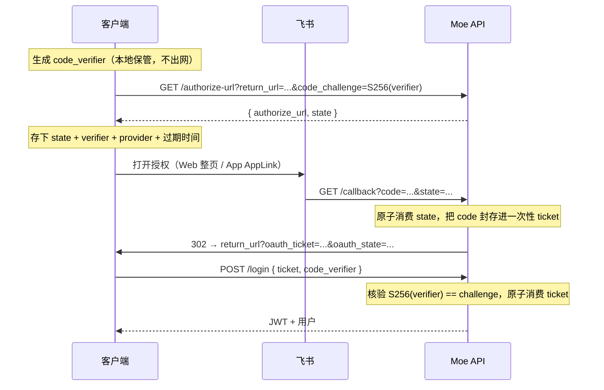

# 飞书通知（自建应用）与绑定

> **OAuth 联调**：分步验证见 [飞书 OAuth 授权验证指南](飞书OAuth授权验证指南.md)。

## 目录

- [模式说明](#模式说明)
- [原则（非强制）](#原则非强制)
- [配置项一览](#配置项一览)
- [OAuth 登录 / 绑定](#oauth-登录--绑定)
- [手动通知邮箱](#手动通知邮箱)
- [角色卡通知](#角色卡通知)
- [飞书开放平台](#飞书开放平台)
- [相关代码路径](#相关代码路径)
- [测试命令](#测试命令)

---

## 模式说明

当前使用 **企业自建应用机器人** + `im/v1/messages`，不是群自定义 Webhook。

配置入口：`backend/config/config.yaml` → `feishu` 段。

---

## 原则（非强制）

- **不加入飞书企业也可正常使用 App**（邮箱/用户名登录）。
- **机器人 IM 仅企业内成员**可收到；需要推送时再绑定飞书或申请加入企业。

---

## 配置项一览

| 配置键 | 说明 |
|--------|------|
| `enabled` | 是否启用飞书能力 |
| `app_id` / `app_secret` | 自建应用凭证 |
| `redirect_uri` | OAuth 回调地址，**须与飞书开放平台「重定向 URL」完全一致** |
| `oauth_scope` | 默认 `contact:user.email:readonly` |
| `receive_id` / `receive_id_type` | 未绑定用户时的默认 IM 收件人 |
| `enterprise_invite_url` | 企业邀请链接（设置页 / 登录页可选展示） |
| `enterprise_notice` | 邀请说明文案 |
| `auto_add_to_directory` | 是否尝试 OAuth 后写入通讯录（默认 `false`） |

**环境对齐（重要）**

| 场景 | `feishu.redirect_uri` | `lib/utils/config.dart` |
|------|------------------------|---------------------------|
| 本机 Chrome + 本地 API | `http://127.0.0.1:8888/api/auth/feishu/callback` | `developmentUrl` = `127.0.0.1:8888` 或本机 IP |
| 真机 App + 公网 API | `http://47.106.175.49:8888/api/auth/feishu/callback`（示例） | `productionUrl` 与 API 主机一致，如 `47.106.175.49:8888` |

三者必须一致：**飞书开放平台重定向 URL** = **config.yaml `redirect_uri`** = **App 实际请求的 API 主机**。

**回跳白名单（`oauth` 段，独立于 `feishu` 段）**

授权完成后的回跳地址由客户端在请求里传 `return_url`，服务端**只放行 `oauth.allowed_return_urls` 中精确命中的条目**（scheme/host/port/path 全比对）。这是防开放重定向的直接后果：服务端不再自动信任 API origin、任意 localhost、局域网或隧道域名。

```yaml
# backend/config/config.yaml
oauth:
  allowed_return_urls:
    - "moesocial://feishu/oauth"   # App 原生深链
    - "moesocial://wechat/oauth"
  auth_ttl_seconds: 600            # 授权事务（服务端 state）有效期
  ticket_ttl_seconds: 60           # 回调签发的一次性 ticket 有效期
  max_pending_auths: 4096          # 内存事务上限，满时淘汰最早到期的一条
```

> ⚠️ **Web 授权的前置条件**：默认只登记了两个 App 深链。要在浏览器里跑通飞书登录，运维必须把 Web 页面地址（如 `http://127.0.0.1:8080/`）加进 `allowed_return_urls`，否则 `/authorize-url` 会直接返回「回跳地址未被服务端信任」。多机器 / 隧道切换就是维护这一份列表，不引入环境拆分。
>
> 事务存在进程内存里（无 DB / Redis），**后端重启即全部失效**，用户需重新发起授权 —— 与当前单进程架构一致。

---

## OAuth 登录 / 绑定

### 能力说明

- **登录页 → 飞书登录**：OAuth 拉取 `open_id`、企业邮箱、显示名；未注册自动建 Moe 账号。
- **申请加入企业（可选）**：`GET /api/auth/feishu/public-config` → `enterprise_invite_url`。
- **数据字段**：`users.feishu_open_id`（唯一）、`feishu_name`、`feishu_email`、`feishu_bound`。

### HTTP 接口

| 方法 | 路径 | 说明 |
|------|------|------|
| GET | `/api/auth/feishu/authorize-url?return_url=...&code_challenge=...` | 返回 `{ authorize_url, state }`；`state` 由**服务端**生成，已绑定 `return_url` / challenge / 供应商配置 / 期限 |
| POST | `/api/auth/feishu/login` | body: `{ "ticket": "...", "code_verifier": "..." }`，换 JWT + 用户信息。**`code` 字段非空即拒**（旧 code-only 通路已关闭） |
| GET | `/api/auth/feishu/callback` | 飞书 `redirect_uri` 落点；原子消费 state 后 302 回 `return_url`，只带 `oauth_ticket` + `oauth_state` |
| GET | `/api/auth/feishu/public-config` | 邀请链接等公开配置 |
| PUT | `/api/user/feishu/bind` | 手工绑定通知邮箱 |
| DELETE | `/api/user/feishu/bind` | 仅清通知邮箱，不清 OAuth `open_id` |
| POST | `/api/user/feishu/test-card` | 发送测试卡片 |

### 授权流程总览


```mermaid
sequenceDiagram
  participant Client as 客户端
  participant Feishu as 飞书
  participant API as Moe API

  Note over Client: 生成 code_verifier（本地保管，不出网）
  Client->>API: GET /authorize-url?return_url=...&code_challenge=S256(verifier)
  API-->>Client: { authorize_url, state }
  Note over Client: 存下 state + verifier + provider + 过期时间
  Client->>Feishu: 打开授权（Web 整页 / App AppLink）
  Feishu->>API: GET /callback?code=...&state=...
  Note over API: 原子消费 state，把 code 封存进一次性 ticket
  API->>Client: 302 → return_url?oauth_ticket=...&oauth_state=...
  Client->>API: POST /login { ticket, code_verifier }
  Note over API: 核验 S256(verifier) == challenge，原子消费 ticket
  API-->>Client: JWT + 用户
```

**关键不变量**：授权码（`code`）从不出现在回跳 URL 上，只在服务端进程内从 state 换到 ticket；`verifier` 从不出网，只在登录时出示一次。因此截获回跳 URL 或窃取服务端事务都换不出登录态。

### Web 端（Chrome / `flutter run -d chrome`）

| 步骤 | 行为 |
|------|------|
| 1 | 客户端生成 `code_verifier`，`return_url` = 当前页地址（去 query/fragment） |
| 2 | `GET /authorize-url?return_url=...&code_challenge=...` → 拿到服务端 `state` |
| 3 | 把 `state` / `verifier` / `provider` / 过期时间写进 **sessionStorage**（同一标签页跳转），写失败即中止授权 |
| 4 | 整页跳转飞书授权；飞书回调 `redirect_uri`（后端地址） |
| 5 | 后端 302 → `{return_url}?oauth_ticket=...&oauth_state=...` |
| 6 | 登录页按 `oauth_state` 在本地事务里认领 provider，取回 verifier，`POST /api/auth/feishu/login` |
| 7 | 无论成败都清除地址栏 OAuth 参数与本地事务记录 |

**注意**：Web **不要**用 WebView 做 OAuth（易拦不到回调）。

相关代码：`lib/services/oauth_begin.dart`（发起）、`lib/services/oauth_pending_store.dart`（本地事务）、`lib/utils/oauth_pkce.dart`（PKCE）、`lib/utils/oauth_web_history_web.dart`（经 `oauth_web_history.dart` 条件导入）、`lib/pages/auth/login_page.dart`（`_resumeOAuthFromBrowserUrl`）。

### 移动端（iOS / Android 真机 App）

方案：**App 内唤起飞书 + 深度链接回调**（与常见「Scheme / App Links」文档同类；实现上采用 **HTTPS redirect_uri + state 深链**，便于开放平台配置）。

| 步骤 | 行为 |
|------|------|
| 1 | `GET /authorize-url?return_url=moesocial://feishu/oauth&code_challenge=...` → 拿到服务端 `state`，并把 verifier/state 写进安全存储（写失败即中止） |
| 2 | 检测是否安装飞书（Android：`com.ss.android.lark`；iOS：`lark://`） |
| 3 | **已安装** → 通过 AppLink 在飞书内打开授权页：`https://applink.feishu.cn/client/web_url/open?url=...`；打开成功即 Toast 提示等待回跳 |
| 4 | **未安装 / AppLink 打不开** → 回落到 App 内 WebView（`FeishuLoginPage`），只认精确命中 `return_url` 且 state 相等的那一跳 |
| 5 | 飞书回调后端 `redirect_uri`，后端 302 → `moesocial://feishu/oauth?oauth_ticket=...&oauth_state=...` |
| 6 | `app_links` 收到深链，登录页按 state 认领本地事务、取回 verifier，`POST /api/auth/feishu/login { ticket, code_verifier }` |

**深链约定**

| 项 | 值 |
|----|-----|
| Scheme | `moesocial` |
| Host / Path | `feishu` / `/oauth` |
| 回跳参数 | `oauth_ticket`（一次性票据）+ `oauth_state`（服务端 state）—— **不再是授权码** |

**原生配置**

- Android：`AndroidManifest.xml` — `moesocial` intent-filter + `queries` 包名 `com.ss.android.lark`
- iOS：`Info.plist` — `CFBundleURLTypes`（`moesocial`）、`LSApplicationQueriesSchemes`（`lark`、`feishu`）

相关代码：`lib/services/oauth_begin.dart`、`lib/services/oauth_pending_store.dart`、`lib/utils/oauth_app_launcher.dart`、`lib/utils/oauth_flow_helper.dart`、`lib/pages/auth/login_page.dart`。

### 与「feishu:// 直连授权」文档的差异

部分文章使用 `feishu://open/authen/v1/authorize` 且 `redirect_uri` 直接设为 App Scheme。本项目采用：

- **授权 URL**：标准 `https://open.feishu.cn/open-apis/authen/v1/authorize`（由后端生成）
- **唤起方式**：AppLink 包一层，在飞书客户端内打开；打不开则回落 App 内 WebView
- **回调**：`redirect_uri` 仍为后端 HTTPS；服务端消费 state 后 302 到 `return_url`（`moesocial://...`），只带 ticket

体验等价，且与飞书控制台「重定向 URL」配置更一致。

### WebView 回落路径

- `lib/pages/auth/feishu_login_page.dart` — App 内 WebView 授权页。接收调用方传入的 `authorizeUrl` / `expectedState` / `returnUrl`，自己不发授权请求；导航监听只接受**精确命中 `returnUrl`**（scheme/host/port + 归一化 path 比对）且 `oauth_state` 相等的那一跳，**不再截获任意 URL 上的 code**。
- `lib/pages/auth/feishu_login_result.dart` — 回传结构（`ticket` + `state`）。

两者都是**在用的**实现，由 `login_page.dart` 的 `_feishuLoginInAppWebView` push；不是遗留文件。

---

## 手动通知邮箱

- **设置 → 账号与安全 → 飞书通知**：未走 OAuth 时可手工填写企业飞书邮箱。
- 通知路由：用户 `feishu_email` → 否则 `config feishu.receive_id`。

---

## 角色卡通知

| 事件 | 卡片标题 | 颜色 |
|------|----------|------|
| 创建 | 角色卡创建成功 | green |
| 更新 | 角色卡已更新 | blue |
| 删除 | 角色卡已删除 | red |

**操作者显示名**：优先 App `username`；若与飞书名不同，展示为 `昵称（飞书：xxx）`。

实现：`backend/utils/feishu_agent_notify.go`（卡片构造）+ `backend/utils/feishu.go`（发送）。

> ⚠️ **钩子已断（2026-09-08 核实）**：原文档写的触发点 `backend/rpc/internal/logic/ai_resources_logic.go` 属 go-zero logic 层，已随双进程退役一起删除，**没有接回 Kratos 侧**。现在 `utils.SendFeishuAgentCreatedNotification()` 全仓**零调用方**（只有自身定义与 `backend/utils/feishu_test.go`），即「创建 Bot → 飞书通知运营」这条链当前不会触发。发送与卡片能力完好，缺的是业务侧调用点；接回属功能开发，不在配置治理范围内。
> 仍在生效的是 `utils.SendFeishuTestCard()`：`internal/biz/user/oauth_feishu.go:141` → `internal/server/protohttp/user/user_login.go:113`（设置页「发送测试卡片」）。

---

## 飞书开放平台

1. **安全设置 → 重定向 URL** = `feishu.redirect_uri`（完整路径，含 `/api/auth/feishu/callback`）。
2. **权限**：OAuth 相关 scope（如 `contact:user.email:readonly`）；IM：`im:message`、`im:message:send_as_bot`。
3. **服务端回跳白名单**：把客户端实际回跳地址登记进 `oauth.allowed_return_urls`。App 深链已默认登记；**Web 页面地址需要运维显式补上**，否则浏览器授权会在 `/authorize-url` 阶段被拒。
4. **（可选）** `enterprise_invite_url`：管理后台 → 邀请成员 → 复制企业链接。

```yaml
# backend/config/config.yaml 示例片段
feishu:
  redirect_uri: "http://47.106.175.49:8888/api/auth/feishu/callback"
  oauth_scope: "contact:user.email:readonly"
  enterprise_invite_url: "https://xxx.feishu.cn/invite/member/..."
  enterprise_notice: "机器人仅可向企业内成员发送通知…"

oauth:
  allowed_return_urls:
    - "moesocial://feishu/oauth"
    - "moesocial://wechat/oauth"
    # Web 授权需追加实际页面地址，例如：
    # - "http://127.0.0.1:8080/"
```

---

## 相关代码路径

| 层级 | 路径 |
|------|------|
| 配置 | `backend/config/config.yaml`（`feishu` 段 + `oauth` 段） |
| OAuth URL / 换 token | `backend/utils/feishu_oauth.go` |
| 授权事务 / state / ticket / 回跳白名单 | `backend/internal/oauthflow/`（`challenge.go`、`store.go`、`returnurl.go`） |
| 回调处理与 302 | `backend/internal/biz/user/oauth_callback.go`、`backend/internal/server/transport/oauth.go` |
| 授权 / 登录业务 | `backend/internal/biz/user/oauth_flow.go`、`oauth_feishu.go` |
| App API 基址 | `lib/utils/config.dart`（`ApiEnvConfig.productionUrl` / `developmentUrl`） |
| 登录页 | `lib/pages/auth/login_page.dart` |
| App 唤起 / 深链 | `lib/utils/oauth_app_launcher.dart` |
| 授权发起（生成 verifier、请求 authorize-url、落库本地事务） | `lib/services/oauth_begin.dart` |
| PKCE（verifier / S256 challenge） | `lib/utils/oauth_pkce.dart` |
| 本地待处理事务存储 | `lib/services/oauth_pending_store.dart`（Web → sessionStorage，原生 → 安全存储） |
| 深链常量 / 解析 ticket+state | `lib/utils/oauth_flow_helper.dart`（`feishuAppOAuthReturnUri` / `OauthCallback`） |
| Web 跳转 | `lib/utils/oauth_web_history.dart`（条件导入 → `_web.dart` / `_stub.dart`） |
| Android 装包检测 | `android/app/src/main/kotlin/com/example/moe_social/MainActivity.kt`（channel `com.moe_social/feishu`） |

---

## 测试命令

单元测试（构建 URL 等）：

```bash
cd backend
go test ./utils -run 'TestBuild|TestNormalize' -v
```

集成发 IM（需真实邮箱与企业成员）：

```bash
FEISHU_INTEGRATION_TEST=1 FEISHU_TEST_EMAIL=you@feishu.cn go test ./utils -run TestSendFeishuTestCardIntegration -v
```

数据库迁移（飞书用户字段）：

```bash
cd backend
make db-migrate          # = go run ./cmd/migrate；只连库跑 AutoMigrate 后退出
```

---

## 自动加通讯录 API（一般不用）

`auto_add_to_directory` 默认 `false`；需管理员 contact 写权限与 `default_department_id`。一般用邀请链接即可。
