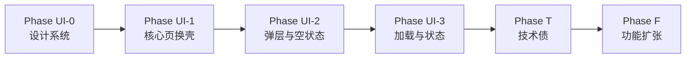

# AI 酒馆 UI 体验迭代方案

日期：2026-05-19  
状态：迭代中（UI-0/UI-1 已落地首批组件与核心页换壳）  
关联文档：

- [AI 酒馆化改造方案](./AI酒馆化改造方案.md) — 能力与架构主文档  
- [UI 设计规范](./UI设计规范.md) — 全站视觉基线  
- [IA 首屏与空状态设计](./IA首屏与空状态设计.md) — 空状态与 CTA 原则  
- [项目开发总览与当前优先级](./项目开发总览与当前优先级-2026-05-18.md) — 全局优先级  

---

## 0. 文档目的

在 **能力已基本可用**（Provider、角色卡、Lorebook、Chat Gateway）的前提下，把 AI 酒馆从「功能堆叠 + 样式参差」推进到 **体验统一、视觉成熟、可渐进交付** 的产品形态。

本方案强调：

1. **先体验、后能力扩张** — 优先统一页面与弹层，再做大功能（群聊、分支会话、生态格式）。  
2. **避免负面优化** — 不为了「好看」破坏已有链路，不重复造聊天页，不大拆路由。  
3. **可验收的迭代** — 每阶段有页面清单、组件清单、回归检查表。  

---

## 1. 现状结论（2026-05-19）

### 1.1 能力层：已具备

| 能力 | 状态 |
|------|------|
| Provider Profile（含中转站） | 已落地 |
| OpenAI 兼容 Chat Gateway | 已落地（system 折叠兜底） |
| 角色卡字段 / 导入导出 JSON | 已落地 |
| Lorebook 管理 + 聊天注入 | 已落地 |
| 后端化配置（API → RPC → DB） | 已落地 |
| 酒馆首页双 Tab（角色 / 模型来源） | 已落地 |

### 1.2 体验层：明显短板

| 问题 | 表现 | 影响 |
|------|------|------|
| **视觉不统一** | 仅 `agent_list_page`、`character_card_plaza`、`chat_page` 部分使用 `AiBrandTokens`；`memory_manager`、`ai_provider_profiles`、`ollama_chat` 各自硬编码色值 | 像多个子 App 拼在一起 |
| **弹层质量参差** | 大量原生 `AlertDialog` + `OutlineInputBorder`，宽屏 `width: 520/560` 不适配手机 | 表单压抑、不萌、不像酒馆 |
| **组件库过薄** | `lib/widgets/ai/` 仅 4 个文件 | 每页重复写卡片/空状态/底栏 |
| **页面成熟度两极** | 首页 Hero 精致；Provider/记忆/导入弹窗简陋 | 用户信任感断裂 |
| **双聊天入口** | `ChatPage` vs `OllamaChatPage` | 认知负担、维护双倍 |
| **假功能占位** | 分类筛选、使用频率排序未实装 | 控件可点但无效，负面体验 |
| **加载策略不一致** | 酒馆首页本地优先；广场全屏 loading | 快慢体验割裂 |

### 1.3 工程层：需同步但不应阻塞 UI 第一阶段

| 项 | 说明 | 迭代阶段 |
|----|------|----------|
| 飞书通知 | 代码可用，`webhook_url` 配置非合法 URL | Phase T（技术债） |
| 中转站流式 | `supportsStreaming` 已发请求但未解析 SSE | Phase T |
| 中转站 URL/鉴权变体 | 仅 Bearer + 固定路径 | Phase T |

---

## 2. 设计目标与原则

### 2.1 产品一句话

**「萌系酒馆入口 + 沉浸式角色聊天」** — 不是模型调试器，也不是通用问答。

### 2.2 体验目标（可量化）

| 指标 | 当前 | 目标（Phase UI-2 结束） |
|------|------|-------------------------|
| AI 模块主色/圆角/卡片阴影一致率 | ~40% | ≥ 95% |
| 弹层使用统一 Shell 比例 | ~10% | 100% |
| 空状态含文案 + 主 CTA | 部分 | 100% |
| 首屏可交互时间（酒馆首页） | 依赖网络 | 本地缓存 < 300ms 有内容 |
| 用户可理解的 Provider 来源标签 | 有 | 卡片 + 状态点 + 失败说明 |

### 2.3 负面优化红线（必须遵守）

开发前对照，**出现以下情况即视为负面优化**：

| 红线 | 说明 |
|------|------|
| **不新增平行聊天页** | 禁止再做一个「新 Chat」；`OllamaChatPage` 只收敛不复制 |
| **不大改数据模型** | UI 阶段不改 SQLite 表结构，除非阻塞展示 |
| **不先上复杂功能** | 群聊、分支会话、SillyTavern 全格式兼容排在 UI 基线之后 |
| **不全局换肤** | 只改 `lib/pages/ai` + `lib/widgets/ai`，不动社交主线 |
| **不删除已有能力** | 导入 JSON、Lorebook、记忆页保留，只换壳与文案 |
| **不假控件** | 未实现的筛选/排序要么做完要么隐藏，禁止空壳 Chip |
| **不牺牲可用性换动效** | 动画可关；弱网下降级为静态 |
| **不把 API Key 上云** | Provider 密钥仍仅本地安全存储 |

### 2.4 与全站 UI 规范的关系

- 色彩、圆角、按钮高度：延续 [UI 设计规范](./UI设计规范.md)。  
- AI 模块扩展：`AiBrandTokens` 升格为 **AiTheme**（间距、字号、阴影、弹层圆角）。  
- 空状态：遵循 [IA 首屏与空状态设计](./IA首屏与空状态设计.md) 的「文案 + 主 CTA」。

---

## 3. AI 酒馆设计系统（Ai Tavern Design System）

> Phase UI-0 交付物：组件 + Token，页面只换引用不改业务逻辑。

### 3.1 色彩与渐变（在 AiBrandTokens 上扩展）

| Token | 值 | 用途 |
|-------|-----|------|
| `pageBackground` | `#F3F5FB` | 列表页底色 |
| `chatBackground` | `#F5F7FA` | 聊天页底色 |
| `surface` | `#FFFFFF` | 卡片、弹层内容区 |
| `primary / secondary / accent` | 已有 | 按钮、强调、Hero |
| `titleColor` | `#1F2430` | 标题 |
| `bodyMuted` | `grey[600]` | 副文案 |
| `success / warning / danger` | 语义色 | Provider 连通状态 |
| `heroGradient` | 已有 | 顶部 Hero、关键 CTA 区 |

### 3.2 间距与圆角

| Token | 值 |
|-------|-----|
| `radiusSm` | 12 |
| `radiusMd` | 18 |
| `radiusLg` | 24 |
| `radiusSheet` | 28（顶部） |
| `pagePadding` | 16 |
| `cardPadding` | 16–20 |
| `sectionGap` | 12 / 24 |

### 3.3 阴影（统一「悬浮卡片」）

```dart
// 标准卡片 — 全模块复用
BoxShadow(
  color: AiBrandTokens.primary.withOpacity(0.08),
  blurRadius: 24,
  offset: Offset(0, 10),
)
```

### 3.4  typography

| 级别 | 字号 | 字重 | 场景 |
|------|------|------|------|
| Display | 22–24 | w800 | Hero 标题 |
| Title | 18 | w700 | AppBar / 区块标题 |
| Body | 14–15 | w400 | 说明、列表副标题 |
| Caption | 12 | w400 | 标签、Provider 状态 |
| Mono | 13 | w500 | 模型 ID、JSON 提示 |

### 3.5 必须新建的共享组件（`lib/widgets/ai/`）

| 组件 | 职责 | 替换目标 |
|------|------|----------|
| `AiScaffold` | 统一 AppBar、背景色、安全区 | 各页 Scaffold 复制 |
| `AiHeroCard` | 渐变 Hero + chips | `agent_list` 内联 Hero |
| `AiSurfaceCard` | 白卡片 + 阴影 + 圆角 | 零散 Container |
| `AiSectionHeader` | 标题 + 副标题 + 右侧 action | `_buildSectionHeader` 等 |
| `AiEmptyState` | 插画区 + 文案 + 1–2 CTA | 各页自定义空状态 |
| `AiChip` / `AiTag` | Provider 来源、模型、分类 | 杂色 Chip |
| `AiSheet` | 底部弹层：圆角、拖拽条、内边距 | `showModalBottomSheet` 裸写 |
| `AiFormSheet` | 多字段表单（Provider/导入） | `AlertDialog` 宽表单 |
| `AiConfirmSheet` | 删除/危险操作确认 | `AlertDialog` 确认 |
| `AiListTileCard` | 角色 / Lorebook / Provider 行 | ListTile 裸写 |
| `AiLoadingSkeleton` | 列表骨架屏 | 全屏 `MoeLoading` |
| `AiStatusDot` | 在线/连通/同步中 | 无 |

### 3.6 弹层规范（核心）

**禁止**：多字段表单使用居中 `AlertDialog`（尤其 `width: 520+`）。

**推荐**：

| 场景 | 组件 | 交互 |
|------|------|------|
| 新建/编辑 Provider | `AiFormSheet`（全屏 90% 高或分步） | 主按钮底部固定 |
| 导入角色卡 JSON | `AiFormSheet` + 粘贴区 | 支持剪贴板、示例链接 |
| 选模板 | `AiSheet` 网格卡片 | 带预览图/emoji |
| 删除确认 | `AiConfirmSheet` | 危险色主按钮 |
| 聊天更多操作 | `AiSheet` 列表 | 图标 + 标题 + 副标题 |

---

## 4. 分页面体验诊断与改造要点

### 4.1 总览矩阵

| 页面 | 文件 | 视觉 | 交互 | 弹层 | 加载 | 优先级 |
|------|------|------|------|------|------|--------|
| AI 酒馆首页 | `agent_list_page.dart` | ★★★★ | ★★★ | ★★ | ★★★★ | P0 精修 |
| 角色聊天 | `chat_page.dart` | ★★★★ | ★★★★ | ★★★ | ★★★ | P0 精修 |
| Provider 管理 | `ai_provider_profiles_page.dart` | ★★ | ★★★ | ★ | ★★ | **P0 重壳** |
| 角色编辑 | `agent_editor_page.dart` | ★★★ | ★★★ | ★★ | ★★★ | P1 |
| 角色卡广场 | `character_card_plaza_page.dart` | ★★★★ | ★★★ | ★★★ | ★★ | P1 |
| 世界书 | `ai_lorebooks_page.dart` | ★★★ | ★★★★ | ★★ | ★★★★ | P1 |
| 记忆管理 | `memory_manager_page.dart` | ★★ | ★★ | ★ | ★★★ | P1 降信息密度 |
| 内容生成 | `content_generation_page.dart` | ★★★ | ★★★ | ★★★ | ★★★ | P2 |
| Ollama 直连 | `ollama_chat_page.dart` | ★★ | ★★ | ★★ | ★★ | **P2 收敛入口** |
| LLM 配置 | `llm_model_config_page.dart` | ★★ | ★★ | — | ★★ | P3 收进设置 |

### 4.2 AI 酒馆首页（P0）

**保留**：Hero 渐变、双 Tab、本地优先加载、入口图标布局。

**改造**：

1. Hero / 列表 / 卡片抽组件（`AiHeroCard`、`AiListTileCard`）。  
2. **隐藏或实装**分类 Chip、使用频率排序（二选一，推荐 Phase UI-1 实装本地计数）。  
3. 模型来源 Tab：Provider 切换用 `AiChip` + `AiStatusDot`（连通/缓存/失败）。  
4. 导入角色卡：`AlertDialog` → `AiFormSheet`。  
5. 空状态：「还没有角色」用 `AiEmptyState`（CTA：选模板 / 导入 / 去模型来源）。

**验收**：冷启动 300ms 内看到本地角色；弹层在手机上无横向溢出。

### 4.3 Provider 管理（P0 — 体验最差页之一）

**问题**：顶部说明文案过时；全页 loading；编辑弹窗为桌面宽 `AlertDialog`。

**改造**：

1. 首屏 **本地缓存秒开** + 顶部同步条（对齐 `ai_lorebooks_page`）。  
2. 列表项：`AiListTileCard` + 来源标签 + 连通状态（测试连接结果缓存 5min）。  
3. 编辑/新增：`AiFormSheet` 分节 — 基础信息 / 能力开关 / 高级（手动模型）。  
4. 能力开关旁 **即时说明**（system/流式/vision），与中转站场景对齐。  
5. 更新顶部说明为当前真实能力（Lorebook、导入导出已可用）。

**验收**：新增 Provider 全程不离开底部弹层；测试连接有 loading + 成功/失败色。

### 4.4 角色聊天（P0）

**保留**：会话抽屉、记忆、Lorebook 注入、气泡样式。

**改造**：

1. 统一 `AiBrandTokens`（清除散落 `0xFF7F7FD5` 硬编码）。  
2. 发送中：**打字指示器** + 可选「停止」— 不要求 Phase UI-0 就上 SSE，但 UI 占位要专业。  
3. 空会话：`AiChatEmptyState` 增强（角色名、开场白、快捷回复）。  
4. 更多设置：`AiSheet` 替代零散 `AlertDialog`。  
5. AppBar 展示 Provider 来源小标签（我的 API / 服务器 Ollama）。

**验收**：第三方 Provider 发送失败时，Toast + 内联提示「检查 Provider 设置」链到管理页。

### 4.5 角色编辑（P1）

**改造**：

1. 分步表单：基础信息 → 人设与世界观 → 模型与 Provider。  
2. 模型下拉：骨架屏 + 上次缓存模型列表。  
3. 「创建真实 Ollama 模型」仅在选择后端 Provider 时显示（避免中转站用户困惑）。

### 4.6 角色卡广场（P1）

**改造**：

1. `_loadAgents` 改为 **本地优先**（同酒馆首页）。  
2. 模板卡片统一 `AiSurfaceCard` + 预览渐变。  
3. 社区区块：明确「即将开放」徽章，避免像坏掉的按钮。

### 4.7 世界书（P1）

**保留**：本地优先 + 云端同步模式（全模块标杆）。

**改造**：

1. 编辑/条目弹层 → `AiFormSheet`。  
2. 同步状态用 `AiStatusDot` + 顶部细条，与首页一致。

### 4.8 记忆管理（P1）

**改造**：

1. 首屏增加 **模式说明卡片**（当前角色用哪种记忆、是否中转站）。  
2. Tab 内容降密度：默认折叠「Prompt 预览」。  
3. 危险操作统一 `AiConfirmSheet`。

### 4.9 Ollama 直连聊天（P2 — 收敛）

**策略（二选一，推荐 A）**：

- **A. 隐藏入口**：从主导航移除，仅开发者设置中保留「调试 Ollama」。  
- **B. 合并**：将独有功能（若有）并入 `ChatPage`，删除重复 UI。

**禁止**：保留两个完整聊天产品界面。

---

## 5. 开发迭代路线（分阶段）



### Phase UI-0：设计系统打底（约 3–5 人日）

| 任务 | 产出 | 不改 |
|------|------|------|
| 扩展 `AiBrandTokens` → `ai_theme.dart` | 间距/圆角/阴影/文字样式 | 业务逻辑 |
| 实现 3.5 节组件 v1 | `lib/widgets/ai/*` | 页面路由 |
| Storybook 式 demo 页（可选） | `ai_design_preview_page.dart` dev only | — |

**验收**：demo 页展示所有组件；无 lint 错误。

### Phase UI-1：核心页换壳（约 5–8 人日）

| 顺序 | 页面 | 关键改动 |
|------|------|----------|
| 1 | `ai_provider_profiles_page` | FormSheet + 本地秒开 |
| 2 | `agent_list_page` | 组件化 + 导入弹层 + 假筛选处理 |
| 3 | `chat_page` | Token 统一 + 发送态 UI |

**验收**：三页截图对比前后；核心流程 E2E 手动走通（建 Provider → 建角色 → 聊天）。

### Phase UI-2：弹层与空状态全覆盖（约 4–6 人日）

| 页面 | 改动 |
|------|------|
| `agent_editor_page` | 分步 + FormSheet |
| `ai_lorebooks_page` | FormSheet / ConfirmSheet |
| `character_card_plaza_page` | 本地优先 + 空状态 |
| `memory_manager_page` | 降密度 + 说明卡 |

**验收**：AI 模块无 `AlertDialog` 承载 >2 个输入框（允许纯确认类小对话框过渡）。

### Phase UI-3：加载、状态、动效（约 3–5 人日）

| 任务 | 说明 |
|------|------|
| 列表骨架屏 | 酒馆首页、广场、Provider |
| Provider 模型列表缓存 | 按 profileId 缓存上次成功列表 |
| 轻量动效 | `FadeInUp` 统一时长；尊重系统「减少动态效果」 |
| 分类/使用频率 | 实装或永久移除 UI |

**验收**：弱网下列表仍有上次数据；无空白闪屏 > 500ms。

### Phase T：技术债（与 UI 并行但低优先级）

| 任务 | 说明 |
|------|------|
| 飞书 webhook 配置修正 | 环境变量 + 合法 URL |
| 中转站 `stream: false` 默认 | 直到 SSE UI 就绪 |
| system 重试匹配收窄 | 去掉宽泛 `invalid_request_error` |
| Base URL 规范化 | 自动补 `/v1`（可配置） |

### Phase F：功能扩张（UI 基线完成后）

按 [AI 酒馆化改造方案](./AI酒馆化改造方案.md) 原优先级：

1. User Persona 产品化  
2. 会话侧边栏 / 分支会话  
3. 流式输出 UI + SSE 解析  
4. 多角色群聊  
5. SillyTavern / TavernAI 格式兼容  

---

## 6. 异步加载策略（体验向）

与 UI 阶段绑定，**不单独做大重构**：

| 场景 | 策略 | UI 表现 |
|------|------|---------|
| 酒馆角色列表 | 本地 → 云端合并 | 骨架 → 内容 |
| Provider 列表 | 本地 → 云端 | 列表立即显示 |
| 模型列表 | 缓存 → 网络 | Chip 区显示「刷新中」 |
| 世界书 | 已有本地优先 | 顶部同步条 |
| 广场角色 | 对齐世界书 | 同左 |

**禁止**：为多 Provider 并行请求 `/models` 阻塞整页。

---

## 7. 中转站 & 通知（产品文案层）

UI 阶段需在 Provider 页明确展示：

| 用户问题 | 界面答案 |
|----------|----------|
| 支持哪些中转站？ | OpenAI 兼容即可；推荐填写 `https://xxx/v1` |
| 不支持 system？ | 开关关闭或自动折叠（已有逻辑） |
| 模型列表为空？ | 引导填写「手动模型列表」+ 测试连接 |
| 流式？ | 标注「即将支持」，默认关闭 stream |
| 记忆？ | 中转站走客户端记忆；后端 Ollama 可走服务端 |

飞书：运营配置项，不在用户 UI 暴露；开发文档记录 webhook 校验步骤。

---

## 8. 每阶段回归检查表

发布前勾选：

- [ ] 新建 Provider → 测试连接 → 保存 → 创建角色 → 聊天 全链路  
- [ ] 导入 JSON 角色卡（弹层内完成）  
- [ ] Lorebook 绑定角色后聊天注入仍正常  
- [ ] Web 端聊天不白屏（本地缓存会话）  
- [ ] 深色模式（若全站支持）AI 页不崩色 — 可 Phase UI-3 后补  
- [ ] 无假筛选、无死按钮  
- [ ] `OllamaChatPage` 入口符合收敛策略  
- [ ] 未新增 API Key 上云行为  

---

## 9. 分工建议

| 角色 | 职责 |
|------|------|
| 产品 | 确认 Phase 范围、假功能去留、Ollama 页收敛方案 |
| UI/Flutter | UI-0~UI-3 组件与换壳 |
| 后端 | Phase T 飞书、配置项；不阻塞 UI-0/1 |
| QA | 每 Phase 走回归检查表 |

---

## 10. 总结

| 维度 | 策略 |
|------|------|
| 优先级 | **先 UI 统一，再功能扩张** |
| 方法 | 设计系统 + 分阶段换壳，不大拆业务 |
| 风险 | 用「负面优化红线」约束范围 |
| 最快体感提升 | Provider 页 + 弹层 + 假控件清理 |
| 长期 | UI-3 完成后接流式、分支会话、生态格式 |

本方案与 [AI 酒馆化改造方案](./AI酒馆化改造方案.md) **互补**：后者管能力与架构，本文管 **体验交付节奏与界面标准**。开发时以本文 Phase UI-x 排期，以能力文档做功能验收对照。
