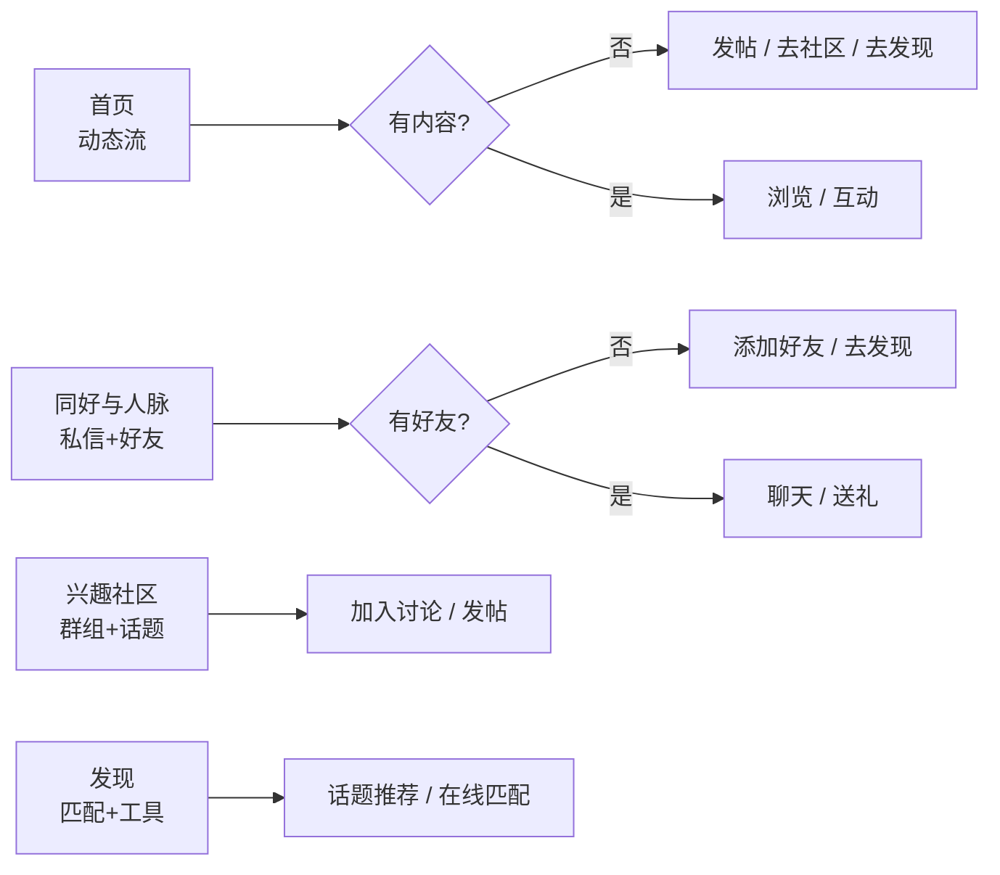
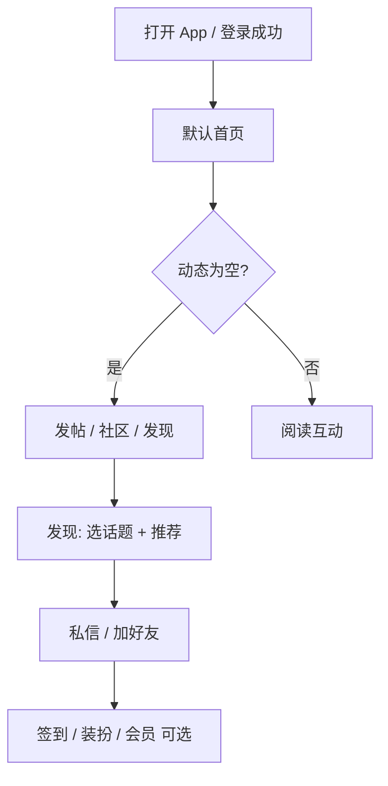

# Moe Social：信息架构（IA）、首屏职责与空状态设计

本文档面向「个人使用但希望产品化」的目标，定义底栏一级入口的职责边界、首屏应完成的任务，以及列表为空时的文案与行动按钮（CTA）。实现上以**最小改动**复用现有页面与路由，不新增独立业务模块。

---

## 1. 背景与目标

### 1.1 现状问题

- 功能域齐全（动态、同好、社区、发现、我的），但用户缺少一条清晰主线：**先做什么、为什么留下**。
- 部分列表在无数据时偏「空白」，未引导下一步动作。
- 底栏与 Tab 命名偏系统词（如「联系人」），与二次元社交心智略有距离。

### 1.2 设计目标

1. **首屏说人话**：每个一级 Tab 打开后，用户能在 3 秒内理解「这里干什么」。
2. **空状态即产品**：无数据时必有短文案 + 至少一个主 CTA，可选次要 CTA。
3. **命名用户化**：面向用户的词（找同好、发帖、社区）优先于实现词。
4. **冷启动可渐进**：首版用 CTA 串联兴趣社区与发现；完整「兴趣 onboarding」可作为下一阶段。

---

## 2. 用户主线（叙事）

**一句话**：用兴趣找到人 → 用低压力方式互动（私信 / 动态 / 同好推荐）→ 用资料与装扮表达身份。

---

## 3. 信息架构：底栏一级 Tab

| 索引 | 对用户名称 | 职责（用户能完成的事） | 与相邻 Tab 的边界 |
|------|------------|-------------------------|-------------------|
| 0 | **首页** | 个人/全站/关注动态流；发动态入口 | 与社区区别：首页偏「关注与算法流」，社区偏「群组与话题广场」 |
| 1 | **同好与人脉** | 私信会话、好友列表、好友申请 | 不叫「联系人」：强调同好关系与可聊天对象 |
| 2 | **兴趣社区** | 兴趣群组、话题讨论、内容广场 | 冷启动找内容与圈子 |
| 3 | **发现** | 话题标签推荐同好、在线匹配、AI/游戏等扩展入口 | 冷启动「找人」主战场之一 |
| 4 | **我的** | 资料、设置、会员与装扮等 | 低频配置与身份展示 |

---

## 4. 首屏职责（各 Tab 打开第一眼）

| Tab | 首屏应回答的问题 | 首屏元素策略（与实现关系） |
|-----|------------------|---------------------------|
| 首页 | 「现在有什么可看？我能发什么？」 | 保持现有 Stories、快捷入口、分区 Tab；空状态引导发帖或去社区/发现 |
| 同好与人脉 | 「我能和谁聊？好友在哪？」 | 子 Tab：私信 / 同好 / 申请；空好友时突出添加好友 + 去发现 |
| 兴趣社区 | 「我能加什么圈子、看什么话题？」 | 保持现有子页切换与 AppBar 说明 |
| 发现 | 「怎么找到聊得来的人？」 | 保持在线匹配卡片 + 话题 Chip + 推荐按钮；未操作时给轻引导 |
| 我的 | 「我是谁、账号与设置在哪？」 | 保持现有个人中心 |

---

## 5. 空状态矩阵（P0 落地范围）

### 5.1 首页动态流

| 条件 | 标题 | 副文案 | 主 CTA | 次 CTA（若有） |
|------|------|--------|--------|----------------|
| 热门/最新/话题下列表为空且无错误 | 依模式变化 | 短句 + 轻语气符号 | 发帖 或 去社区 / 去发现 | 与主 CTA 互补 |
| **关注** Tab 且为空 | 关注的人还没有发动态 | 先去社区逛逛，或发现更多可关注的同好 | 去兴趣社区 | 去找同好 |
| 加载失败 | 保持现有「重新加载」 | 网络/服务端说明 | 重试 | — |

### 5.2 发现页 · 离线推荐无结果

| 条件 | 说明 |
|------|------|
| 已点击推荐且无候选人 | 保持现有卡片内双按钮（刷新 / 随机）与在线匹配入口；文案可微调为更「陪伴感」 |

### 5.3 探索页 · 同好 Tab · 未点击推荐前

| 条件 | 说明 |
|------|------|
| 未搜索 | **不展示**结果区空状态卡；话题 Chip + 主 CTA「随机发现新面孔」承担引导（2026-05-19 起移除重复的二次按钮卡片） |

### 5.4 同好与人脉 · 好友列表为空

| 条件 | 主 CTA | 次 CTA |
|------|--------|--------|
| 无好友 | 添加好友（已有） | 去认识同好（跳转发现 Tab） |

### 5.5 冷启动路径（分阶段）

**P0（当前文档 + 代码）**：通过空状态与底栏 CTA，把用户从「无数据」推到 **发帖 / 社区 / 发现** 之一。

**P1（建议）**：首次登录后一次性「兴趣标签」底部表单（写 `SharedPreferences` 标记已展示），标签写入资料或本地偏好，用于首页与推荐排序。

**P2（建议）**：与后端「推荐关注」接口打通，关注 Tab 空状态时直接列出可一键关注的用户。

---

## 6. 命名规范

- **底栏、AppBar、按钮**：使用动作或场景词，如「去找同好」「去兴趣社区」「发布动态」。
- **代码层**：类名、文件名、路由 path 可保持英文与现有约定，不在 UI 字符串中暴露 `Service`、`Page` 等词。
- **同好与人脉子 Tab**：对用户展示「私信」「同好」「申请」，避免仅写「消息」「好友」造成与系统短信混淆（可选优化，以实际 UI 空间为准）。

---

## 7. 技术实现要点（与代码映射）

| 能力 | 实现思路 |
|------|----------|
| 从首页/同好跳到底栏其他 Tab | `MainNavController`（`ChangeNotifier`）+ `MainPage` 监听 `requestTab(index)`，避免深层 `Navigator` 无法切换底栏的问题 |
| 首页空状态分支 | `HomePage` 内根据 `_HomeFeedMode` 区分「关注」与「其他模式」文案与 CTA |
| 同好空状态 | `FriendsPage` 空列表卡片内增加次要按钮，调用 `MainNavController.requestTab(3)` |

---

## 8. 验收清单（手动）

1. 首页各 Tab 在无动态时展示非空白卡片，且主按钮可点击跳转或打开发帖。
2. 关注 Tab 无动态时，两个跳转按钮能分别切换到「兴趣社区」「发现」。
3. 同好与人脉无好友时，「去认识同好」能切换到发现 Tab。
4. 探索 · 同好 Tab 未点击推荐时，仅展示话题区与主 CTA，不出现重复的空状态卡片。
5. 底栏第二项文案为「同好与人脉」，子 Tab 为「私信 / 同好 / 申请」（若已实现）。

---

## 9. 文档维护

- 视觉细则仍以 [UI 设计规范](UI设计规范.md) 与仓库 `.cursorrules` 为准。
- 后续若调整底栏数量或合并 Tab，请同步更新本页「§3 信息架构」与「§5 空状态矩阵」。
