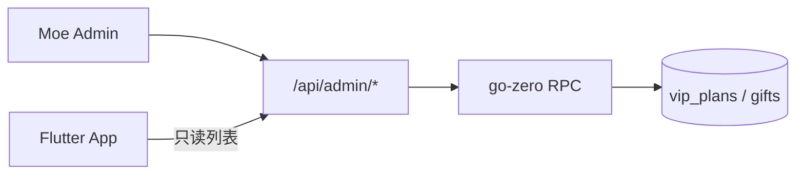

# Moe Social 产品成熟度评估（对照官网）

> 更新：2026-05  
> 对照页面：`website/official/index.html`  
> 目的：判断「官网叙事 vs App 真实能力」差距，指导内测与上架节奏。

---

## 1. 总体结论

| 维度 | 评级 | 一句话 |
|------|------|--------|
| 功能广度 | **A-（对团队）** | `lib/pages` 90+ 页面，能力面很宽 |
| 产品深度 | **C+** | 多数模块「能进能点」，缺统一主路径 |
| 稳定性 | **B- ~ C+** | 核心 Feed/聊天有工程处理，测试与商业化闭环不足 |
| 设计 / 产品化 | **C+** | 有品牌色，IA 与视觉未收束，营销页领先于 App |
| 对外上架信心 | **内测可，商店偏早** | 适合小范围内测，不宜按官网级别对外承诺 |

**核心判断：** 官网描述的能力 **约 70% 有代码支撑**，但呈现的是「成熟消费品」，实际是 **功能齐全的 Beta / 技术型合集**。  
团队直觉「产品化不足、设计要提升」与现状一致，且 **当前最大短板之一**（甚至重于继续堆功能）。

---

## 2. 官网卖点 vs 实现对照

| 官网卖点 | 实现情况 | 代码 / 说明 |
|----------|----------|-------------|
| 动态时间线 | ✅ 较完整 | `lib/pages/feed/home_page.dart`：热门/最新/关注、分页、错误重试 |
| 手绘心情 | ✅ 有 | `hand_draw_editor_page.dart`；API/RPC 含 `hand_draw_card` |
| 圈子 / 同好 | ✅ 有 | 底栏「兴趣社区」「同好与人脉」 |
| 私信 | ✅ 有 | `conversations_page` / `direct_chat_page`、推送 |
| 语音通话 | ⚠️ 有 | Agora：`voice_call_page.dart`；需真机长期压测 |
| AI 伙伴 / 酒馆 | ✅ 功能多 | 智能体、角色卡、记忆、Lorebook 等；入口在「探索/我的」 |
| 签到 / 成长 / VIP | ⚠️ 半产品化 | VIP 走 API；扭蛋/背包仍有 **mock**（`gacha_page`、`VirtualItem.mockItems`） |
| 「温柔、不焦虑」 | ⚠️ 体验未统一 | 功能堆叠多，主路径与视觉叙事未收束 |
| 多平台 | ⚠️ | Flutter 多端目录齐全，**上架级**主要仍是 Android / iOS |

---

## 3. 官网与 App 信息架构不一致

**官网手机 Mock：** 首页 · 消息 · **AI** · 我的  

**实际底栏（`lib/app/main_shell.dart`）：**

| Tab | 页面 |
|-----|------|
| 首页 | `HomePage` |
| 同好与人脉 | `FriendsPage` |
| 兴趣社区 | `CommunityHomePage` |
| 探索 | `DiscoverPage`（匹配 + 酒馆/小游戏） |
| 我的 | `ProfilePage` |

影响：

- **AI 不在一级 Tab**，与官网主视觉不符。
- **消息** 非独立 Tab，新用户难以对齐官网预期。
- 「探索」混合匹配、AI、小游戏，缺少单一产品故事。

另有 **非面向普通用户** 的模块：`autoglm`、`demo`、`achievement_test`、本地 LLM 设置等，拉高「功能很多」印象，拉低「产品干净度」。

---

## 4. 稳定性

### 4.1 做得好的

- 首页 Feed：加载/刷新/分页/错误态、请求防并发（`home_page.dart`）。
- 统一主题、`error_handler`、`moe_toast` 等基础设施。
- 后端 go-zero + RPC 分层；官网反馈、Admin 网关已接。

### 4.2 薄弱环节

- Flutter 自动化测试极少（`test/` 仅少量文件），回归主要靠手点。
- 多处 **「功能开发中」**（签到历史、外观部分项、AutoGLM 等）。
- 商业化局部仍 **mock**（扭蛋、背包礼物池）。

### 4.3 分模块粗评

| 模块 | 评级 | 说明 |
|------|------|------|
| 刷帖 / 发帖 | B | 可用，需弱网与异常场景补测 |
| 聊天 / 语音 | B- | RTC 需专项压测 |
| AI 全链路 | B- | 能力强，配置复杂，易劝退普通用户 |
| 付费 / 扭蛋 / 背包 | C+ | 部分未接真运营数据 |
| 整体上架信心 | C+ ~ B- | 内测可以，公开商店偏早 |

---

## 5. 内容丰富程度

- **页面数量**：90+ → 对开发者已很丰富。
- **产品深度**：许多停留在「能进、能点」，未到「默认就会用、愿意天天用」：
  - 话题推荐仍有 TODO（`lib/models/topic_tag.dart`）。
  - 探索 Tab 职责过重。
  - 设置内多项「功能开发中」。

更像是 **功能仓库（feature warehouse）**，还不是 **一条清晰用户旅程（user journey）**。

---

## 6. 设计 / 产品化

**已有：**

- 主色 `#7F7FD5`、薄荷青（`ThemeProvider`、`AiBrandTokens`）。
- 部分动效与骨架屏（`fade_in_up`、`post_skeleton` 等）。

**不足：**

1. **信息架构**：5 底栏 + 大量二级入口，新用户不知从哪开始。
2. **视觉不统一**：Feed、AI 酒馆、商业化、AutoGLM 像不同子产品拼接。
3. **营销与 App 脱节**：官网已是滚动产品页，App 仍是工程师导航。
4. **Onboarding 弱**：首日路径、空状态、引导相对少。
5. **缺设计规范文档**：组件、间距、插图风格未固化，迭代易发散。

---

## 7. 建议优先级（产品向）

不必先加功能，更适合 **收束**：

### P0 — 叙事与入口对齐（约 2 周）

1. 定版底栏策略：例如 **首页 · 消息 · AI · 我的**（或改官网 Mock 与现网一致，二选一）。
2. 首屏只强调 3 个动作：刷动态 / 发一条 / 聊天或 AI。
3. 官网只写 **已默认开放** 的能力；内测中的标「即将开放」。

### P1 — 划清用户版 / 开发者版

- AutoGLM、demo、本地模型等收入 **「实验室」**，默认隐藏。
- 扭蛋/背包：**接真运营数据** 或内测期从 App/官网下架入口。

### P1 — 运营配置走 Admin（见 §8）

- VIP 套餐、礼物目录在 **Moe Admin** 维护，迁移只做表结构。

### P2 — 设计系统一小步

- 统一 AppBar、卡片、主按钮、空状态（3 种主屏：Feed / 聊天 / AI 聊天先对齐）。

### P2 — 稳定性底线

- 核心路径补 10～20 个 widget/integration test（登录 → 刷帖 → 发帖 → 聊天）。
- 内测前：弱网、杀进程恢复、语音来电。

---

## 8. 商业化配置：VIP / 礼物应走 Admin，而非迁移种子

### 8.1 结论（推荐）

**同意。** VIP 套餐、礼物目录、排序、上下架等 **运营数据** 应：

| 方式 | 用途 |
|------|------|
| **数据库迁移（AutoMigrate）** | 只建/改 **表结构**（`vip_plans`、`gifts` 等） |
| **Moe Admin CRUD** | 日常调价、上新、下架、排序、文案、图标 URL |
| **可选「一键初始化」** | Admin 内 **导入默认套餐/礼物**（幂等），替代 SQL 脚本 |
| **迁移内嵌 seed** | ❌ 不推荐作为常规手段 |

理由：

1. **运营节奏**：价格、活动、礼物 SKU 变更频繁，不应每次改数据都发版或跑迁移。
2. **环境一致**：开发/预发/生产各自维护数据；`init_vip_plan_data.sql` 类脚本易与环境漂移。
3. **模型已支持**：`backend/model/gift.go` 注释已写「目录由 seed / 运营维护」；RPC 已有 `CreateVipPlan` 等能力。
4. **与官网一致**：对外是「可运营的产品」，后台应能改套餐，而不是改 SQL。

### 8.2 现状（仓库内）

| 资产 | 位置 | 说明 |
|------|------|------|
| 迁移 `-migrate` | `go run super.go -migrate` | **仅建表**；不再自动 seed 礼物/VIP/成就 |
| VIP 套餐 SQL | `backend/scripts/init_vip_plan_data.sql` | 遗留 dev 脚本；请用 Admin bootstrap |
| Admin VIP CRUD | `GET/POST/PUT/DELETE /api/admin/vip/plans` + Moe Admin `/vip/plans` | **已实现** |
| Admin 礼物 CRUD | `/api/admin/gifts` + Moe Admin `/gifts/catalog` | **已实现**（含 bootstrap） |
| Admin 订单只读 | `/api/admin/orders/vip`、`/orders/gift-purchase` + `/wallet/orders` | **已实现** |
| Admin 内容与社区 | posts / comments / groups / post-reports | **已实现**（列表 + 删帖/评/社区） |
| VIP 创建 API（旧） | `POST /api/vip/plans` | 已要求 Admin Token；运营请走 Admin 路径 |
| App 扭蛋 | `gacha_page.dart` | 仍用 `VirtualItem.mockItems` → 应对齐 `gifts` 表或下线 |

### 8.3 目标架构

**Admin 建议菜单（并入 `moe-admin` 侧栏「App 用户」或单独「运营商品」）：**

| 功能 | Admin API（建议） | App 侧 |
|------|-------------------|--------|
| VIP 套餐列表/编辑/上下架 | `GET/POST/PUT /api/admin/vip/plans` | 继续 `GET /api/vip/plans`（仅 `status=on`） |
| 礼物目录 CRUD | `GET/POST/PUT /api/admin/gifts` | `GET /api/gifts` |
| 一键初始化默认数据 | `POST /api/admin/catalog/bootstrap` | 无；幂等插入默认 3 档 VIP + N 个礼物 |
| 操作审计 | 写 `admin_audit_log` | — |

**迁移时只做：**

- `AutoMigrate` 增加字段（如 `status`、`sort_order`、`deleted_at`）；
- **不**在 `-migrate` 里 `INSERT` 业务套餐（最多保留 **dev 专用** 开关，默认关闭）。

**开发环境可选：**

- Admin 工作台按钮「导入默认商品」；
- 或 `config.yaml` 中 `admin.bootstrap_catalog: true` **仅本机** 执行一次（类似 `admin_account` 种子模式）。

### 8.4 与「用户 VIP 状态」的区别

| 数据类型 | 维护方式 |
|----------|----------|
| **套餐/礼物目录**（商品） | Admin 配置 |
| **用户是否 VIP、到期时间**（订单结果） | 支付/订单链路 + Admin **用户详情**只读或客服改 |
| **用户背包库存** | 购买/赠送业务产生，Admin 可做补偿发放（P2） |

不要在迁移里写死套餐，避免与线上用户已购套餐 ID 冲突。

### 8.5 实施顺序建议

1. **P1**：Admin VIP 套餐 CRUD + 列表页；`POST /api/vip/plans` 加鉴权或废弃改 Admin。
2. **P1**：Admin 礼物 CRUD；App 扭蛋/背包读真实 `gifts`。
3. **P1**：`bootstrap` 幂等接口 + Admin「初始化默认商品」按钮；文档标注替代 `init_vip_plan_data.sql`。
4. **P2**：套餐多语言、活动价、礼物分类运营字段。

详见：[moe-admin-platform-design.md](../dev/moe-admin-platform-design.md)、[moe-admin-menu-map.md](../dev/moe-admin-menu-map.md)。

---

## 9. 相关文档

| 文档 | 说明 |
|------|------|
| [moe-admin-menu-map.md](../dev/moe-admin-menu-map.md) | 管理台菜单与 App 域对照 |
| [moe-admin-platform-design.md](../dev/moe-admin-platform-design.md) | Admin API 与分期 |
| [cross-platform-dev.md](../dev/cross-platform-dev.md) | 本地 / Mac / Win 启动 |
| [website/official/README.md](../../website/official/README.md) | 官网部署与反馈 API |

---

## 10. 维护说明

- 官网改版或底栏 IA 调整时，请同步更新 **§2、§3**。
- Admin 上线 VIP/礼物管理后，更新 **§8.2 现状** 并勾选 P1 项。
- 每轮内测前可复用 **§4.3** 做冒烟检查表。
