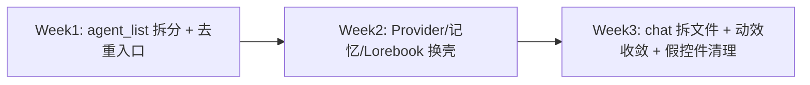

# 探索页重构方案

日期：2026-05-19  
状态：**已落地（Phase 1）**  
关联文档：

- [IA 首屏与空状态设计](./IA首屏与空状态设计.md)
- [AI 酒馆 UI 体验迭代方案](./AI酒馆UI体验迭代方案-2026-05-19.md)
- [UI 设计规范](./UI设计规范.md)

---

## 1. 背景与目标

底栏原「发现」页将 **社交匹配** 与 **AI / 小游戏** 堆在同一条无限滚动里，导致：

- 一屏三套产品（在线匹配、话题推荐、工具入口），主次不清；
- 与「兴趣社区」的「找同好」心智重叠；
- AI 入口文案为「AI 助手」，与酒馆主页「AI 酒馆」不一致；
- 单文件 `discover_page.dart` 超千行，难以维护。

**本次目标（Phase 1）**

1. 底栏 Tab 文案：**发现 → 探索**。
2. 探索页顶部 **Segmented：同好 | 玩法**，分区承载能力。
3. **同好**：仅保留匹配与推荐社交能力。
4. **玩法**：AI 酒馆 + 小游戏；入口统一为「AI 酒馆」，图标与酒馆 Hero 一致（`Icons.auto_awesome_rounded` + `AiBrandTokens.heroGradient`）。
5. 抽取子页面与共享卡片组件，控制单文件体量。

**不在本次范围**

- 底栏新增独立「酒馆」Tab — **产品决策：不新增**，酒馆继续从「探索 · 玩法」进入。
- 酒馆上帝页 `agent_list_page` 拆分（见下文 Phase UI-结构）。

---

## 2. 信息架构

### 2.1 底栏

| 索引 | 旧名 | 新名 | 页面 |
|------|------|------|------|
| 3 | 发现 | **探索** | `DiscoverPage`（类名不变，减少路由改动） |

### 2.2 探索页内 Segmented

```mermaid
flowchart TB
  Explore[探索页] --> Seg[Segmented: 同好 | 玩法]
  Seg --> Match[同好 Tab]
  Seg --> Play[玩法 Tab]
  Match --> Online[在线实时匹配 Hero]
  Match --> Topics[话题 Chip]
  Match --> Offline[离线推荐按钮]
  Match --> Grid[推荐结果网格]
  Play --> Tavern[AI 酒馆 主入口卡]
  Play --> Game[小游戏 次入口卡]
  Tavern --> AgentList[agent_list_page]
  Game --> GameLobby[game_lobby_page]
```

### 2.3 与兴趣社区分工

| 模块 | 职责 |
|------|------|
| 兴趣社区 | 群组、话题帖流、广场形态筛选 |
| 探索 · 同好 | 1v1 匹配、按话题推荐陌生人 |
| 探索 · 玩法 | AI 酒馆、小游戏等扩展能力 |

---

## 3. 视觉与交互规范

### 3.1 色彩

探索页与 AI 酒馆共用 `AiBrandTokens`（`lib/widgets/ai/ai_brand_tokens.dart`）：

| Token | 用途 |
|-------|------|
| `chatBackground` / `pageBackground` | 页面底色 |
| `primary` / `secondary` / `accent` | 按钮、Hero 渐变 |
| `heroGradient` | 在线匹配 Hero、AI 酒馆入口卡 |
| `titleColor` | 标题文案 |

### 3.2 顶部结构

```
┌──────────────────────────────────────┐
│ 探索                    [通知]        │
│ 匹配同好，或试试酒馆与小游戏            │
├──────────────────────────────────────┤
│  [  同好  ]  [  玩法  ]   ← Segmented │
├──────────────────────────────────────┤
│           Tab 内容区                  │
└──────────────────────────────────────┘
```

### 3.3 同好 Tab 区块顺序

1. **在线匹配** — 单张 Hero 卡（匹配中渐变变暖色，可选脉冲缩放）。
2. **话题** — Chip 多选 + 清除。
3. **主 CTA** — 「随机发现新面孔」/「根据话题推荐同好」。
4. **结果** — 未搜索时不占位（话题区 + 主 CTA 已足够）；搜索后展示 loading / 错误 / 空 / 网格。

### 3.4 玩法 Tab

1. **AI 酒馆** — 大卡片（Hero 渐变、`auto_awesome` 图标、副标题与酒馆首页一致）。
2. **小游戏** — 次级卡片（非 Hero 尺寸，避免双 Hero 竞争）。

### 3.5 动效

| 场景 | 规则 |
|------|------|
| 在线匹配脉冲 | 仅 `_onlineMatching == true` 且未开启「减少动态效果」 |
| 列表 | **禁止**逐条 FadeInUp |
| Tab 切换 | 系统默认 `TabBarView` |

---

## 4. 文件结构（落地后）

```
lib/pages/discover/
├── discover_page.dart          # Shell：标题、Segmented、TabBarView
├── discover_match_tab.dart     # 同好：匹配全流程
├── discover_play_tab.dart      # 玩法：酒馆 + 游戏
└── widgets/
    └── explore_feature_card.dart  # 玩法区入口卡片

兼容：
└── explore_match_redirect_page.dart  # `/match` → 探索 · 同好
```

---

## 5. 文案统一

| 位置 | 旧文案 | 新文案 |
|------|--------|--------|
| 底栏 Tab | 发现 | 探索 |
| 页面标题 | 发现 | 探索 |
| 玩法入口 | AI 助手 | **AI 酒馆** |
| 会话空状态等 | 在发现里… | 在**探索**里… |
| 好友页提示 | 发现页 | **探索页** |

不改：登录 Slogan「发现更可爱的世界」、版本更新「发现新版本」等通用用语。

---

## 6. 验收清单

- [x] 底栏显示「探索」，进入后为 Segmented「同好 | 玩法」。
- [x] 同好 Tab：在线匹配、话题、离线推荐、结果网格行为与重构前一致。
- [x] 玩法 Tab：仅 AI 酒馆 + 小游戏；酒馆卡片跳转 `AgentListPage`。
- [x] 酒馆入口图标为 `Icons.auto_awesome_rounded`，渐变与 `AiBrandTokens.heroGradient` 一致。
- [x] 开启系统「减少动态效果」时，匹配 Hero 无脉冲缩放。
- [x] `/match` 深链重定向到探索 · 同好。
- [x] `dart analyze` 对 `lib/pages/discover/` 无新增 error。

---

## 7. 已完成：P2 `/match` 收敛

| 项 | 处理 |
|----|------|
| `match_page.dart` | **已删除**（与 `DiscoverMatchTab` 重复） |
| 路由 `/match` | `ExploreMatchRedirectPage` → `MainNavController.requestExplore(subTab: 0)` + `/home` |
| 底栏「酒馆」Tab | **不新增**；酒馆入口保留在「探索 · 玩法」 |

---

## 8. 酒馆子页统一骨架（2026-05-19 已落地）

### 8.1 可抽离项 → 落地文件

| 层级 | 文件 | 职责 |
|------|------|------|
| 状态 | `lib/pages/ai/state/lorebooks_list_controller.dart` | 世界书：本地优先 + 云端同步 |
| 状态 | `lib/pages/ai/state/memory_manager_controller.dart` | 记忆库：Orchestrator 聚合状态 |
| 布局 | `lib/widgets/ai/ai_list_page_layout.dart` | Scaffold + 下拉刷新 + 统一 padding |
| 布局 | `lib/widgets/ai/ai_scaffold.dart` | 标题 / 副标题 / 顶部同步条 |
| 组件 | `ai_highlight_card.dart` / `ai_template_tile.dart` / `ai_list_tile_card.dart` | 说明卡 / 模板行 / 列表行 |

### 8.2 页面文件

| 页面 | 文件 |
|------|------|
| 世界书列表 | `ai_lorebooks_list_page.dart` |
| 世界书编辑 | `ai_lorebook_editor_page.dart` |
| Provider（标杆） | `ai_provider_profiles_page.dart` |
| 记忆库 | `memory_manager_page.dart`（已接 Controller + AiScaffold） |

入口 `ai_lorebooks_page.dart` 仅 export，避免循环依赖。

### 8.3 原则（避免东拼西凑）

1. **子页一律** `AiListPageLayout` 或 `AiScaffold`，禁止自建 Scaffold 配色。  
2. **列表数据** 用 `ChangeNotifier` Controller，Widget 只 `ListenableBuilder` 渲染。  
3. **弹层** 用 `AiSheet` / `AiConfirmSheet`，禁止宽屏 `AlertDialog`。  
4. **空状态** 用 `AiEmptyState`，禁止手写灰框 + Icon。  

---

## 9. AI 酒馆首页结构优化（2026-05-19 已落地）

| 项 | 处理 |
|----|------|
| `agent_list_page.dart` | 拆为 `tavern/agents_tab.part.dart`、`tavern/providers_tab.part.dart` |
| Hero | 抽取 `tavern/tavern_hero_card.dart` |
| AppBar | 4 图标 → `PopupMenu`（广场 / 导入 / 世界书 / Provider） |
| 快捷入口 | 移除大块 QuickAction 渐变卡，保留「套用角色模板」Chip |
| 动效 | 角色列表、模型分类移除 `FadeInUp`；`content_generation` 消息区同步移除 |

---

## 10. 下一步：页面结构 + UI / 动效（建议优先级）

> 探索页 IA 已稳定；世界书 / 记忆库已接统一骨架。下一阶段：**agent_editor 分步**、**chat_page 拆分**、**Provider 页与首页完全同构**。详见 [AI 酒馆 UI 体验迭代方案](./AI酒馆UI体验迭代方案-2026-05-19.md)。

### 10.1 页面结构（P0 — 先减复杂度）

| 目标 | 动作 |
|------|------|
| 拆分上帝页 | `agent_list_page.dart`（~2250 行）→ `tavern_home` + `tavern_agents_tab` + `tavern_providers_tab` + 小组件 |
| 去重入口 | AppBar 图标与 QuickAction 合并为「···」菜单或只保留 1 行快捷入口 |
| 统一 Shell | 酒馆子页尽量 `AiScaffold`；`chat_page` 拆 AppBar / 输入区 / 抽屉 |
| 弹层 | 多字段表单统一 `AiSheet` / `AiFormSheet`，清理宽屏 `AlertDialog` |

### 10.2 UI 一致（P0 — 体感最明显）

| 页面 | 现状 | 目标 |
|------|------|------|
| `ai_provider_profiles_page` | 已换壳 | 作标杆，其它页对齐 |
| `agent_list_page` | Hero 精致、列表/弹层参差 | 组件化 `AiHeroCard` / `AiListTileCard` |
| `memory_manager` / `ai_lorebooks` | 硬编码 + AlertDialog | Token + FormSheet |
| `agent_editor` | 单页长表单 | 分步：基础 → 人设 → 模型 |

### 10.3 动效（P1 — 先减后加）

| 规则 | 说明 |
|------|------|
| 禁止列表逐条 `FadeInUp` | `agent_list`、`content_generation` 等需移除错峰入场 |
| 探索匹配脉冲 | 已实现：仅排队中 + 未禁用系统动画 |
| 新增 `MoeMotion`（可选） | 统一 duration（200ms）、curve；封装 `disableAnimations` 判断 |
| 聊天 | 保留 `AnimatedSize` / 打字指示器；去掉消息区 `FadeInUp` |

### 10.4 建议迭代顺序（约 2–3 周）



### 10.5 探索页后续（低优先级）

- 同好 Tab 空状态改用 `AiEmptyState` 族（与酒馆视觉对齐，非必须）。
- 玩法 Tab 可增加「最近聊过的角色」快捷入口（需读本地 DB，属增强）。

---

## 11. 变更记录

| 日期 | 说明 |
|------|------|
| 2026-05-19 | 初版方案 + Phase 1 探索页重构落地 |
| 2026-05-19 | Phase 2：`/match` 重定向，删除 `match_page`；确认不增底栏酒馆 Tab |
| 2026-05-19 | 酒馆首页：Tab 拆分 part、菜单去重、Hero 组件化、FadeInUp 清理 |
| 2026-05-19 | 子页骨架：Controller + AiListPageLayout；世界书/记忆库换壳 |
